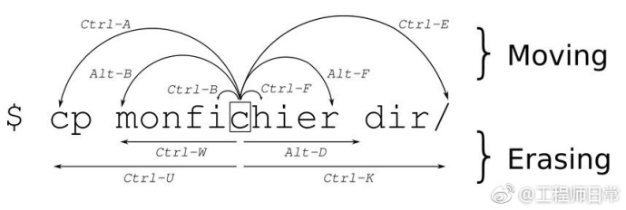

### 2018/01/14

原文链接：[CPU和GPU的设计区别](http://www.cnblogs.com/biglucky/p/4223565.html)
总结：[CPU和GPU的设计区别总结](quiver-note-url/77AD7A0F-5370-4B51-B16A-ECAA399EAF7E)

### 2018/01/15
原文链接：[跳出面向对象思想(一) 继承](https://casatwy.com/tiao-chu-mian-xiang-dui-xiang-si-xiang-yi-ji-cheng.html)
原文链接：[跳出面向对象思想(二) 多态](https://casatwy.com/tiao-chu-mian-xiang-dui-xiang-si-xiang-er-duo-tai.html)
总结：[跳出面向对象思想总结](quiver-note-url/ED3A2D65-03B3-4C9C-9194-821191756BEB)

### 2018/01/16
链接：[iOS应用架构谈 view层的组织和调用方案](https://casatwy.com/iosying-yong-jia-gou-tan-viewceng-de-zu-zhi-he-diao-yong-fang-an.html)
主要涉及代码规范、MVC、MVVM、Mediator、strategy 设计模式等，可能是因为有了一定基础再回过头来看这篇文章，并没有太大的启发点；不过有些地方太过苛求绝对，不敢苟同（e.g. 比如所有的视图实例化都使用 `getter setter` 方法）。
另外文章没有说到MVVM的重点：View-Model是业务层，View和Model其实可以复用，因此只要替换掉 View-model 我们就可以愉快的重用，想要实现MVVM，必须是双向绑定，即 View 和 ViewModel 双向绑定， Viewmodel和model双向绑定。

### 2018/01/17
链接：[iOS应用架构谈组件化方案](https://casatwy.com/iOS-Modulization.html)
总结：[iOS应用架构谈组件化方案总结](quiver-note-url/02C80AA7-BF70-4D7E-89B4-8E84324328CD)

### 2018/01/18
链接：
[对象间交互模式](https://casatwy.com/communication_patterns.html)
[一种基于ResponderChain的对象交互方式](https://casatwy.com/responder_chain_communication.html)
[去model化和数据对象](https://casatwy.com/OOP_nomodel.html)

总结：
1. 对象之间简单传值，即定义外部属性，例如`@property(nonamatic,copy)NSString *stockName`，写死了属性；
2. 轻度抽象，定义一个基类，包含所有可用的属性和方法，子类派生重写即可 ———— 这里可以参考NSNumber这种；
3. 制定协议规范接口，好处时可以multi-compliance，但是oc不能默认实现，swift是可以的
4. `Target-Action`有待学习，强解耦，但是失去编译器检查
5. 响应式不能局限于所谓的注册通知，而是发送一个signal出去，让所有关心这个信号的对象来处理这件事，避免了原本关心这个信号的对象需要定时轮询的尴尬；
6. `delegate和notification有什么区别` 命令式和响应式的区别，很容易理解；

### 2018/01/22
链接：[CocoaPods Guides](https://guides.cocoapods.org/)
总结：[CocoaPods Guides 初探](quiver-note-url/77FA36ED-91BE-4E1B-8244-F6B50941311F)

### 2018/01/23
链接：[函数式编程圣经](https://mp.weixin.qq.com/s/0gErQ3tjDLZuD1bYOhi0mQ)
总结：形象生动，蛮有意思

链接：[避免DateFormatter重复实例化造成的开销，gitHub链接](https://github.com/BrooksWon/BTNSDateFormatterFactory/blob/master/BTNSDateFormatterFactory/BTNSDateFormatterFactory.m)
### 2018/01/24
链接：[Wrapping Analytics APIs](https://talk.objc.io/episodes/S01E83-wrapping-analytics-apis)
总结：主要讲述关于 Wrapping Analytics APIs 的重构过程：
1. `AnalyticsBackend` 使用单例作为分析后端（类似埋点收集），许多地方会调用`send`方法，但是消息内容各不相同；
2. 分析发现`send`发送Event的方式就两种，所以可以抽象出两个类型的发送Action，`extension AnalyticsBackend` 添加两个Action，而`send`是通用方式。这种方式缺点是不易测试，原因我认为是首先你要实例化一个 `AnalyticsBackend` 实例对象，然后调用 `taoMeTapped` 方法，但是又没有返回值，怎么写NSAssert呢？
3. 所以现在改进，应该`Extension Event` 这个结构体，然后把Action写在这里（static func），但是返回的对象不再是void，而是Event，这样才有利于测试，但是这会造成太多的业务积累在 Event 的扩展中
4. Swift很自然的会用到 Enum 重构。Event现在重构成 Enum 类型，然后内部有个data字段，会根据枚举值来返回对应的data数据；
5. 最后用协议规范 `AnalyticsBackend` 对象，方便注入。

链接：[使用 VIPER 构建应用](https://www.objccn.io/issue-13-5/)

### 2018/01/25
链接：Effective Object-C 2.0 Use Zombies to Help Debug Memory-Management problems
总结：进一步理解runtime中对`instance object`、`class object` 以及 `metaClass object`的理解；以及isa的理解，使用`object_setClass`让实例的isa指向另外一个`class object`；最后是forwardMethod的机制，先从cache中以SEL为key找，没有则从methodlist中继续找，再没有的话就forward转发消息，这里有三步：1. 先`+(BOOL)resolveInstanceMethod`，这里允许动态添加方法（ps:当然对应的IMP是在编译时候就决定的），另外还要注意+resolveInstanceMethod和 +resolveClassMethod 都是类方法；2.如果前者return NO，那么则进行 forwardingTargetForSelector，即交由另外一个object来响应，这个方法是return一个对象； 3. 最后是forwardInvocation。消耗也是逐级递增。

[Zombie 设计思路总结](quiver-note-url/2DF63FEB-CEC5-4620-8022-82FD8833E25F)

### 2018/01/26
内容：观察者模式和 Behavior 策略模式
总结：
>Q: 首先观察什么？ 
>
>A: 要有 Subject，你可以选择订阅来观察，当然Subject可能包含多个Events.
>
>Q: Subject要有什么？ 
>
>A：基本的subscribeObserver,removeObserver，供外部调用的接口改变主题，然后响应内部所有的注册者。
>
>Q: 注册者需要什么？ 
>
>A: 一般会用协议来规范，比如定义一个 ObserverableInterface 。

Behavior 这个小框架以strategy 设计模式为基础，同时借助runtime message forward 技术达到多重代理的目的。

### 2018/01/29
终端命令跳转快捷键：

其中 `ctl+w` 往前删除，`ctrl+k` 往后删除，快速切换到上一个单词是`alt+方向键左`，同理 `alt+方向键右`，

### Aspect

链接：[Aspect 源码学习](https://github.com/steipete/Aspects)

阅读一遍源码，大致已经了解整个设计思路，收获如下：

1. 巩固 runtime 基础知识： instance object, class object, metaClass object ，后两者生命周期有且仅有一个，同时都分配在堆上；
2. 对某个类所有的实例变量以及方法描述都存储在class object 对象中，而所有类方法(+ 标识)和变量都存储在 metaClass object 中
3. 必须理解oc消息发送的灵魂在于 `objc_msg_send`，依次传参：self，sel，args可变参数；其中self可以理解为内存地址，self 可以为实例、class object，我猜测这个c语言方法这么实现：先用`object_getClass(self)`获取到isa的地址，然后通过sel就可以找到对应的方法了，如果self是实例变量，那么`object_getClass`取到的就是类对象，它完整描述了当前类的实例信息：有什么变量以及方法；如果self是类对象，那么`object_getClass`取到的就是metaClass object，它完整描述了当前类的类信息：有什么类变量以及类方法。（ps：所以为啥总是类属性有且仅有一个，因为类对象整个生命周期也只有一个啊）
4. 基于上面的理解，什么isKindOf isMemberOf 都非常好理解了

