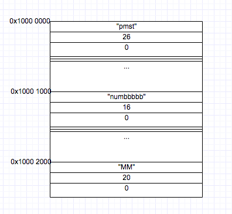
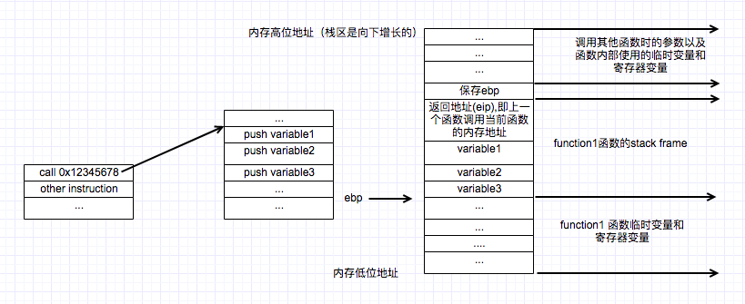
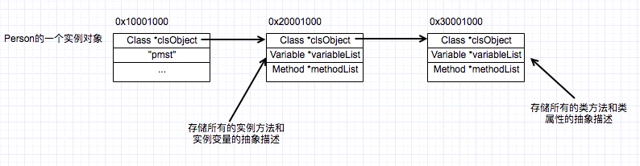

# 1. 具体和抽象
具体：客观存在着的或在认识中反映出来的事物的整体，是具有多方面属性、特点、关系的统一；
抽象：从具体事物中被抽取出来的相对独立的各个方面、属性、关系等。

以 Person 为例：“pmst”，“numbbbbb”，“MM”等都是客观存在的，称之为具体；然后我们抽取共同的特性：姓名，性别，年龄和介绍自己等（当然这是极小、极小的一部分）。

# 2. C 语言抽象的雏形
先用 C 语言抽象，实现如下:
```
typedef struct Person Person;

typedef void (*Method)(Person *my_self);

typedef struct Person {
    char name[12];
    int age;
    int sex;
    Method behavior1; // 行为1
} Person;


void selfIntroducation(Person *my_self) {
    printf("my name is %s,age %d,sex %d\n",my_self->name,my_self->age,my_self->sex);
}

int main(int argc, const char * argv[]) {
    // 1
    Person *pmst = (Person *)malloc(sizeof(Person));
    // 1.1
    strcpy(pmst->name, "pmst");
    pmst->age = 18;
    pmst->sex = 0;
    // 2
    pmst->behavior1 = selfIntroducation;
    // 3
    pmst->behavior1(pmst);

    return 0;
}
```
1.  `int`，`float`，`struct` 等类型在编译之后转变成对内存地址的访问，比如 `1` 中的 pmst 指针在调用 `malloc` 方法后返回分配的地址为 `0x12345678`，会标识占 `sizeof(Person)` 个字节；`pmst->age = 18` 其实是对 0x12345678  偏移 12 字节内存的赋值，占4个字节；
2.  函数在编译之后放置在代码段，入口为函数指针；
3.  `pmst->behavior1(pmst);` 先取到 0x12345678 偏移 20 字节内存的值————函数指针，然后 call 命令调用

> 编译之后代码都变成了对内存地址的访问，称之为静态绑定；那么该如何实现 Runtime 运行时的动态访问呢？比如在UI界面上（ps:Terminal那种古老的输入输出方式也是OK的）输入一个类的名称以及调用方法名称，紧接着我们要实例化一个该类的对象，然后调用方法。

# 3. C 语言实现动态性

## 3.1 运行时如何实现抽象->具体

想要运行时随心所欲地将**抽象**转变成**具体**，就需要在内存中保存一份对抽象的描述，这里的描述并非指 `typedef struct Person {...}Person` 定义 ———— 这是静态的，而是开辟一块内存加载一份 json 抽象描述：
```C
{
  "Name": "Person",
  "VariableList":[
    {
      "VarName":"name",
      "Type":"char[]",
      "MemorySize":12,
    },
    {
      "VarName":"age",
      "Type":"int",
      "MemorySize":4,
    },
    {
      "VarName":"sex",
      "Type":"int",
      "MemorySize":4,
    },
  ],
  "MethodList":[
    {
      "name":"selfIntroducation",
      "methodAddress":0x12345678
    },
  ]
}
```
关于这串json描述，可以是在编译阶段生成的，运行时使用 `char *description` 加载到堆内存上，需要时通过对应的 Key 取到 Value：例如 Key=Name 可以取到类名，Key=VariableList 可以取到变量列表，Key=MethodList 可以取到方法列表。这里可能需要有个小小的Parser解析器。

## 3.2 二次抽象，生成类对象

倘若每次用到时就要进行一次 `char *description` 信息 parser 解析，性能这关都过不去，正确做法是解析成某个数据结构，保存到堆内存中：
```C
// 伪代码如下
typedef struct Variable {
  char *name;
  char *type;
  int memorySize;
}Variable;

typedef struct Method {
  char *name;
  void (*callAddress)(void *my_self);// 显然这里多参传入 当然这些暂时不考虑
}Method;

typedef struct Class {
  char *className;
  /// Variable List 是一个数组 类型为 Variable
  Variable *variableList;
  /// Method List 也是一个数组 类型为 Method
  Method *methodList
}
```
上述是最简单的抽象定义，现在我们将解析json信息，然后分配内存填充信息（抽象->具体）的过程，首先 Class 是一个抽象概念，抽象出类名、变量列表和方法列表等信息，但此刻我们开辟了一块内存填充信息———— 客观存在了，称之为对象（通常我们称之为class object，类对象）

```C
//////////////伪代码如下/////////////////
//////////////////////////////////////////
// parse person json proccess get result
///////////////////end////////////////////

// 分配一块内存
Class *personClsObject = (Class *)malloc(sizeof(Class));

strcpy(personClsObject->className, "Person");

personClsObject->variableList = (Variable *)malloc(sizeof(Variable) * 3);// 有3个变量

Variable *nameVar = (Variable *)malloc(sizeof(Variable));
strcpy(nameVar->name, "name");
strcpy(nameVar->type, "char[]");
nameVar->memorySize = 12;
//... ageVar & sexVar 生成

personClsObject->variableList[0] = nameVar;
personClsObject->variableList[1] = ageVar;
personClsObject->variableList[2] = sexVar;

// 同理生成一个个Method 然后填充到 personClsObject->methodList;
```
你、我、他是客观存在的称之为对象，进一步抽象出了姓名、性别和年龄三个方面，使用 `struct Person` 结构体定义，之前说了编译之后不存在所谓的结构体，都会转而变成对内存地址的访问；我们换了种思路，又抽象出了一个 Class 结构体，然后分配一块具体客观存在的内存保存信息，即 `personClsObject` 类对象(class object)，然后将所有变量信息存储到`variableList`，方法信息存储到 `methodList`。

> 举一反三，如果继续定义`typedef struct Animal `，`typedef struct Car` 等一系列的类，那么必定也会各自在堆内存上生成有且仅有一个 `AnimalClsObject` 、`CarClsObject` 类对象！

## 3.2 使用类对象来生成实例对象
上文说到内存中保存了一份对 `Person` 抽象描述，即`PersonClsObject`类对象，包含类名称，变量列表，方法列表等信息。此刻进一步具体到现实生活中某个具体的人，生成 “pmst” 博主我，"numbbbbb" 帮主梁杰，“mm”灵魂画师，有种God创世的赶脚。这一个个都是现实存在的，即实例对象————自然要分配一块内存给各自，填充 `name`名字，`sex`性别，`age`年龄。



```C
///////////// 以下为伪代码 ////////////////////

// 可以遍历 personClsObject 中variableList所有变量
// 取到每个变量所占的内存大小memorySize，累加得到总的需要分配的内存大小
int size = 0;
for variable in personClsObject->variableList {
  size = variable->memorySize;// 当然这里肯定要考虑内存对齐问题
}

Person *pmst =  (Person *)malloc(size);   // 分配内存 得到指针0x10000000
Person *numbbbb = (Person *)malloc(size); // 分配内存 得到指针0x10001000
Person *MM = (Person *)malloc(size);      // 分配内存 得到指针0x10002000
```

> note: 这里只为实例变量分配了内存，章节2中我们还包含一个8字节的函数指针，那么问题来了，现在我们该如何调用`selfIntroducation`函数呢？


## 3.3 实例对象和类对象
因为我们在内存中保存了一份对 Person 的抽象描述，在运行时就知道Person包含哪些允许调用的函数名称，函数类型以及位于代码段的函数入口地址。

章节 2 中使用了 `pmst->behavior1(pmst)` 调用方式 ：先取到函数指针，然后把实例对象自身指针作为传参传入调用。现在有了 `personClsObject` 我们又该如何实现这种调用呢？

```C
/// 伪代码如下
/// C语言函数返回类型为函数指针写法如下：
/// ps:当然也可以先typedef 然后替换返回类型，
void (*findMethod(char *methodName))(void *myself) {
  for method in personClsObject->methodList {
    if methodName == method->name {
      return method->callAddress;
    }
  }
  return NULL;
}
```
可以看到我们会通过传入函数名称，遍历类对象中的方法列表进行匹配，找到函数指针，接下去就是和章节2调用一样。

```C
void (*call)(void *) = findMethod("selfIntroducation");
call(pmst);
```

现在的运行时动态性方案存在很多缺陷，随便举几点：
1. 实例对象会有很多个，但是对应的类对象有且仅有一个，因为类对象是一份抽象描述，一个足矣。但是你会发现实例对象和类对象并没有联系在一起，导致我们得到一个实例对象无法运行时得知其属于什么类（对应哪个 class object 类对象）！这也是后面我们要解决的；
2. 存在太多的硬编码，比如 `findMethod` 写死了是从 `personClsObject` 中去遍历方法列表

> 小总结：1.实例对象允许很多个，但是对应的类对象有且仅有一个，运行时保存在堆上；2.类对象是一份抽象描述，我们可以在运行通过查询类对象，拿到关于类的信息，比如第一个变量名称，占字节数，变量类型等等，拿到这些信息可以帮助我们实际访问实例对象指针指向内存中的数据啦！—————— 因为我们知道字节偏移和变量类型。


## 3.4 改进：实例对象关联类对象
3.3节中我们仅考虑只有一个`personClsObject`，并且在 `findMethod` 查询函数中也硬编码写死了是从 `Person` 类对象方法列表中遍历匹配，现在开始加入不同的类对象，`findMethod` 只需要新增一个入参即可:

```C
/// 分离硬编码部分，传入 `Class *classObject` 不同的类对象
void (*findMethod(Class *classObject, char *methodName))(void *myself) {
  for method in classObject->methodList {
    if methodName == method->name {
      return method->callAddress;
    }
  }
  return NULL;
}
/// 现在调用方式改为：
void (*call)(void *) = findMethod(personClsObject, "selfIntroducation");
call(pmst);
```
但是这样实现 `findMethod` 的前提是知道 `pmst` 这个实例对象对应的类对象为 `personClsObject`，单纯拿到指向实例对象内存的指针（0x1000 0000）显然信息不足：


试想知晓一个实例对象的指针 `0x1000,0000`，指针类型为 `void *` ，我们可以访问这块内存的数据，但是问题来了：
1. 这个实例对象到底占几个字节呢？
2. 内存布局怎样————比如第一个成员类型是`Int`，要读入4个字节，ps:这里可能要考虑内存对齐问题；
3. 我们依旧不知道这个实例对象对应的类对象是哪个，或者说类对象所占的内存地址是多少。

正如第三点指出，问题根本在于我们的实例对象没有绑定类对象的内存地址！这样问题就很好解决了，我们只需在内存头部“塞入”类对象的指针就OK了，假设 `personClsObject` 类对象地址为`0x2000 0000`
```
—————————————————                 ——————————————————————————————————————————————
|   0x2000 0000 -|--------------->|     "Person"(char *className)              |
|_______________ |                |____________________________________________|
|   "pmst"       |                |     0x2000 1000(Variable *variableList)    |  
|     26         |                |____________________________________________|
|     0          |                |     0x2000 2000(Method *methodList)        |
—————————————————                 |____________________________________________|  
```
其中 `0x2000,1000 0x02000,2000` 都是指针，分别指向变量列表和方法列表内存地址。

这样的结构意味着要修改 `Person` 的结构体：
```C
typedef struct Person {
    Class *clsObject;
    char name[12];
    int age;
    int sex;
} Person;

////////// 伪代码(前提我们已经得到了person 类对象) /////////////
int size = 0;
for variable in personClsObject->variableList {
  size = variable->memorySize;// 当然这里肯定要考虑内存对齐问题
}
Person *pmst =  (Person *)malloc(size + 8); // 因为多了一个指针，32位平台占4字节 64位平台占8字节
pmst->clsObject = personClsObject;
//...
```
这样就可以解决我们之前的问题了，给一个实例变量的指针，我们先取到内存首地址开始的8个字节，解释成 `Class *` 指针指向了我们的类对象，愉快地获取想要的所有信息。


## 3.5 关于实例对象

不过问题来了，上述实现必须在抽象出来的数据结构顶部插入一个 `Class *clsObject` ，如下：
```C
typedef struct Person {
    Class *clsObject; // 指向 personClsObject 类对象
    char name[12];
    int age;
    int sex;
} Person;

typedef struct Car {
    Class *clsObject; // 指向 carClsObject 类对象
    char brand[12];
    int color; 
    int EngineDisplacement;
    //...
} Car;

//... 还有其他很多抽象类定义
```
不同类的实例对象声明如下：
```C
// Person 实例对象：pmst numbbbb
Person *pmst = (Person *)malloc(person_size);
pmst->clsObject = personClsObject;

Person *numbbbb = (Person *)malloc(person_size);
numbbbb->clsObject = personClsObject;

// Car 实例对象：pmst's bmw  & benz 以下表示客观存在的两辆车 
Car *bmw_pmst = (Car *)malloc(car_size);
bmw_pmst->clsObject = carClsObject;

Car *benz_pmst = (Car *)malloc(car_size);
benz_pmst->clsObject = carClsObject;
```
尽管 `pmst` `numbbbb` `bmw_pmst` `benz_pmst` 都是指针，但是指向类型分别是 `Person` 和 `Car` 结构体，那么在此种情况下，我们使用能够使用一种统一的方式来定义一个实例对象呢？

观察上述实例对象声明以及抽象类的定义，我们找出相同点：数据结构顶部都为 `Class *clsObject` 指针。

```C
struct object {
  Class *clsObject; 
};

struct object *pmst = (Person *)malloc(person_size)
pmst->clsObject = personClsObject;

struct object *bmw_pmst = (Car *)malloc(car_size);
bmw_pmst->clsObject = carClsObject;
```
`Person` 和 `Car` 后面的成员，我们无法使用 `->` 访问了，转而变成查询各自的类对象中 `variableList` 变量列表————变量类型和地址偏移量。这样可以间接访问`pmst`这个实例指向内存内容了（当然内存前8个字节保存的是类对象指针）。

至于为什么能这么做，先来说说C语言实现**变长结构体**。

```
struct Data   
{  
    int length;  
    char buffer[0];  
};
```
结构体中，length 其实表示分配的内存大小，而buffer是一个空数组，可理解为占位名称罢了；buffer的真实地址紧随 Data 结构体包含数据之后，可以看到这个结构体仅占4个字节，倘若我们在`malloc`时候分配了100个字节，那么剩下`100-4=96`个字节就是属于 `buffer` 数组，非常巧妙不是吗？

```
char str[10] = "pmst demo";
Data *data = (Data *)malloc(sizeof(Data) + 10); 
data->length = 10;
memcpy(data->data,str, 10); 
```

回归正题，现在我们可以使用 `struct object` 结构来统一指向我们的实例对象了，但是这并不意味着我们不需要`Person`类 `Car`类的定义，只不过现在抽象数据结构体的顶部不需要嵌入 `Class *clsObject`了。

## 3.6 改写实例对象的分配方式
前文demo中是这么实例化一个对象的:
```
/// ...

Person *pmst = (Person *)malloc(person_size)
pmst->clsObject = personClsObject;

/// ...
```

> PersonClsObject 知道 Person 的一切。

以 `(Person *)malloc(person_size)` 方式实例化一个对象，首先是要拿到 `personClsObject` 对象，然后遍历 `variableList` 累加所有变量占的内存得到 `person_size`，最后调用 `malloc` 方法开辟内存返回指针。

`分配一块内存给person实例对象` 这种行为属于`person`类对象的职责，因此将这种行为添加到 `personClsObject` 类对象的 `methodList` 中（其实细细想来，是不太恰当的，之后还会继续改进），命名为 `mallocInstance`。

```
/// 简单修改下定义 真实定义结构名称改为了 `Person_IMP`
typedef struct object Person;

struct Person_IMP {
    char name[12];
    int age;
    int sex;
}

/// 增加一个分配内存的方法 注意传参为实例对象 对于当前方法来说应该传NULL
(struct object *)mallocIntance(void *myself) {
  /// 伪代码
  int size = 0;
  for variable in personClsObject->variableList {
    size = variable->memorySize;// 当然这里肯定要考虑内存对齐问题
  }
  return (struct object *)malloc(size);
}
personClsObject->methodList[xx]=mallocInstance;

/// 分配内存改写如下：
void (*mallocIntance)(void *) = findMethod(personClsObject, "mallocIntance");
Person *pmst = mallocIntance(NULL); // 之前是要传一个实例对象进去，为了方便操作，但是分配内存比较特殊，要知道此刻连实例都不存在!
```

## 3.8 对象调用函数方式的思考
实例对象函数调用过程： `findMethod` 传入对应的类对象和函数名称，遍历 `methodList` 找到匹配项返回函数指针，传入实例对象指针调用即可，譬如之前person实例调用自我介绍方法的demo。
```C
/// 现在调用方式改为：
void (*call)(void *) = findMethod(personClsObject, "selfIntroducation");
call(pmst);
```
那么问题来了，实例对象的属性变量如何修改呢？比如`name`,`age`和`sex`。现在已经不能像最开始之前那样直接访问内存地址进行修改了，尽管`personClsObject`知道这些变量的信息：变量名称，类型以及所占内存大小。

其实解决方案也很简单，既然不能直接访问变量，间接总可以把！

> Any problem  in computer science can be solved by anther layer of indirection.

现在为每个属性变量都创建一个读写方法，通过调用这两个方法来修改实例对象内存中的变量值(Note:前8个字节保存的是类对象地址)
```
void setName(void *my_self, char *newName) {}
char *getName(void *my_self) {}
```
注意到不同函数的传参个数也不同，如 `selfIntroducation` 传参仅 `void *my_self`一个，而 `setName` 方法传参个数为2。这其实是ok，`Method`封装的是个函数**指针**(占4或8个字节)，指向某块代码段的地址，C语言又是支持可变参数的函数，原理自行google关键字"C语言 函数 可变参数"。

这里讲下我的理解，函数其实就是封装好的代码块，编译之后转成一串指令保存在代码段。

* 关于函数调用：正常的调用方式 `functionName(variable1,variable2,variable3)`，编译器会把`functionName`替换成函数地址(0x12345678)，汇编可能是使用类似 `call 0x12345678` 来调用函数；
* 关于函数入参实现：`variable1 variable2 variable3`，应该是会调用 `push` 指令一个个入栈（这里注意是先 `push variable1` 还是 `push variable3` 是由ABI决定的！）
* 如果说函数是指令，那么栈就是给函数提供数据的源！函数实现是一串指令，使用`push`和`pop`操作栈上的数据，拿上面的函数入参来说，我们就使用 `push` 命令将`variable1 variable2 variable3`压到栈里，其中 `ebp` 寄存器指向当前函数调用上下文的栈 base address，而`esp`寄存器则是根据`push`和`pop`改变指针地址，一开始`ebp`和`esp`指针都是指向 base address。



上面就是简单的一个调用方式，至于`variable1`这些函数入参如何取，应该是依靠 `ebp`+ `offset`得到。

## 3.9 对象调用函数改进
前文说到 `mallocIntance` 函数直接放在 `personClsObject` 的方法列表中不太合适，原因主要在于创建实例对象，为其分配内存地址似乎不应该由它来做，而是另外一个对象，而类似 `init` 初始化值才属于`personClsObject`类对象的行为。

现在引入 metadata的概念：

> Metadata is data that describes other data. Meta is a prefix that in most information technology usages means "an underlying definition or description."       
> Metadata summarizes basic information about data, which can make finding and working with particular instances of data easier. For example, author, date created and date modified and file size are examples of very basic document metadata. Having the abilty to filter through that metadata makes it much easier for someone to locate a specific document. [更多..](https://www.jianshu.com/p/4ebaf029325d)

ok，现在除了为每个类创建一个 `class object` 对象之外，再引入一个 `metaClass object` 对象，前者存储所有的实例方法和实例属性，后者存储所有的类方法和类属性。

我们不需要在创建额外的MetaClass结构体，因为之前定义的 `struct Class` ，`struct Method`， `struct Variable` 都可以复用。

```C
struct object *personMetaClsObject = (Class *)malloc(sizeof(Class));
personMetaClsObject->methodList[0] = mallocIntance;

/// 填充其他的类变量和类方法...
```

实例化一个`person`对象“看似”可以这么干了：

```C
// ===================  伪代码 ===========================
// 修改mallocIntance方法，直接传要分配的 memory size 进去
(struct object *)mallocIntance(size_t size) {
  return (struct object *)malloc(size);
}
// =======================================================

// =================  实际调用如下  ======================
// 还需要从 personClsObject 获取到变量列表中所有变量的memory size总大小
int size = 0;
for variable in personClsObject->variableList {
  size = variable->memorySize;// 当然这里肯定要考虑内存对齐问题
}
// 从metaClsObject 中取到分配内存的方法
void (*mallocIntance)(void *) = findMethod(personMetaClsObject, "mallocIntance");
Person *pmst = mallocIntance(size); 
```
实例化一个对象需要涉及**类对象**和**metaclass元类对象**，由于两者没有关联，所以需要分开获取我们想要的信息，类对象中获取需要分配的内存大小，元类对象中获取分配内存函数的函数指针，然后调用得到一个实例。

如何把类对象和元类对象关联起来，我们依葫芦画瓢，在定义的 `struct Class` 结构体中塞入一个指针变量，类型为 `Class` ———— 这个指针会指向元类对象，现在两者就关联起来了！

```
typedef struct Class {
  class *isa;     // is a xx class
  char *className;
  /// Variable List 是一个数组 类型为 Variable
  Variable *variableList;
  /// Method List 也是一个数组 类型为 Method
  Method *methodList
}

// 实例化一个元类对象 这里留个坑元类对象的isa指针应该指向哪个对象呢？
struct object *personMetaClsObject = (Class *)malloc(sizeof(Class));

// 实例化一个类对象
struct object *personClsObject = (Class *)malloc(sizeof(Class));
personClsObject->isa = personMetaClsObject;
```

回顾下实例对象关联类对象，类对象关联元类对象：



现在谈谈如何调用实例方法以及类方法了。

```
void msg_send(struct object *instance,char *methodName){
  Class *clsOrMetaClassObject = instance->isa;
  void (*method)(void *) = findMethod(clsOrMetaClassObject, methodName);
  method(instance);
}
```
Note: 实例对象，类对象，元类对象都是具体存在的，都称之为实例对象，所以这里取名 `instance`，函数内部的实现很简单，取 `isa` 指针，然后查询函数指针并调用，考虑两种情况：
* 如果传入实例对象，那么取到类对象，调用的都是实例方法；
* 如果传入类对象，那么取到元类对象，调用的都是类方法。

> 这里留下的坑很多，之后慢慢补。总之，我们总是先取到isa指针，找到当前对象的metaData进行操作的。

简单解释下OC中 `NSObject *instance = [NSObject new];`，这里调用了类方法，使用 `clang -rewrite-objc` 命令查看编译器重写后的代码：
```
((Person *(*)(id, SEL))(void *)objc_msgSend)((id)objc_getClass("Person"), sel_registerName("new"));
```
其实这里 `objc_getClass("Person")` 会返回Person的类对象，而查找元类对象的方法是`objc_getMetaClass()`。

当然我们写代码的时候可能为了区分实例方法和类方法，用一些关键字符区分，比如OC里实例方法都是用 `-` 打头，类方法用 `+` 打头。
```
- (void)instanceMethod;
+ (void)classMethod;
```

## 总结
上述就是我的简单总结，每天晚上简单记录下，收获颇丰，至于留下的无数坑，希望之后慢慢补吧。