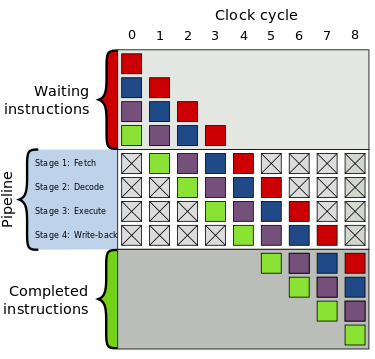
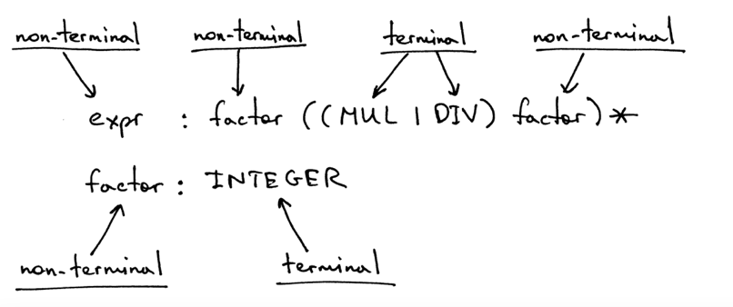
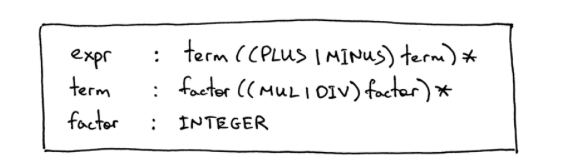
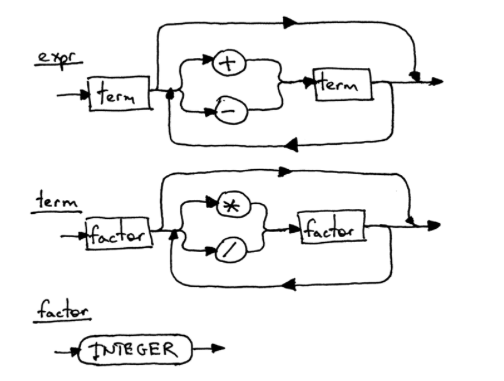

> Theme: Low-programming（Compiler & Interpreter）    
> Source Code Read Plan: Still Aspect      
> Reference Book List: objc App Architecture

# 2018/03/01 - 2018/03/02

[推荐：C语言实现 OC 运行时一步步推倒过程](https://github.com/colourful987/2018-Read-Record/blob/master/2018-02/resource/C_IMP_Runtime.md)


# 2018/03/03
[函数调用栈帧过程带图详解](http://blog.csdn.net/IT_10/article/details/52986350)

主要学习了 C 语言函数 stack frame 的知识以及一些简单的汇编指令：`mov 目的操作数 源操作数` 即源操作赋值给目的操作数；`lea edi,[ebp-44h]  mov acx,11h  mov eax,0CCCCCCCCh` edi存储起始地址，acx记录填充次数，eax存储要填充的占位数据；ebp 和 esp 是调用函数过程中比较重要的两个寄存器，其中ebp最为重要，取变量地址都是通过ebp+offset来取值。
> 这里有个坑没有填：文中说到的函数帧是先push 传参，然后push ebp，接着是call 返回地址，最后是函数的临时变量；而之前看到的是push ebp，push 返回地址，最后才是传参和临时变量。另外对于 `int x = 10;` 编译器会编译成如下命令`mov dword ptr [ebp-4],0Ah`，其实就是把 0Ah 这个值写入 `ebp-4` 地址上，至于 `dword ptr` 修饰`[ebp-4]` 是个四字节地址；而访问变量 x 的操作，其实也是对内存的操作。

Note: 编译之后压根不存在我们定义的数据结构！

其他关于函数调用栈的参考文章:    

[通过swap代码分析C语言指针在汇编级别的实现](http://www.cnblogs.com/inevermore/p/4393124.html)

[函数调用过程（ebp，esp） ](http://blog.163.com/yichangjun1989@126/blog/static/131972028201442221956603/)

[C 语言指针与汇编地址（一）](http://blog.csdn.net/lanchunhui/article/details/51366513)

# 2018/03/04
[objc App Architecture Introduction](https://www.objc.io/books/app-architecture/)     
设计一款应用时候可以从以下五点入手：
1. Construction: 谁创建View和Model，以及两者之间的关联；
2. Update the model: 哪些 View Action 处理需要修改model，比如界面上的按钮点击等；
3. Changing the view: model data 的改动又该如何反应到视图上；
4. View-state
5. Testing

主流应用架构模式：
* MVC
* OO-MVC，弱Model版本的 MVC，是 Online-Only Model-View-Controller的缩写，比如网页开发中，弱化了Model层，数据源来自服务端，然后呈现到View上
* MVVM，需要双向绑定
* The Elm Architecture
* Model-View-Controller+ViewState
* ModelAdapter-ViewBinder

后三者应该是借鉴其他编程语言开发中的模式，改写应用到iOS，这个应该比较有意思，待学习。


# 2018/03/05 ~ 2018/03/08
这几天在改[iOS and macOS Performance Tuning](https://www.amazon.com/iOS-macOS-Performance-Tuning-Objective-C/dp/0321842847) 译书的修改意见，简单说下其中提到的pipeline流水线技术，主要参考了wiki的解释：
> 指令流水线是为了让计算机和其他数字电子设备能够加速指令的通过速度（单位时间内被运行的指令数量，吞吐量？）而设计的技术。

参考工业流水线做法，一个完整的产品需要经过工艺1（工人A负责），工艺2（工人B负责），以此类推...
这样的好处在于工人不需要“全能”，节省教学成本，他只需要懂自己步骤的工艺就可以重复劳动了。

其实CPU同样如此，内部有很多电子元器件组成，触发器，逻辑门等，其中每个电子器件各自独立，功能也是同流水线的工人一样很专一。

当代CPU都是利用时钟频率驱动的，而CPU是由内部的逻辑门与触发器组成。当受到时钟频率触发时，触发器得到新的数值，并且逻辑门需要一段时间来解析出新的数值，而当受到下一个时钟频率触发时触发器又得到新的数值，以此类推。而借由逻辑门分散成很多小区块，再让触发器链接这些小区块组，使逻辑门输出正确数值的时间延迟得以减少，这样一来就可以减少指令运行所需要的周期。（摘自wiki，若对计算机组成有兴趣，可以阅读 Code 一书）

以 RISC 流水线来说，被分为5个步骤，每个步骤之间用触发器链接，意思就是前一个步骤的输出作为下一个步骤的输出，而触发器的两端就是输入和输出，可以进行数据保持（在一段时间内）
1. 读取指令
2. 指令解码与读取寄存器
3. 运行
4. 内存访问
5. 写回寄存器

一条指令实际是由我们定义的一系列步骤，而不是一条指令对应一个物理层面的电路模块（有待确认）。

摘自wiki的一个示例：

上图展示了4层流水线的示意图：
1. 读取指令（Fetch）
2. 指令解码（Decode）
3. 运行指令（Execute）
4. 写回运行结果（Write-back）

> 疑惑：每个步骤实际对应一个复杂的功能电路，那它们是如何保证每个步骤都是在一个时钟周期完成呢？还是说并非每个步骤时间相同————但是这样的话上图x轴又不对了。

图中不同颜色的方块分别对应一条指令，而中间的 pipeline 流水线纵向分为四个步骤（不要误解成指令）：Fetch、Decode、Execute和 Write-back。X轴方向是时间，注意到第一步Fetch横向去看，每次都是读入一条指令，第一个时钟读入了绿色指令，第二个时钟读入紫色，接着是蓝色和红色指令，它就像一个工人每个时钟读一条指令，下个时钟到来时候把读入的指令传给下一个步骤Decode，接着继续读指令；第二个步骤同样如此，只负责Decode一条指令，然后传给下一个步骤。

现在罗列下绿，紫，蓝，红四条指令执行开始到完成，开始和结束分别对应的时钟周期坐标（注意x轴方向）：
* 绿色指令：时钟周期1开始读入---> 时钟周期5结束，经历了Fetch,Decode，Excute,Write-back
* 紫色指令：时钟周期2开始读入---> 时钟周期6结束，同上
* 蓝色指令：时钟周期3开始读入---> 时钟周期7结束，同上
* 宏色指令：时钟周期4开始读入---> 时钟周期8结束，同上

如果是非流水线的话，应该是只有当一条指令执行完四个步骤的时候，才开始下一条指令执行四个步骤，也就是说执行两条指令要花费8个时钟周期，每条指令花费4个周期；而应用流水线技术，我们执行了4条指令，每条指令花费2个周期。但是随着指令源源不断地输入执行，最终相当于一个时钟周期执行一条指令。

> 我的理解：假设执行的指令无穷尽，那么随着时间推移，流水线中的每个步骤都处于忙碌状态，不可能有怠工的情况（理想情况下），从宏观去看这条流水线的工作情况，A在Fetch 指令4，B在Decode 指令 3，C在Excute指令2，D在Write-back指令1，其实我们认为A，B，C，D同时在对“同一个指令”操作，感觉就像一个时钟执行了一条指令。

当然非流水线的执行方式设计简单，成本低，而且指令和指令互不影响，出错概率低吧。

另外在修改译书时发现`阿姆达尔（Amdahl）定律`蛮有意思，关于内核数量和程序中并发代码比值对执行时间的影响。

# 2018/03/09（编译器和解释器专题）
Ruslan 写的[Let’s Build A Simple Interpreter](https://ruslanspivak.com/lsbasi-part1/) 专题总共有14节。
进度：read chapter 1，过于基础，暂时没有什么感悟和理解，只当打卡。

另外看评论Jack Crenshaw留言说文章貌似有“抄袭”嫌疑，没有细看，给出Jack Crenshaw 关于编译器和解释器的文章，有完整的pdf下载
[Let's Build a Compiler](https://compilers.iecc.com/crenshaw/)

# 2018/03/10
[Let’s Build A Simple Interpreter part2](https://ruslanspivak.com/lsbasi-part2/)    
* 借助 Scanner（扫描器）从 Source Code->Token的过程：Token 囊括了程序代码中所有的字符，比如整数，`+,-,*,/,= ...`，使用Token数据结构表示。在读入字符串parse后分别存储到一个个Token中，这一步称之为Lexical Analyzer(词法分析)；
* Lexeme 可以是一个或多个字符串（Note:比如"+","-"，也可以是整数“123”），毕竟我们输入的代码本质还是一长串字符串，由我们“分析”输入的“词”，然后将其Map到对应的Token结构中；
* 本节中，词法分析之后紧跟就是Interpreting(就是应用+和-)，但是目前逻辑代码是硬编码的，也就是if-else分支处理，目前仅仅只是做了空白字符串判断，一些特殊的还未判断。

# 2018/03/11
[Let’s Build A Simple Interpreter part3](https://ruslanspivak.com/lsbasi-part3/)   

本节学习稍微复杂的计算器表达式，例如 “1+2-100+123”这种表达式，顺便用oc写了个demo。

[OC-Lexical_Analyzer_UI](./resource/Lexical_Analyzer_UI)

[OC-Lexical_Analyzer_Terminal](./resource/Lexical_Analyzer_Terminal)

oc 终端接受字符串输入有两种方式：
```oc
// c语言方式
char *cstring = malloc(sizeof(char) * 100);
scanf("%s", cstring);
NSString *string = [NSString stringWithUTF8String:cstring];

// oc 层面
// 当然还可以继续调用 `[NSString stringByTrimmingCharactersInSet:[NSCharacterSet newlineCharacterSet]` 将接收的字符串去除空格和换行等
NSData *data = [[NSFileHandle fileHandleWithStandardInput] availableData];
NSString *string = [[NSString alloc] initWithData:data encoding:NSUTF8StringEncoding];
```

此次在学习过程中遇到了个小坑，对于带空格的输入,`scanf`接收总是出问题，最后查了[c++官方文档说明](http://www.cplusplus.com/reference/cstdio/scanf/)：

> Any number of non-whitespace characters, stopping at the first whitespace character found. A terminating null character is automatically added at the end of the stored sequence.

即对于输入format为`%s`时，接收字符串直到遇到第一个为空格的字符算作结束，然后接收到的字符串后面拼接`null(\0)`。

解决方法可以使用`gets()`函数，另外如何读取带空格的字符串，有一种比较有意思的格式：
```
scanf(” %[^\n]s”,a);
```
出自[How to use scanf to read Strings with Spaces](https://gpraveenkumar.wordpress.com/2009/06/10/how-to-use-scanf-to-read-string-with-space/)

# 2018/03/14
[Let’s Build A Simple Interpreter part4](https://ruslanspivak.com/lsbasi-part4/)       
[Let’s Build A Simple Interpreter part5](https://ruslanspivak.com/lsbasi-part5/)      
[Let’s Build A Simple Interpreter part6](https://ruslanspivak.com/lsbasi-part6/)      

文章目的是为了实现一个简单的算术解释器，使用巴科斯-诺尔范式（BNF —— Backus-Naur Form）对诸如`1*2/3*4/5`的表达式求值。

1. 首先引入表达式 `expr` 的概念，`1*2/3*4/5` 毫无疑问是一个`expr`；
2. 单独一个整数 `1`，`2` 抽象意义上也是一个表达式。对于整数这种特殊的“expr”（其实就是单纯的返回值，类似于代码中的 {return value}），称之为**factor(因子)**

> factor(因子)可理解为特殊的 `expr`，定义如下：任何运算符放置其任意一边都不会导致这个表达式内部其他部分分离出来，成为这个运算符的运算操作数。


* 举例1： `1` 这个“表达式”，是一个基本单元，实际上内部无法再分割了，那么在`1`的左右两侧放置运算符（譬如 *1，或是1/），显然不会将表达式中的其他部分分离出来；
* 反例： 而类似于 `2/3` 这种表达式，我们在左侧放置一个 `*` 号，显然会让内部的 `2` 和乘号左侧的操作数结合了；
* 举例2：除了整数这种特殊的可称之为factor外，我们熟知的用括号括起来的表达式也称之为factor，譬如`(1*2/3*4/5)`这个整体称之为factor，我们在其左右两侧放置操作符，不会把表达式中的其他部分分离出来！这种形式的factor我们可以表示成`(expr)`，左右括号(parenthesis)包括一个expr表达式。

回到正题`1*2/3*4/5`，在引入`expr` 和 `factor` 之后，表达式可写成 `factor*factor/factor*factor/factor`；进一步发现形式不过是 `factor*factor` or `factor/factor` ，借鉴正则表达式中的`|`或概念，我们可以改写成 `factor (MUL|DIV) factor (MUL|DIV) factor (MUL|DIV) `；其中 ` (MUL|DIV)factor`是重复部分，这在正则表达式中用 `()*`来表示；这样就得到了最终的 `factor ((MUL|DIV)factor)* `，其中 `factor` 此时只表示为整数 `INTEGER`。

继续引入 `non-terminal` 和 `terminal` 的概念，即非终结和终结：



> Note: factor 同样是一个表达式。首先我们要做的是重复替换一个 non-terminal 成 terminal，直到得到第一个我们想要的诸如表达式(terminal MUL|DIV terminal)，比如碰到第一个factor，它是non-terminal的，因此继续对这个factor替换，得到具体一个整数（terminal）;紧接着我们会得到一个MUL或DIV，这是terminal;继续对下一个factor做替换；最后满足（INTEGER（MUL | DIV）INTEGER)的小expr，求值得到结果作为下一个expr的输入，重复该步骤。

但复杂操作时，会涉及优先级的问题，比如*和/的优先级高于+和-。如何构建优先级的语法需要涉及以下两个规则：

1. 为每个优先级定义一个**non-terminal**。而定义的**non-terminal**的body也是有格式要求的：`other-non-terminal (操作符) other-non-terminal`(可以重复多个此表达式)，表达式中的操作符即当前优先级定义的符号；而other-non-terminal为更高级优先级中的non-terminal；
2. 如果我们有N个Level的操作优先级，那么意味着我们要创建 N+1 个 **non-terminal**，每个 **non-terminal** 的body正如上面说的由当前Level的操作符加上高优先级的两个 **non-terminal**。

> 再简单说下目前对 non-terminal 的理解：有点像一个表达式的别名，编码中就像是定义了一个变量`var nameOfNonTerminal = { body }`，正如上面图中所展示的，factor 是一个 non-terminal，body 为 INTEGER； expr 也是一个 non-terminal，body为 `factor ((MUL | DIV) factor) *`。

四则运算+，-，*，/中有两个优先级，高优先级的 *和/，接着+和-同一级，按照上面的说定义如下几个non-terminal和terminal:




对于 +，- 优先级我们定义了 `term ((ADD | sub) term) * `；其中 term 是更高优先级的**non-terminal**，属于 *，/ 优先级：`factor ((MUL | DIV) factor) *`；factor 为整数，优先级最高！

> 表达式评估求值必须遵循一个规则：碰到一个non-terminal就必须替换成仅含terminal的表达式。

因此例子中expr表达式入口第一个遇到 non-terminal term 就要开始替换，它属于高一级优先级的*和/；而term入口第一个遇到的 non-terminal又是 factor（因此又要替换！），属于更高一级的 INTEGER，；

优先级的实现就这么搞定了！再回顾下上面的图，之所以把优先级低的先放在最外层，然后立马解释高一层的优先级non-terminal，”层层深入“，直至最里面优先级最高的且替换成一个 terminal，再一层层返回。
```
--> Level最低
      |—-> Level稍高
            |--> ...
                  |--> Level最高
```

# 2018/03/17

[Let’s Build A Simple Interpreter part7](https://ruslanspivak.com/lsbasi-part7/)    

> Lexer -> Parser -> Parser Tree -> Interpret。

Parser 到 Parser Tree 前文都是使用 BNF 范式，引入了 expr， term， factor 三个 non-terminal 和 terminal的 + - * /，每个 non-terminal 感觉就是一个表达式的别名，body就是表达式的具体内容，body会包含优先级更高的两个non-terminal以及当前优先级的符号。

Parser Tree 的每个Node都是一个 non-terminal，从某种意义上来说包含了特定的语法，比如 + ，-，*，/。

关于 AST 是本章刚引入的概念，Abstract Syntax Tree ———— 抽象语法树，AST 较之 Parser Tree，前者的节点可以是操作符也可以操作数，不像后者是一个 non-terminal，内涵具体的一个语法。

本节简单介绍了下 AST ，我目前只觉得换了种数据结构呈现表达式而已，理解还不够深入。

# 2018/03/18
[Let’s Build A Simple Interpreter part8](https://ruslanspivak.com/lsbasi-part8/)   
[Let’s Build A Simple Interpreter part9](https://ruslanspivak.com/lsbasi-part9/)   

pascal 语法：

* program :  "BEGAN END." 是一个完整的程序，注意"."DOT符号；
* compound statement: 复合语句，即program包括的程序，同样是 “BEGAN END”(注意是没有 DOT 符号的)；

```
BEGAN   <---- program 开始
  BEGAN  <----- compound statement 开始
    ...
  END
  
  BEGAN
    ...
  END
  ...     <----- compound statement 结束
END.    <---- program 结束
```

* statement list: 即复合语句中一个 “BEGAN END” 中包含的语句列表，列表即说明包含了多条语句 statement，而语句和语句之间用分号 “;” 隔开，当然语句列表允许为空；
* one statement：目前只介绍赋值Assign语句，即 “varName := value” 类型，":=" 左边是变量名称 ID，右边是值或表达式expr;
* 说到 expr 就可以联想到前面几章的 factor, term 这些术语了。

目前理解 Lexer -> Token，AST新增几个Tokens：BEGAN，END，SEM(;)，ASSIGN(:=)，NoOp(空操作)等。
Parse 过程也会遵循从 program -> compound statement -> statement list -> single statment or compound statement(注意这里有个回环) -> factor 的过程写 parse。

待补充：Visitor

# 2018/03/19
[Let’s Build A Simple Interpreter part10](https://ruslanspivak.com/lsbasi-part10/) 

如果说目前在创建一门新语言，那么第十节就像在赋予“新生命”，增加新规则、语法糖... 

> 疑惑点:目前更想是在写一个解释器，输入一串代码字符串，通过我们写的解释器按照约定好的规则解释，“运行”得到结果。那么问题来了，用gcc llvm编译后的二进制文件，又该如何得到。

* PROGRAM：以“PROGRAM”保留关键字开头，以 "." 结尾，中间包裹了代码块 BLOCK;
* BLOCK: 包含 VAR 保留关键字开头的声明部分（可选，即可有可无），加上 `BEGAN END` 组成的 compound_statement部分；
* DECLARATION: 声明分为两种，一种显示指定类型，另一种自然是隐式看推断类型，有点像swift，前者比如 `var name:String`，后者`var name = "pmst"`；

| 名称                 | 定义                                                         | 解释                                                         |
| -------------------- | ------------------------------------------------------------ | ------------------------------------------------------------ |
| program              | PROGRAM variable SEMI block DOT                              |                                                              |
| block                | declarations compound_statement                              | 声明+复合语句                                                |
| declarations         | VAR (variable_declaration SEMI)+  \| empty                   | 以**VAR**关键字打头，多条 **variable_declaration** 组成      |
| variable_declaration | ID (COMMA ID)* COLON type_spec                               | 1. `a, b, c, x : INTEGER;`  2. `number     : INTEGER;` 3. `a : INTEGER;` |
| type_spec            | INTEGER                                                      | 同上 type_spec 仅仅作为一个类型描述                          |
| compound_statement   | BEGIN statement_list END                                     | 由多条 **statement** 组成                                    |
| statement_list       | statement                    \| statement SEMI statement_list | 可能只有一条 `number := 2;`                                  |
| statement            | compound_statement               \| assignment_statement               \| empty |                                                              |
| assignment_statement | variable ASSIGN expr                                         |                                                              |
| empty                | noOp                                                         |                                                              |
| expr                 | term ((PLUS \| MINUS) term)*                                 |                                                              |
| term                 | factor ((MUL \| INTEGER_DIV \| FLOAT_DIV) factor)*           |                                                              |
| factor               | PLUS factor            \| MINUS factor            \| INTEGER_CONST            \| REAL_CONST            \| LPAREN expr RPAREN            \| variable |                                                              |
| variable             | ID                                                           |                                                              |
|                      |                                                              |                                                              |

# 2018/03/20
[Let’s Build A Simple Interpreter part11](https://ruslanspivak.com/lsbasi-part11/) 

引入 Symbol 概念，留坑待补充

# 2018/03/21
[Let’s Build A Simple Interpreter part12](https://ruslanspivak.com/lsbasi-part12/) 
[Let’s Build A Simple Interpreter part13](https://ruslanspivak.com/lsbasi-part13/) 
[Let’s Build A Simple Interpreter part14](https://ruslanspivak.com/lsbasi-part14/) 

大致过了一遍，12章引入了procedure的概念，我理解等同于c语言的函数；13章是11章的extend，对symbol 已经symbolTable 做了更详细的解释；14章引入scope作用域和source-to-source compile的概念。这里思考了 IR （Intermediate Representation）中间表示，之后用Code-Generate生成目标代码（比如汇编？），最后生成可行执行文件。

> 目前 Ruslan 仅更新到Chapter14，但不可否认这真的是非常awesome tutorial，相比较其他的博文晦涩难懂或者长篇代码亦或是跳跃式的讲解，Ruslan的文章基本都是图文并茂，知识点都是有铺垫的展开。

小总结：从9号开始入坑，过去了10几天时间，从开始模仿写一个计算器解释器，起初难度不大，也用oc实现了两个，遇到的坑也填了。而第9章之后就基本在阅读和理解之间，总觉得还不是写的时候，现在看完14章，感觉还是可以Coding一波的。**这次阅读经历让我学习到技术之外的两点：1.坚持，坚持每天阅读，coding，采坑填坑；2.坚持之上的一鼓作气，如果把“战线”拉太长，会导致之前阅读的内容遗忘或模糊，返工去温习非明智之举，只有一鼓作气阅读完，同时兼顾实践才能加深印象以及收获更多额外知识！**


# 2018/03/22
开始从Chapter1开始Coding，这次用 Python 实现，为之后DeepLearning做好准备。
* [x] [Let’s Build A Simple Interpreter part1](https://ruslanspivak.com/lsbasi-part1/) 
    Python 缩进真的很蛋疼！其次调试文件 file.py 中的某个类 MyClass，可以在python的REPL中使用`from file import MyClass`；顺便回顾下chapter 9的知识：
* program ： `compound_statement` + DOT('.') 结尾；
* `compound_statement`： BEGAN打头 + `statement_list`(多条语句列表) + END 结尾；
* `statement_list`：由 statement 组成，每条statement之间用“；”分号隔开；
* `statment`：可以是 `compound_statement` 或者 `assignment_statement` 或者为空，当然也可以我们自己的语句；
* `assignment_statement`: variable_symbol ASSIGN(:=)  expr(不单单是值，也可以是表达式的返回值)；
* `variable`: ID
* `factor:`

* [x] [Let’s Build A Simple Interpreter part2](https://ruslanspivak.com/lsbasi-part2/) 
  完善了第一节脚本，考虑删除空格，引入减法和多位整数的计算。遇到的坑主要是由于粗心在 `get_next_token()` 中除去我们定义的token if 条件外，我误写了 self.error()，应该是 `return Token(EOF,None)`，且作用域是最外层

* [x] [Let’s Build A Simple Interpreter part3](https://ruslanspivak.com/lsbasi-part3/) 
  对于输入的“代码”————字符串，有两个“指针”协助我们parsing（also as known syntax analyze），一个是`current_token`以`token`为单位的指针，可以是Integer、+、-符号，一个是`current_char`以字符为单位的指针。`eat` 方法从字面理解是吃掉，即吃掉当前的token，将 `current_token`指针指向下一个，但是前提必须传入要吃掉的token类型，必须和当前类型一致，否则会报error；eat操作会`get_next_token` 会间接操作`current_char`字符指针，返回下一个有效的token（这里是硬编码的，比如我们规定有+，-，整数），这里并不能按照预期去拿，而是解析器返回一个有效的给我们，并不能决定要什么类型，讲道理是这样的，要按序返回

* [x] [Let’s Build A Simple Interpreter part4](https://ruslanspivak.com/lsbasi-part4/) 
  Lexer 承担的职责是对输入的代码字符串进行遍历解析，解析成 token。遍历————advance，token————integer，`skip_whitespace`，`get_next_token()`。
  而Interpreter的职责是对grammer的解析，输入其实是调用lexer ”吐出“一个个token，eat其实可以放到lexer中的；process 是对语法单元的描述，包含 factor，term，expr等。

* [x] [Let’s Build A Simple Interpreter part5](https://ruslanspivak.com/lsbasi-part5/) 
  引入了算术优先级，每个优先级定义一个 non-terminal，这里为 `term` 和 `factor`，每个 non-terminal 的 body 都是独立的处理————`while(TRUE){...}`。如果有N个优先级，我们就需要定义N+1个non-terminal。

* [x] [Let’s Build A Simple Interpreter part6](https://ruslanspivak.com/lsbasi-part6/) 
  引入了"("和")"，`(expr)`由于左右括号的存在，优先级会提高，比如(1+2)*3，这里实现不需要引入新的 `no-terminal`，而是将`(expr)`当做和 INTEGER 同一层级的东西。

* [x] [Let’s Build A Simple Interpreter part7](https://ruslanspivak.com/lsbasi-part7/) 
  parse tree 每个节点都是grammar-reference，比如 expr，term，factor，至于+，-，*，/等操作符都涵盖在语法节点中，即每个Node是对一个语法的描述；而syntax tree的节点是不分这些的，而且是没有“(”和“)”的节点的。

* [x] [Let’s Build A Simple Interpreter part8](https://ruslanspivak.com/lsbasi-part8/) 
  引入 unary operators，即“-3”和“+3”，之前接触的是binary operator的二元 “+” “-” 运算符，因此这里引入了一个新的Node，叫做`UnaryOp`，包含一个token "-" or "+"，以及下一个factor，无非就是 `Num，(expr)，UnaryOp` 这几种，这里特别注意的是：我们定的语法是第一个碰到的 +， -为双目运算符，之后跟随的“+”，“-”都是单目运算符。
  python 中的 `getattr` 用法，感觉就是类型反射：
```
// 获取类变量
class A:
    a = 1
getattr(A,"a") == 1

// 获取类函数
class B:
    def funb():
        print 'abc'

getattr(B,'funb')
```
chapter 8中的 visitor 主要使用了获取类函数的特性，以`visit(node)`函数为入口，内部做函数派发 `visit_Num`，`visit_BinOp`，`visit_UnaryOp`。

* [x] [Let’s Build A Simple Interpreter part9](https://ruslanspivak.com/lsbasi-part9/) 
    `__str__`和`__expr__` 类似oc的`description`和`debugDescription`，前者面向用户，后者面向程序员，本质都是描述对象，[参考文章](https://blog.csdn.net/luckytanggu/article/details/53649156)

从calc 直接跳到pascal的程序AST，这个跳跃还是蛮大的，不要有畏惧心理，更多的难道不应该是兴奋吗？ps: 关于Parser中逻辑还需要稍稍理一下，总体都ok。
> 遗留问题：
1. variable 就是平常声明的 x, y, i等变量，而本章用一个token来实例化一个Var类型的Node，此时怎么会有值呢？
2. 从 `Program -> compound_statement -> statement_list -> statement`,其中 statement 中的assign_statement调用 expr, factor 等是如何实现？

* [x] [Let’s Build A Simple Interpreter part10](https://ruslanspivak.com/lsbasi-part10/) 
    python List extend和append的区别：
    **append case:**
```
list1 = ['1','2','3']
list2 = ['4','5']
list1.append(list2)
print list1
>>> ['1','2','3',['4','5']]
```
**extend case:**
```
list1 = ['1','2','3']
list2 = ['4','5']
list1.extend(list2)
print list1
>>> ['1','2','3','4','5']
```
[python 列表解析,很强大](http://www.secnetix.de/olli/Python/list_comprehensions.hawk)

本节新增了一些pascal的语法，比如Program，block，var_declaration等，在debug python demo的时候遇到点小坑，主要还是粗心导致，目前可以使用PyCharm IDE对python代码debug排查问题了，也算一个小小进步吧。

* [x] [Let’s Build A Simple Interpreter part11](https://ruslanspivak.com/lsbasi-part11/) 
    引入symbol and symbol table， 即把我们的变量符号或是builtin type存储到Symbol Table中，之后通过存取更新这张表，如果按照正常思路，应该有一张Global Symbol Table 以及不同作用范围的 Symbol table

* [x] [Let’s Build A Simple Interpreter part12](https://ruslanspivak.com/lsbasi-part12/) 
* [x] [Let’s Build A Simple Interpreter part13](https://ruslanspivak.com/lsbasi-part13/) 
  Procedure 可以认为是子程序，具有独立作用域，执行子程序没有返回值，以**PROCEDURE**关键字打头，会紧跟var_declaration 变量声明和Begin End 复合声明————这两者合起来又称之为block。

我认为 Procedure是一种提前定义，所以可以归纳到 declarations grammer list。
```
declarations: VAR(variable_declaration SEMI)+
            | (PROCEDURE ID SEMI block SEMI)*
            | empty
```
program组成不变，内容为一个block————包含declarations 和 compound_statemnt(BEGIN END 包裹)

* [x] [Let’s Build A Simple Interpreter part14](https://ruslanspivak.com/lsbasi-part14/) 
    之所以取名为`formal_parameters`形参复数形式，主要在于pascal的procedure语法有如下形式：
```
procedure Foo(a, b : INTEGER; c : REAL);
```
`a,b:INTEGER`是一个 `formal_parameters`，而整个形参列表定义为 `formal_parameters_list`。
`formal_parameters` 其实使用一个数组持有所有形参，一个形参e.g. `a:INTEGER`