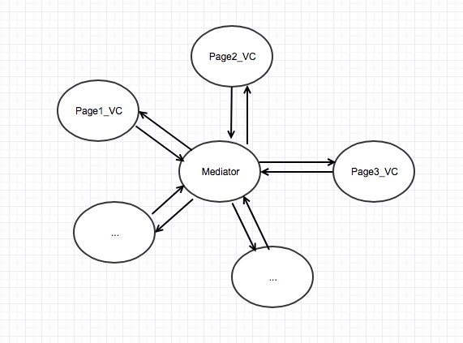

> Theme: 待定 
> Source Code Read Plan:
- [x] [AppLord](https://github.com/NianJi/AppLord)
- [ ] [JLRoute](https://github.com/joeldev/JLRoutes)
- [ ] Block
> Reference Book List:  
- [x] 《THE INNOVATORS》本月看了三分之二
- [x] 《Curious git》
- [ ] 《Git教程（廖雪峰）》

# 2018/05/01
[我是一个“栈”](https://www.itcodemonkey.com/article/3033.html)

数据结构入门新手文，阐述数组、链表、队列和栈的概念，主要用比喻拟人的手法描述，对于入门文章来说非常不错，但对于想深入理解的依旧从“枯燥”的理论学习。

# 2018/05/03
[冰霜的iOS 组件化 —— 路由设计思路分析](https://www.jianshu.com/p/76da56b3bd55) 是一篇不错的入门文章，由web端的路由对照iOS端的路由表，然后介绍了`JLRoutes`、`routable-ios`、`HHRouter `、`MGJRouter`以及`CTMediator`，实现方式大同小异，总之值得反复阅读。

> 关于何为路由，作为一个初学者，我理解的是应用程序处于某个页面（VC控制器）时，页面上会绑定各种跳转行为（简单有模态弹出、navigation的push入栈等），举个简单的例子：点击按钮弹出一个详情页面，我们会先实例化一个详情页面的VC，然后调用`self.present`方法，此时当前视图控制器文件要`#import`详情页面的VC头文件。

我觉得上述所有这些都是为了**解决问题**而应运而生，那么从做一个需求开始讲起：

### 1.接手一个新需求
当需求给定时，页面的跳转行为十有八九就决定了，比如这个按钮跳转到页面1，另外一个控件触发跳转页面2，and so on。所以这个视图控制器要`#import`所有跳转的视图控制器类的头文件。

**问题1：** 页面的跳转行为硬编码，能否在当前页面跳转任意视图页面？

**答1:**  正如上面所说的，需求决定时，页面上的跳转行为实际已经决定，但是有一天后台说某个按钮的跳转页面由他回传字段决定，比如传过来字段是”KLine“，那么就跳转到K线页面，如果传过来字段是”Fenshi“，那么就跳转到分时页面，如果.... 此时你就会`switch-case`实现一个简单的映射表。但是想跳转到任意视图的页面... 似乎你的 `switch-case` 会撑爆你VC。

**问题2：** 当前VC关联了太多VC类的头文件，维护太吃力。

**答2：** 从正常使用来说无可厚非，解决方法可以借助 runtime 的反射，因为应用程序一开始就加载了所有类对象和元类对象，我们可以调用 `NSClassFromString()`来得到 Class，然后调用 `alloc init` 方法实例化一个`UIViewController`返回，这样我们的VC就不需要`#import`所有的关联类，解耦完毕！但是整个VC充斥的 runtime 的气息真的好吗？

### 2.中间者
为了代码友好，我们希望把所有实例化视图控制器的代码都移到一个类中：

```objective-c
//Mediator.m 文件
#import "Page1_VC.h"
#import "Page2_VC.h"

@implementation Mediator
// 页面1实例化行为
+ (UIViewController *)Page1_VC:(NSString *)param{
 return [Page1_VC viewController:param];
}

// 页面2实例化行为
+ (UIViewController *)Page2_VC:(NSString *)param1 param2:(NSInteger)param2 {
 return [Page2_VC viewController:param1 param2:param2];
}
@end
```

如果当前页面想要跳转到其他页面，调用如下，先导入`#import "Mediator.h"`

```objective-c
// 想要在 Page3_VC 中跳转，先导入中间者
#import "Mediator.h"
#import "Page3_VC.h" // 当前视图控制器的头文件

@implementation Page3_VC
- (void)gotoPage1  {
  // 获取参数 在下面注入
  // ...
  // 跳转
 UIViewController *page1 = [Mediator Page1_VC:params];
 [self.navigationController pushViewController:page1];
}

- (void)gotoPage2 {
  // 获取参数 在下面注入
  // ...
  // 跳转
  UIViewController *page2 = [Mediator Page2_VC:param1 param2:param2];
  [self.navigationController pushViewController:page2];
}
@end
```
现在问题在于 Mediator.h 依赖了所有视图控制器头文件。而每个视图控制器又导入了`#import "Mediator.h"`，依赖关系如下：



随着映射越来越多，中间件会难以维护，所以我们开始借助runtime来实例化对象，只需要知道类名就可以：

```objective-c
//Mediator.m 文件
#import "Mediator.h"

@implementation Mediator
// 页面1实例化行为
+ (UIViewController *)Page1_VC:(NSString *)param{
  Class cls = NSClassFromString(@"Page1_VC");
  return [cls performSelector:NSSelectorFromString(@"viewController:") withObject:@{@"param":param}];
}

// 页面2实例化行为
+ (UIViewController *)Page2_VC:(NSString *)param1 param2:(NSInteger)param2 {
  Class cls = NSClassFromString(@"Page2_VC");
  return [cls performSelector:NSSelectorFromString(@"viewController:") withObject:@{@"param":param,@"param2":param2}];
}
@end
```
类对象 `performSelector`，runtime 底层就是给类对象发送 `viewController` 消息，类对象会先取 isa 指针得到元类对象，然后在元类对象中找类方法`viewController`。

> 这里有个问题：参数传递！`performSelector` 的局限性，所以借助了字典。

此时 `Mediator.h` 对象就可以删掉所有`#import xxVC.h` 了，轻松。


### 3.其他方案
大部分的Route方案都是借助了runtime的进行解耦，如果把 runtime 也看做一个中间对象，那么依赖链如下： 

```
Page1_VC  ┐
Page2_VC  ┤
Page3_VC  ┤--> Mediator -> Runtime
...       ┤ 
PageN_VC  ┘
```

所有VC依赖 Mediator， 而 Mediator 依赖Runtime，整一个单项依赖。之后的优化这套方案，可以参考 casa 的做法，借助 category 来业务分类，避免集中把调用接口写在 Mediator.m 一个文件中，后面还是借助`target-action 简化写法`。

而蘑菇街的做法采用注册表的方式，Key=URL，Value=处理闭包，比如在闭包中实现实例化一个VC，然后返回`UIViewController *`，调用呢就是使用`open:withParams`方法

```objective-c
//Mediator.m 中间件
@implementation Mediator
typedef void (^componentBlock) (id param);
@property (nonatomic, storng) NSMutableDictionary *cache
- (void)registerURLPattern:(NSString *)urlPattern toHandler:(componentBlock)blk {
 [cache setObject:blk forKey:urlPattern];
}

- (void)openURL:(NSString *)url withParam:(id)param {
 componentBlock blk = [cache objectForKey:url];
 if (blk) blk(param);
}
@end
```

引出问题：难道我们要集中在Mediator文件中对每个组件都进行`register`？那么势必要导入所有依赖VC的头文件。所以这样不行。

那么我们规定每个组件必须统一要有一个 `+initComponent` 类方法进行组件注册不就ok了吗，问题是谁来 call 这个方法？估摸就是搞一份配置文件，然后在`didFinishLaunch`方法中读取了组件类信息，然后还是调用runtime进行注册。

关于蘑菇街的`protocol-class`还没有看。另外关于大神们一直诟病于蘑菇街的本地调用和远程调用混用，也暂时不太理解。

# 2018/05/06
[A curious tale](https://matthew-brett.github.io/curious-git/curious_journey.html)

git 实现原理比喻版本，通俗易懂。其实从大学写论文我们就已经在接触版本管理了。XX论文初稿->XX论文修订版->XX论文完整版->XX论文终极版->XX论文终极无敌版...

文章分为了11小节，主要讲述了 `workspace`工作区、为什么要有`commit`、`checkout`该命令的设计目的、为何要引入 `stage` 区等方面。

### Gitwards 1: make regular snapshots
未引入版本管理之前，我们就在一份work上进行修改，添加，删除等操作，但这些都是不可逆的，一旦发现之前的才是正确的，需要我们回想然后再次修改。因此一旦我们认为此次修改是一次里程碑，那么就会把工作目录下的文件移动到另外一个文件夹，命名成 snapshotX。ps：其实应该大部分写过论文都会这么干过吧。

### Gitwards 2: reminding yourself of what you did
为了记起每次提交的信息，我们会添加一个 `message.txt` 文件记录提交者、日期以及描述

### Gitwards 3: breaking up work into chunks
由于每个人的工作习惯不同，导致有些人喜欢一次性在工作区进行多个不同方面的改动，然后作为一次提交命名成一个snapshot，如果我们想要分功能依次提交，该怎么做？

这时候就要引入 staging 区，它其实就是作为每次提交的内容文件夹，我们一旦认为工作区的修改可以作为下一次提交，就把它们add到staging区，一旦提交，staging区就打包成一个新的snapshot。

### Gitwards 4: getting files from previous commits
从之前版本中获取文件，即 checkout 操作，一旦检出某个文件，就是把那个snapshot中的文件替换掉工作区的相同文件，此时肯定有改动，但是你想要提交，那么按照add到stage区后commit下就ok了。

### Gitwards 5: two people working at the same time
阐述 git branch 和 git merge 的操作

### Gitwards 6: how should you name your commit directories
但是在多人合作的情况下回出现命名文件，所以我们寻求一个唯一identifier，即hash操作，easy get hard reverse。此时只是用hash值重命名snapshotN文件夹以及文件内的message.txt文件，至于其他的都未改动

### Gitwards 7: naming commits from hashes
现在所有的snapshot都以hash命名，导致从阅读性上不太人性化，首当其冲就是我们无法得知提交的顺序，之前还可以从文件命名获取序号1、2、3...

为此我们在message.txt中新记录 parent field，即上一次的提交hash，如果是merge则会是两个。

### Gitwards 8: the development history is a graph
### Gitwards 9: saving space with file hashes
### Gitwards 10: making the commits unique
### Gitwards 11: away with the snapshot directories
8-11总结：以上面的方式进行版本管理，内存问题是我们需要优化，毕竟每次都会重新copy一份，迟早会爆掉。
注意到其实每次提交我们并非修改全部文件，有些文件压根都没动过，但是它们还是会被重新copy多次。

为此我们会新建一个 repo 目录，每个文件就是一个object存在，计算它的hash值，然后以hash值命名放到repo下，如果这个文件修改过，那么重新计算hash，此时作为一个新的object（命名自然也是新hash）放到repo目录下，这么做的好处在于减少无谓的内存开销。

至于我们怎么知道某次snapshot中囊括的文件版本，我们可以新加一个directory.txt文件，里面记录此次提交的文件名称对应的hash，这样每次恢复的时候就会从repo下去拿了，而message中我们新加一条 directory: directory.txt的hash记录。

# 2018/05/08
[git-from-the-inside-out](https://codewords.recurse.com/issues/two/git-from-the-inside-out)，配合[A curious tale](https://matthew-brett.github.io/curious-git/curious_journey.html)简直就是神作。

补了下 git 基础知识

# 2018/05/09
关于Bridge桥接模式、Adapter适配器模式和Facade外观模式的简单理解：

> 接口是现有设计好的，只能用**适配器模式**去包裹源接口，开放适配接口调用; 而桥接模式是在一切都未设计之前，将抽象和实现分离，这样讲其实很抽象。


上面是桥接模式的一种展示，桥接最重要区分 **事物对象** 和 **行为或特征**，红色框出的方法就是桥 “**Bridge**”，这座桥连接了不同的实例对象，而这些对象是具体实现行为。Note: 这座桥的定义是抽象的，Java 中的 Interface，OC中的 Protocol，左侧输入端必须传入一个遵循 IBridge 的对象，内部调用实现类的接口方法，对外开放了另外一组接口方法——method1和method2。

> Client 就是事物对象，这里有两种分支：一、先定义一个Client的抽象类（Abstract Class 而非接口），具体类继承并实现抽象方法：method1和method2，重点来了，不同的client子类可能间接调用外部传入的 Imp类，但是不同子类具体实现视情况不同；二、可能没有抽象类，直接定义一个具体的类，有一个设置 “桥”的方法，对外开放一组接口。

 [Gang of Four](https://en.wikipedia.org/wiki/Design_Patterns) 定义的桥接模式应该是方式一，而方式二我认为是一种变种，简化。

Demo:
```Objective-c
/** "Implementor" */
interface DrawingAPI {
    public void drawCircle(final double x, final double y, final double radius);
}

/** "ConcreteImplementor"  1/2 */
class DrawingAPI1 implements DrawingAPI {
    public void drawCircle(final double x, final double y, final double radius) {
        System.out.printf("API1.circle at %f:%f radius %f\n", x, y, radius);
    }
}

/** "ConcreteImplementor" 2/2 */
class DrawingAPI2 implements DrawingAPI {
    public void drawCircle(final double x, final double y, final double radius) {
        System.out.printf("API2.circle at %f:%f radius %f\n", x, y, radius);
    }
}

/** "Abstraction" */
abstract class Shape {
    protected DrawingAPI drawingAPI;

    protected Shape(final DrawingAPI drawingAPI){
        this.drawingAPI = drawingAPI;
    }

    public abstract void draw();                                 // low-level
    public abstract void resizeByPercentage(final double pct);   // high-level
}

/** "Refined Abstraction" */
class CircleShape extends Shape {
    private double x, y, radius;
    public CircleShape(final double x, final double y, final double radius, final DrawingAPI drawingAPI) {
        super(drawingAPI);
        this.x = x;  this.y = y;  this.radius = radius;
    }

    // low-level i.e. Implementation specific
    public void draw() {
        drawingAPI.drawCircle(x, y, radius);
    }
    // high-level i.e. Abstraction specific
    public void resizeByPercentage(final double pct) {
        radius *= (1.0 + pct/100.0);
    }
}

/** "Client" */
class BridgePattern {
    public static void main(final String[] args) {
        Shape[] shapes = new Shape[] {
            new CircleShape(1, 2, 3, new DrawingAPI1()),
            new CircleShape(5, 7, 11, new DrawingAPI2())
        };

        for (Shape shape : shapes) {
            shape.resizeByPercentage(2.5);
            shape.draw();
        }
    }
}
```

这里`CircleShape`就是 Client，桥接口是遵循 `DrawingAPI` 接口的对象，开辟了 `draw` 和 `resizeByPercentage` 方法供外部使用，而其中`draw`又间接调用传入对象的 drawCircle 方法。

而 `class BridgePattern` 的main方法中就是在调用 `Shape` 开放的接口`resizeByPercentage` 和 `draw` 方法

> 这么看来，上面说的抽象和具体实现分离就很清楚了。

而外观模式不过是二次封装接口，使得 API 接口更加友好罢了。


# 2018/05/10
[AppLord](https://github.com/NianJi/AppLord)

### 关于 AppLord 模块注册方式的理解
关于路由、模块的信息收集，常规操作就是**集中**在某个地方(比如 AppDelegate 的 `didFinishLaunchingWithOptions` 方法)`register`注册所有模块，比如：

```objective-c
// pseudo 伪代码
ModuleShareInstance.register("ClassName1");
ModuleShareInstance.register("ClassName2");
ModuleShareInstance.register("ClassName3");
ModuleShareInstance.register("ClassName4");
...
```
这种做法优点是集中注册，缺点是`didFinishLaunchingWithOptions`会随着模块增加而行数增加,最后你会看到一长排拉不到底的注册方法列表。因此有人会搞一个配置文件`Module.conf`，里面定义模块名称和对应的模块类名，以及其他一些信息。现在`didFinishLaunchingWithOptions`只需要从本地读取就可以了。

> 上述两种方式注册行为和模块关系分离了 —— 我们可能更希望在模块各自地方进行注册。

那么如何在模块各自的底盘注册自己呢？

```
//.h文件
@interface Module : NSObject 
// 属性和方法声明
@end

//.m文件
@implementation Module

@end

```

1. 模块 `+ (void)load` 或 `+ (void)initial`方法中进行 `ModuleSharedInstance.register` 操作。**存在的问题：**一、加载时序？二、要知道所有模块都调用load方法会导致启动时间延长；
2. 宏定义 or 全局变量？ 待研究，关键还是注册的时机和代码放置位置。
3. 在引入AppLord中用的方式，就是引入section段，其实我们可以在模块各自的文件定义`__attribute__((used, section(".mySection"))) char *moduleName="XXXXXX"`，之后会把所有这些定义加载到 `mySection` 段中。

> 其实大家熟知的就是代码段，数据段，BSS段（Block Started by Symbol）等，其实我们编码的代码最后加载到内存中都成为01，但是为了更好的区分和工作，我们进行了内存分类，比如这块区域是数据段，那块区域是代码段（就是放置指令，毕竟任何语言最后都是机器码），这里也是这样，我们自己开辟了一个内存段叫做mySection，定义的内容会在ld的时候移动到这个段中。之后我们可以从这个段中读取出来。

// 从段中读取module信息的定义
```objective-c
NSArray<NSString *>* AppLordReadConfigFromSection(const char *sectionName){
    
#ifndef __LP64__
    const struct mach_header *mhp = NULL;
#else
    const struct mach_header_64 *mhp = NULL;
#endif
    
    NSMutableArray *configs = [NSMutableArray array];
    Dl_info info;
    if (mhp == NULL) {
        dladdr(AppLordReadConfigFromSection, &info);
#ifndef __LP64__
        mhp = (struct mach_header*)info.dli_fbase;
#else
        mhp = (struct mach_header_64*)info.dli_fbase;
#endif
    }
    
#ifndef __LP64__
    unsigned long size = 0;
    uint32_t *memory = (uint32_t*)getsectiondata(mhp, SEG_DATA, sectionName, & size);
#else /* defined(__LP64__) */
    unsigned long size = 0;
    uint64_t *memory = (uint64_t*)getsectiondata(mhp, SEG_DATA, sectionName, & size);
#endif /* defined(__LP64__) */
    
    for(int idx = 0; idx < size/sizeof(void*); ++idx){
        char *string = (char*)memory[idx];
        
        NSString *str = [NSString stringWithUTF8String:string];
        if(!str)continue;
        
        if(str) [configs addObject:str];
    }
    
    return configs;
}
```
其实上述做法蛮有意思的，脱离了常规的注册，虽然我们在不同的文件里进行`__attribute__((used, section(".mySection"))) char *moduleName="XXXXXX"` 的声明，但实际它们都写入到指定的段中，然后统一在读出来。

上面的代码需要一定编译基础知识，建议阅读《程序员的自我修养》一书。

# 2018/05/11
[深入理解RunLoop](https://link.jianshu.com/?t=http://blog.ibireme.com/2015/05/18/runloop/)

[关于Runloop的原理探究及基本使用](https://www.jianshu.com/p/911549ae4bf8)

[Threading Programming Guide](https://developer.apple.com/library/content/documentation/Cocoa/Conceptual/Multithreading/RunLoopManagement/RunLoopManagement.html#//apple_ref/doc/uid/10000057i-CH16-SW23)

RunLoop 目前理解为 `do{}while(1)` ，起到线程保活的作用。iOS 我们大部分时间只和主线程打交道，一些关于异步操作，我们会使用封装好的 GCD来实现，所以避免和线程相关的工作接触，比如开辟线程（fork）、保活、接收事件（system level的或者是进程间通信等）。

RunLoop是一个对象，没有问题，设计思路大概是通过配置（Mode和Mode中的ModeItem）来实例化一个RunLoop对象，实际上我们无法自己创建，而是通过 `CFRunLoopGetCurrent` 来获取，这步操作其实很简单，调用这行代码必定在某个线程中，有个线程id，那么全局存了一个字典，key=线程id，value=runloop实例，有点懒加载的意思，有则直接取缓存，没有则创建一份并且存储到cache中。

重点来了：RunLoop 有个实例方法叫做 `CFRunLoopRunInMode` 方法，方法实现就是`do{}while(1)`的形式。就像这样：

```
void CFRunLoopRun(void) { 
    int32_t result;
    do {
        result = CFRunLoopRunSpecific(CFRunLoopGetCurrent(), kCFRunLoopDefaultMode, 1.0e10, false);
        CHECK_FOR_FORK();
    } while (kCFRunLoopRunStopped != result && kCFRunLoopRunFinished != result);
}
```

所以开辟的子线程执行一段实例化runloop对象，然后runInMode的代码，那么代码实际上就一直无休止的运行在那里了，线程永远不会结束。当然线程并非一直处于100%工作状态，满足条件就会退出，或者休眠。

> 为何要保活一个线程，这么做有什么好处？如果一项工作很耗时，我们会开辟一个线程然后放到后台去执行，一旦执行完毕，线程就会销毁退出；而这项工作可能同时有多个会到来需要我们执行，为此我们会开辟对应个数的线程分别执行，假设10个，20个甚至100个？开一百个线程，想想都觉得可怕，所以我们希望专门有个线程做这件事，维护一个队列，设定优先级，即使同样的工作，可能考虑到时效性我们只进行最后一项，而之前的就摒弃掉。

接着讨论如何添加一项工作到线程中，即如何让`do{ // block 代码块 }while(1)` 中的 block 代码中执行我们随时加入的任务呢？

其实需要我们预先定义，比如block中有段代码逻辑是从某个全局队列pop一项工作执行，没有则休眠。而主线程如果想要在这个线程中添加工作项，只需要往这个队列加任务就可以了。

就现在而言，对Runloop理解不深，源码也没怎么看过。上述是我的浅显理解，可能有不对之处，尽请谅解。

# 2018/05/12 - 2018/05/17
这段时间学习[RunLoop源码](https://github.com/apple/swift-corelibs-foundation)，同时写点源码[阅读笔记](https://github.com/colourful987/2018-Read-Record/blob/master/Content/iOS/RunLoop/RunLoop源码解析.md)，其实网上已经有很多剖析深入的RunLoop博文，但是仍有一些知识点没有谈及，这也是我要学习和记录的。

[每天进步一点点——Linux中的线程局部存储（一）](https://blog.csdn.net/cywosp/article/details/26469435)

# 2018/05/20

更新[RunLoop源码阅读笔记](https://github.com/colourful987/2018-Read-Record/blob/master/Content/iOS/RunLoop/RunLoop源码解析.md)

封装好的 RunLoop 调用：
`CFRunLoopRun -> CFRunLoopRunSpecific(默认运行kCFRunLoopDefaultMode模式) -> __CFRunLoopRun(一套具体的处理流程)` 其中 `do{}while(ret)`执行主体代码块就是 `CFRunLoopRunSpecific`，这个函数就是处理流程。

当然如果想要一开始就运行在某个模式下，调用 `SInt32 CFRunLoopRunInMode(CFStringRef modeName, CFTimeInterval seconds, Boolean returnAfterSourceHandled)` 接口，不过呢，最终本质还是调用`CFRunLoopRunSpecific`。

另外对于 [`volatile`](https://en.wikipedia.org/wiki/Volatile_variable) 关键字，一旦一个共享变量用 `volatile` 修饰，那么就具备了两层语义：

1. 保证了不同线程对这个变量进行操作时的可见性，即一个线程修改了某个变量的值，这新值对其他线程来说是立即可见的。
2. 禁止进行指令重排序。

其他参考文章：
* [详解C中volatile关键字](https://www.cnblogs.com/yc_sunniwell/archive/2010/06/24/1764231.html)
* [你真的了解volatile关键字吗？](http://www.importnew.com/24082.html)

# 2018/05/24 - 2018/06/08
* [swissland Honeymoon]()，瑞士的风景真的是无可挑剔，生活节奏巨慢，从 Luzern 到 Lungern， Gridewald ，Spiez，上几座山（ps：只知道 Jungfrau...），参观几座 museum，风景看到审美疲劳。。。当然也感受了 Geneva 和 Zurich 大城市的魅力。不过最享受的是住在 Gridelwald 小镇的一家 Hotel 里，下午5、6点钟坐在 Hotel 阳台面朝几座大山，看着《THE INNOVATORS》，喝着奶茶耗时间的日子，真的很喜欢这份惬意。 反正除了物价无力吐槽以及晚上娱乐几乎为0之外，其他都很赞！ 接下去到努力加倍投入到工作中创造价值了！
* [x] 《THE INNOVATORS》一书看了三分之二