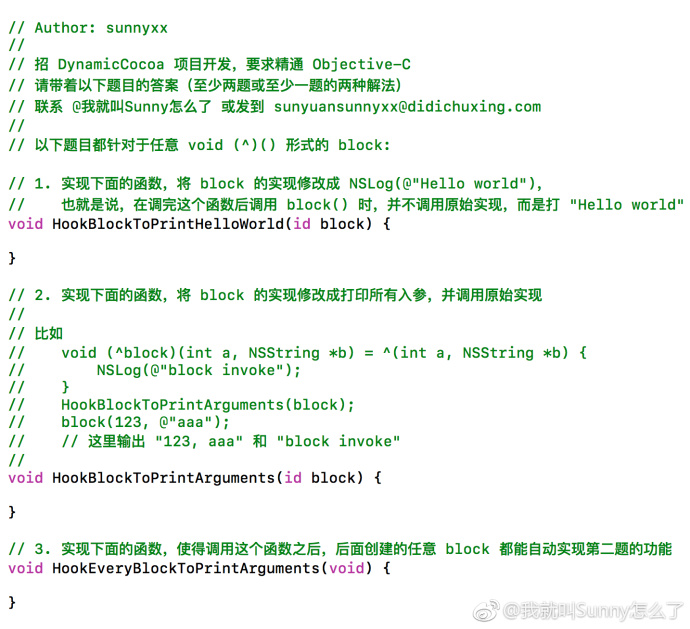
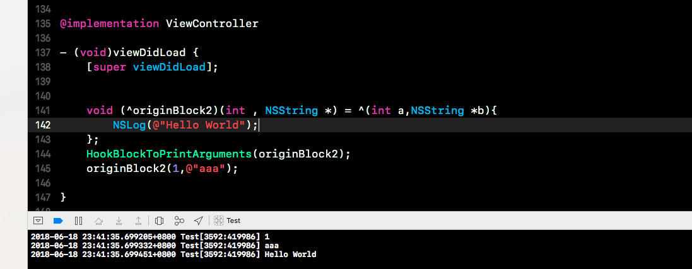
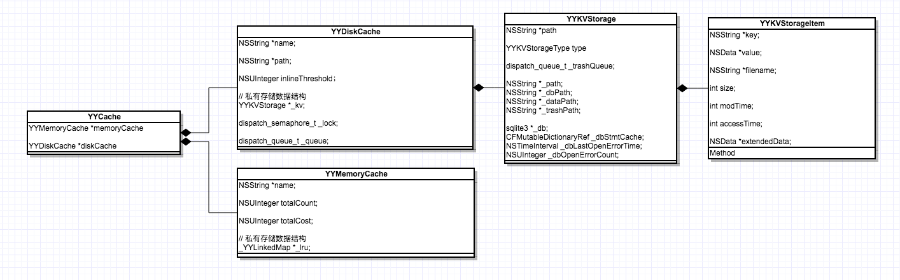
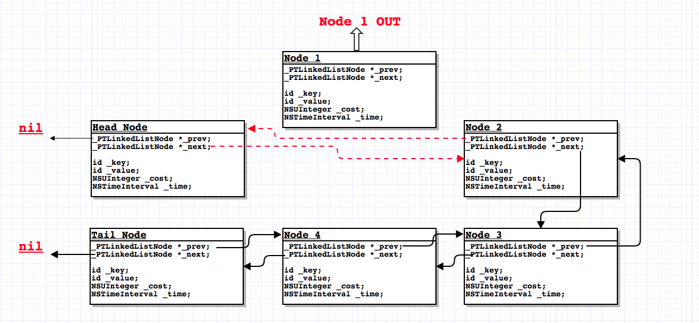

> Theme: 待定 
> Source Code Read Plan:
- [x] [RunLoop 源码]()
- [ ] [JLRoute](https://github.com/joeldev/JLRoutes)
- [x] Block
- [ ] Method Forward
- [ ] GCD 底层libdispatch
- [ ] Aspect 温顾
- [ ] YYModel 温顾
- [x] YYCache
- [ ] SwiftJson
- [ ] SDWebImage
- [x] Communication Between JS and Native 
> Reference Book List:
- [ ] 《Git教程（廖雪峰）》

# 2018/06/13
* [InjectionIII](https://github.com/johnno1962/InjectionIII) iOS 代码注入工具
* [injectionforxcode](https://github.com/johnno1962/injectionforxcode) Xcode 代码注入插件

John Holdsworth 一位56岁，20多年开发经验的牛人！

关于实现原理，简单看了下老峰的 [Injection：iOS热重载背后的黑魔法](https://mp.weixin.qq.com/s/hFnHdOP6pmIwzZck-zXE8g)，对于完整的实现并没有一个系统的了解，之后补上。

# 2018/06/14(LLDB 调试相关)
objc 的[与调试器共舞 - LLDB 的华尔兹](https://www.objccn.io/issue-19-2/)，讲述了如何在 xcode 命令行调试工程，尤其是最后几个实战的例子，我认为是入门的佳作，简单总结下：
1. 常用的像 `print(p)`，`expression(e)` ， 小知识：`print` 实际上是 `expression --` 的缩写；输出格式也可以指定二进制，八进制，十进制或者十六进制或字符，分别对应`p/t`，`p/o`，`p`，`p/x`，`p/c`；
2. `continue，step over，step into，step out`流程控制，简写分别对应 `c`，`n`，`s`，`finish`，小知识：如果一个函数要提前退出，且返回一个值，可以用 `thread return xx`，实时上对于 `c，n，s` 都是 `thread` 命令的缩写； 
3. 关于断点，breakpoint 缩写 br，支持显示断点列表(br li)，断点开启和关闭(br enable，br disable)，断点删除(br delete)等等，个人觉得还是可视化界面直接鼠标点击来的方便
4. 我们知道可以命令行修改视图背景色，宽高等等，但是如何立即生效呢？用 `e (void)[CATransaction flush]` 刷新一次UI； ，不着急记命令，因为后面说到python可以封装一个，然后简写命名；
5. 命令行创建一个视图控制器，然后push or present 它，知识点：所以命令行声明一个变量都是以 `$` 打头的，比如 `int $a = 20`，之后用也是 `$a` 来访问值，指针注意是星号在前，简单来说就是 `$` 总是紧贴变量，例如`int *$a`
6. 观察实例变量比较少用，场景是我们想要只是这个实例变量什么时候被修改，那么我们就要用 `watchpoint set expression -- instanceVarAddress`，关键是怎么计算这个实例变量的地址，我们用实例地址+偏移量得到，偏移量要用runtime的`ivar_getOffset()` 和 `(struct Ivar *)class_getInstanceVariable([MyView class], "_layer")` 
7. 最有意思的是自己在已有的命令上封装，比如刷新页面 `e (void)[CATransaction flush]` 或 push 一个视图，毕竟我们不能每次都手输一长串的代码，我们希望将一系列操作封装成类似函数的东西，然后调用，所以这里要用到 lldb和 python 如何结合实现

看了下官方文档 [LLDB Python Reference](http://lldb.llvm.org/python-reference.html)，大致也了解了用法：

方式一，直接在命令行输入 `script` 先进入 python 的 REPL(Read–eval–print loop)模式：

```
(lldb) script
// 注意 `ModifyString` 是程序中的全局函数
>>> def pofoo_funct(debugger, command, result, internal_dict):
...	cmd = "po [ModifyString(" + command + ") capitalizedString]"
...	lldb.debugger.HandleCommand(cmd)
... 
>>> exit()
(lldb) command script add pofoo -f pofoo_funct 
(lldb) pofoo aString
$1 = 0x000000010010aa00 Hello Worldfoobar
(lldb) pofoo anotherString
$2 = 0x000000010010aba0 Let's Be Friendsfoobar
```

注意`command script add 别名 -f 函数名`，-f 我猜测是function的标识，现在直接可以在Xcode命令终端中输入 pofoo 来愉快的玩耍了

方式二，将命令封装成一个 Module，然后调用 `command script import` 导入，以下是官方提供的例子：

```
#!/usr/bin/python

import lldb
import commands
import optparse
import shlex

def ls(debugger, command, result, internal_dict):
    print >>result, (commands.getoutput('/bin/ls %s' % command))

# And the initialization code to add your commands 
def __lldb_init_module(debugger, internal_dict):
    // 这个函数是官方说第一次加载时候回自动执行
    // 接着就是熟悉的添加命令了，函数定义在上面，ls.ls 是 “文件名.函数名” 命名
    debugger.HandleCommand('command script add -f ls.ls ls')
    print 'The "ls" python command has been installed and is ready for use.'
```

其他方式，如 facebook 的 Chisel 库同样也是以约定好的方式用python对已有命令进行封装，比如 pviews 就是输出整个视图层级。安装这个库相当简单，用brew或者手动下载源文件，然后在用户目录(`~`)下的 `.lldbinit ` 文件写入：

```
command script import /path/to/fblldb.py 
```

没有这个文件也没啥，自己 `touch .lldbinit` 一个然后编译下，写入内容其实很熟悉，就是导入 dblldb.py 这个Module，我们可以看下这个文件的 `__lldb_init_module` 函数：

```
def __lldb_init_module(debugger, dict):
  // 1
  filePath = os.path.realpath(__file__)
  lldbHelperDir = os.path.dirname(filePath)

  commandsDirectory = os.path.join(lldbHelperDir, 'commands')
  // 2
  loadCommandsInDirectory(commandsDirectory)
```

第一步是获取 `dblldb.py` 文件所在地址，然后这个文件目录下有个 `commands` 目录，包含了所有自定义 python 脚本，用 `loadCommandsInDirectory` 加载：

```
def loadCommandsInDirectory(commandsDirectory):
  // 1
  for file in os.listdir(commandsDirectory):
    // 2
    fileName, fileExtension = os.path.splitext(file)
    if fileExtension == '.py':
      // 3
      module = imp.load_source(fileName, os.path.join(commandsDirectory, file))
  
      // 4
      if hasattr(module, 'lldbinit'):
        module.lldbinit()
      
      // 5
      if hasattr(module, 'lldbcommands'):
        module._loadedFunctions = {}
        // 6
        for command in module.lldbcommands():
          loadCommand(module, command, commandsDirectory, fileName, fileExtension)
```

1. 遍历commands 目录下的所有文件；
2. 获取文件名和扩展名，这里只处理 `.py` 脚本
3. 这里导入了 imp 模块，个人认为有点类似runtime机制，可以 `[xx performSelector:]`，而不需要在文件头部导入依赖(`import 某个python脚本名称`)，
4. 判断是否能响应 `lldbinit()` 方法，能则调用；
5. 同理，`module._loadedFunctions` 返回了这个模块下所有的命令
6. 使用 loadCommand 加载，具体实现见下：

```
def loadCommand(module, command, directory, filename, extension):
  func = makeRunCommand(command, os.path.join(directory, filename + extension))
  name = command.name()
  helpText = command.description().strip().splitlines()[0] # first line of description

  key = filename + '_' + name

  module._loadedFunctions[key] = func

  functionName = '__' + key

  // 1
  lldb.debugger.HandleCommand('script ' + functionName + ' = sys.modules[\'' + module.__name__ + '\']._loadedFunctions[\'' + key + '\']')
  // 2
  lldb.debugger.HandleCommand('command script add --help "{help}" --function {function} {name}'.format(
    help=helpText.replace('"', '\\"'), # escape quotes
    function=functionName,
    name=name))
```

上面函数简单理解就是先拼接出一串能在终端执行的命令，接着调用`lldb.debugger.HandleCommand` load 命令到 lldb.debugger，关于代码 2 `command script add --help` 就是把命令添加进来，同时还给出了帮助说明。但是代码 1 输出命令为：

```
script __FBTextInputCommands_settext = sys.modules['FBTextInputCommands']._loadedFunctions['FBTextInputCommands_settext']
script __FBTextInputCommands_setinput = sys.modules['FBTextInputCommands']._loadedFunctions['FBTextInputCommands_setinput']
script __FBDebugCommands_wivar = sys.modules['FBDebugCommands']._loadedFunctions['FBDebugCommands_wivar']
...
```

> sys.modules是一个全局字典，该字典是python启动后就加载在内存中。每当程序员导入新的模块，sys.modules都将记录这些模块。字典sys.modules对于加载模块起到了缓冲的作用。当某个模块第一次导入，字典sys.modules将自动记录该模块。当第二次再导入该模块时，python会直接到字典中查找，从而加快了程序运行的速度。

# 2018/06/15
关于 sunnyxx 出的面试题：



针对第一题，只是替换 Block 的实现为输出 “Hello world”，其实第一反应是替换掉Block内的函数指针就行，但是必须先由一定Block基础知识，知道它的数据结构：

```objective-c
typedef struct _PT_Block {
    __unused Class isa;
    volatile int flags; // contains ref count
    __unused int reserved;
    void (*invoke)(void *, ...); // 这个就是要替换的函数指针
    struct {
        unsigned long int reserved;
        unsigned long int size;
        void (*copy)(void *dst, const void *src);
        void (*dispose)(const void *);
        const char *signature;
        const char *layout;
    } *descriptor;
} *PTBlockRef;
```

然后在 `HookBlockToPrintHelloWorld` 将 Block 中的 invoke 函数指针指向我们的 `printHelloWorld`。

```objective-c
void printHelloWorld(){
    printf("Hello World");
}

void HookBlockToPrintHelloWorld(id block) {
    PTBlockRef layout = (__bridge void *)block;
    void (*hookedFunc)(void *,...) = printHelloWorld;
    layout->invoke = hookedFunc;
}
```

第二题，思路应该是在 `HookBlockToPrintArguments` 同样替换掉实现，然后新的实现会输出参数和再次执行闭包，我一开始是想通过获得第一个入参的栈上地址，然后取偏移量，结果发现貌似和我想的有出路，没法实现。。。。贴下代码：

```objective-c
NSMethodSignature *methodSignature = nil;
// Self 是闭包自己
void printParams(void *Self, ...) {
    
    NSInteger count = methodSignature.numberOfArguments;
    void *ap = ((void *)&Self) + sizeof(Self);
    
    // 遍历block的参数列表 第一个是Self 指向 Block 本身
    for (int index = 1; index < count; index++) {
        const char *argType = [methodSignature getArgumentTypeAtIndex:index];
        int offset = 0;

        if (strcmp(argType, @encode(id)) == 0 || strcmp(argType, @encode(Class)) == 0) {
            NSLog(@"%@",(__bridge id)ap);
            offset = sizeof(id);
        } else if (strcmp(argType, @encode(char)) == 0) {
            NSLog(@"%c",*(char *)ap);
            offset = sizeof(id);
        } else if (strcmp(argType, @encode(int)) == 0) {
            NSLog(@"%d",*(int *)ap);
            offset = sizeof(int);
        } else if (strcmp(argType, @encode(short)) == 0) {
            NSLog(@"%d",*(short *)ap);
            offset = sizeof(short);
        } else if (strcmp(argType, @encode(long)) == 0) {
            NSLog(@"%ld",*(long *)ap);
            offset = sizeof(long);
        } else if (strcmp(argType, @encode(float)) == 0) {
            NSLog(@"%f",*(float *)ap);
            offset = sizeof(float);
        } else if (strcmp(argType, @encode(double)) == 0) {
            NSLog(@"%f",*(double *)ap);
            offset = sizeof(double);
        } else if (strcmp(argType, @encode(BOOL)) == 0) {
            NSLog(@"%d",*(BOOL *)ap);
            offset = sizeof(BOOL);
        } else if (strcmp(argType, @encode(char *)) == 0) {
            NSLog(@"%s",*(char **)ap);
            offset = sizeof(char *);
        }
        ap += offset;
    }
}

void HookBlockToPrintArguments(id block) {
    PTBlockRef layout = (__bridge void *)block;
    void (*hookedFunc)(void *,...) = (void (*)(void *, ...))printParams;

    // 为了获取block参数类型
    const char *_Block_signature(void *);
    const char *signature = _Block_signature((__bridge void *)block);
    
    methodSignature = [NSMethodSignature signatureWithObjCTypes:signature];
    
    layout->invoke = hookedFunc;
}

```

后面我借助c语言的 va_list 试着修改了下 `printParams` 函数：
```

NSMethodSignature *methodSignature = nil;
void (*g_invoke)(void *, ...) = nil;
// Self 是闭包自己
void printParams(void *Self, ...) {
    
    NSInteger count = methodSignature.numberOfArguments;
    void *ap = ((void *)&Self) + sizeof(Self);
    va_list va;
    va_start(va, Self);
    
    // 遍历block的参数列表 第一个是Self 指向 Block 本身
    for (int index = 1; index < count; index++) {
        const char *argType = [methodSignature getArgumentTypeAtIndex:index];
        int offset = 0;

        if (strcmp(argType, @encode(id)) == 0 || strcmp(argType, @encode(Class)) == 0) {
            void *args = va_arg(va, void *);
            NSLog(@"%@",args);
        } else if (argType[0] == '@') {
            void *args = va_arg(va, void *);
            NSLog(@"%@",args);
        } else if (strcmp(argType, @encode(char)) == 0) {
            char args = va_arg(va, char);
            NSLog(@"%c",args);
        } else if (strcmp(argType, @encode(int)) == 0) {
            int args = va_arg(va, int);
            NSLog(@"%d",args);
        } else if (strcmp(argType, @encode(short)) == 0) {
            short args = va_arg(va, short);
            NSLog(@"%d",args);
        } else if (strcmp(argType, @encode(long)) == 0) {
            long args = va_arg(va, long);
            NSLog(@"%d",args);
        } else if (strcmp(argType, @encode(float)) == 0) {
            float args = va_arg(va, float);
            NSLog(@"%f",args);
        } else if (strcmp(argType, @encode(double)) == 0) {
            double args = va_arg(va, double);
            NSLog(@"%f",args);
        } else if (strcmp(argType, @encode(BOOL)) == 0) {
            BOOL args = va_arg(va, BOOL);
            NSLog(@"%d",args);
        } else if (strcmp(argType, @encode(char *)) == 0) {
            char *args = va_arg(va, char *);
            NSLog(@"%x",args);
        }
        ap += offset;
    }
    
    va_end(va);
    
    g_invoke(Self);
}

void HookBlockToPrintHelloWorld(id block) {
    PTBlockRef layout = (__bridge void *)block;
    void (*hookedFunc)(void *,...) = printParams;

    layout->invoke = hookedFunc;
}


void HookBlockToPrintArguments(id block) {
    PTBlockRef layout = (__bridge void *)block;
    void (*hookedFunc)(void *,...) = (void (*)(void *, ...))printParams;

    // 为了获取block参数类型
    const char *_Block_signature(void *);
    const char *signature = _Block_signature((__bridge void *)block);
    
    methodSignature = [NSMethodSignature signatureWithObjCTypes:signature];
    g_invoke = layout->invoke;
    layout->invoke = hookedFunc;
}

- (void)viewDidLoad {
    [super viewDidLoad];
    
    
    void (^originBlock2)(int , NSString *) = ^(int a,NSString *b){
        NSLog(@"Hello World");
    };
    HookBlockToPrintArguments(originBlock2);
    originBlock2(1,@"aaa");

}
```

输出：



这样就可以正常输出闭包参数了，但是感觉哪里怪怪的。

# 2018/06/19
上面代码中 `_Block_signature` 实际上runtime中是 export 出来的方法，但是因为是 `_block_private.h`，意味着是私有的API，但是又因为它是全局export，所以你只要先声明就可以调用了，获取block的签名
```objective-c
const char *_Block_signature(void *);
const char *signature = _Block_signature((__bridge void *)block);
```

如果不能用私有API，我们可以用如下方式实现，即用 block 结构体中的 signature 参照 Aspect 的源码取block的签名（其实就是获取结构体中的 descriptor）：

```
static NSMethodSignature *aspect_blockMethodSignature(id block, NSError **error) {
    AspectBlockRef layout = (__bridge void *)block;
	if (!(layout->flags & AspectBlockFlagsHasSignature)) {
        NSString *description = [NSString stringWithFormat:@"The block %@ doesn't contain a type signature.", block];
        AspectError(AspectErrorMissingBlockSignature, description);
        return nil;
    }
	void *desc = layout->descriptor;
	desc += 2 * sizeof(unsigned long int);
	if (layout->flags & AspectBlockFlagsHasCopyDisposeHelpers) {
		desc += 2 * sizeof(void *);
    }
	if (!desc) {
        NSString *description = [NSString stringWithFormat:@"The block %@ doesn't has a type signature.", block];
        AspectError(AspectErrorMissingBlockSignature, description);
        return nil;
    }
	const char *signature = (*(const char **)desc);
	return [NSMethodSignature signatureWithObjCTypes:signature];
}

static id invokeBlock(id block ,NSArray *arguments) {
    if (block == nil) return nil;
    id target = [block copy];
    
    NSMethodSignature *methodSignature =aspect_blockMethodSignature(block,nil);
    NSInvocation *invocation = [NSInvocation invocationWithMethodSignature:methodSignature];
    invocation.target = target;
    
    // invocation 有1个隐藏参数，所以 argument 从1开始
    if ([arguments isKindOfClass:[NSArray class]]) {
        NSInteger count = MIN(arguments.count, methodSignature.numberOfArguments - 1);
        for (int i = 0; i < count; i++) {
            const char *type = [methodSignature getArgumentTypeAtIndex:1 + i];
            NSString *typeStr = [NSString stringWithUTF8String:type];
            if ([typeStr containsString:@"\""]) { 
                type = [typeStr substringToIndex:1].UTF8String;
            }
            
            // 需要做参数类型判断然后解析成对应类型，这里默认所有参数均为OC对象
            if (strcmp(type, "@") == 0) {
                id argument = arguments[i];
                [invocation setArgument:&argument atIndex:1 + i];
            }
        }
    }
    
    [invocation invoke];
    
    id returnVal;
    const char *type = methodSignature.methodReturnType;
    NSString *returnType = [NSString stringWithUTF8String:type];
    if ([returnType containsString:@"\""]) {
        type = [returnType substringToIndex:1].UTF8String;
    }
    if (strcmp(type, "@") == 0) {
        [invocation getReturnValue:&returnVal];
    }
    // 需要做返回类型判断。比如返回值为常量需要包装成对象，这里仅以最简单的`@`为例
    return returnVal;
}
```

上面遇到了 signature 返回的描述，如果是 NSString *，返回的是 "@\NSString\". 

invocation.target 设成了闭包，我猜测内部会判断target类型，如果是闭包，就执行调用里面的函数指针，然后传入参数值，至于怎么变参注入比较疑惑。

# 2018/06/20

完善 [RunLoop源码解析](https://github.com/colourful987/2018-Read-Record/blob/master/Content/iOS/RunLoop/RunLoop源码解析.md) 一文。

# 2018/06/21 - 2018/06/22

日常开发中对导航栏 navigationItem 的 leftBarButtonItem 和 rightBarButtonItem 修改频繁，试想我们在同一个 navigationController push 多个视图控制器，而每个视图控制器又对自定义导航栏样式，要知道 navigationController 的 childViewControllers 共享同一个导航栏视图，所以鬼知道什么时候上一个视图控制器对导航栏的修改会影响到其他视图控制器导航栏的显示。

> 回归问题的本质，我们想要什么？1. 自定义每个视图控制器顶部一块视图区域(“导航栏”)的样式 2. 视图控制器自定义样式不会影响到其他视图控制器的修改 3.视图控制器转场要类似 navigationController push pop那种。

针对上面提出的，我们可以自定义顶部视图控件，不过感觉成本太高；第二点只要一个视图控制器各自管理一个顶部视图控件，完美解决互相影响的问题；第三点自定义转场动画，还是成本太高的问题。。。

我们可以在已有的 navigationController 上做文章，比如第二点每个视图控制器管理顶部视图控件，我们可以用 `UINavigationController` 有且仅包裹一个 ViewController，调用 `[[UINavigationController alloc] initWithRootViewController:]`，这样被封装的视图控制器“独有”一个顶部导航栏修改的权益，调用 `self.navigationController` 和 `self.navigationItem.leftBarButtonItem` 就能对顶部做修改啦。

现在问题来了，关于第三点，UINavigationController 无法 push 一个 UINavigationController 的，只能是 UIViewController！

> Any problem  in computer science can be solved by anther layer of indirection.

因此我们为上面封装了 ViewController 的 NavigationController 在封装一层

```
// WrappedViewController.m 示意代码
- (void)viewDidLoad {
    [super viewDidLoad];
    UIViewController *yourController = [UIViewController new];
    UINavigationController *nav = [[UINavigationController alloc] initWithRootViewController:yourController]；
    
    [self addChildViewController:nav];
    [self.view addSubView:nav.view];
    [nav didMoveToParentViewController:self]; // ? 是否要加这句话
}
```

代码理解：首先 nav 本身就是一个视图控制器，现在作为 `WrappedViewController` 子控制器罢了，nav 的view 就是它 childViewControllers 堆栈中唯一的视图控制器的view————也就是我们的业务视图控制器。

现在我们可以愉快的用根视图控制器(同样是一个 NavigationControlle) 去 push 一个又一个的 `WrappedViewController` 了。

从调用上来看是非常不友好的，原因很简单，触发push的地方我们都需要依赖 `WrappedViewController` 类，maybe我们可以用 `[[WrappedViewController alloc] initWithVC:YourCustomViewController]`封装好，然后调用 `[self.navigationController pushViewController:wrappedVC animated:YES]` push 我们想要的视图控制器。

这部分代码可以抽象成一个方法：

```objc
- (void)pushViewController:(UIViewController *)vc {
  WrappedViewController * wrapped = [[WrappedViewController alloc] initWithVC:vc];
  [self.navigationController pushViewController:wrappedVC animated:YES];
}
```

这个方法我们可以放到一个基类 ViewController 中提供服务，然后所有的业务VC必须继承这个基类ViewController，在push的地方我们调用 `[self pushViewController:YourCustomViewController]`;

还有一个方法是在 `self.navigationController` 上做文章，我们可以继承 UINavigationController 自定义一个 Nav，然后重写 `pushViewController:animated: ` 方法，实现如上。

但是前提要保证，每个业务视图控制器的 navigationController 要统一为自定义Nav，这里可以在 `WrappedViewController` 类中进行封装，修改如下：

```objc
// WrappedViewController.m 示意代码

- (instancetype)initWithVC:(UIViewController *)vc {
  self = [super init];
  
  if(self) {
    self.yourController =  vc;
  }
  
  return self;
}

- (void)viewDidLoad {
    [super viewDidLoad];

    YourNavigationController *nav = [[YourNavigationController alloc] initWithRootViewController:self.yourController]；
    
    [self addChildViewController:nav];
    [self.view addSubView:nav.view];
    [nav didMoveToParentViewController:self]; 
}
```

> 上面应该考虑生命周期的问题。

最后只剩下对 Window RootViewController 的设计考虑了

```
- (BOOL)application:(UIApplication *)application didFinishLaunchingWithOptions:(NSDictionary *)launchOptions {
    
    // 创建Keywindow
    UIWindow *window = [UIWindow new];
    window.frame = [UIScreen mainScreen].bounds;
    [window makeKeyAndVisible];
    self.window = window;

    // 创建导航控制器
    WrappedViewController *wrappedRootView = [WrappedViewController alloc] initWithRootViewController:[FirtstViewController new]];
    UINavigationViewController *rootNav = [[UINavigationController alloc] initWithRootViewController:wrappedRootView];
    
    // 创建标签控制器
    UITabBarController *tab = [UITabBarController new];
    // 为标签控制器添加一个Item
    tab.viewControllers = @[rootNav];
    UITabBarItem *item = [[UITabBarItem alloc] initWithTabBarSystemItem:UITabBarSystemItemFavorites tag:0];
    rootNav.tabBarItem = item;
    
    // 设置window的根控制器为标签控制器
    self.window.rootViewController = tab;
    
    return YES;
}
```

之后 `FirtstViewController` 视图控制器发生的 `push` 跳转都会调用 `[self.navigationController pushViewController:vc animated:YES];`接口，要知道 FirstViewController 是被封装了一层，`self.navigationController` 是我们的自定义navigationController，要知道我们重写了push接口：

```
- (void)pushViewController:(UIViewController *)viewController animated:(BOOL)animated {
    if (self.navigationController) {
        WrappedViewController *wrapperViewController = [[WrappedViewController alloc] initWithRootViewController:viewController];
        // 1
        [self.navigationController pushViewController:wrapperViewController animated:animated];
        return;
    }
    [super pushViewController:viewController animated:animated];
}
```

注意我们这里居然还调用了 `self.navigationController`，实际上这个 nav 是最外层的导航栏控制器。

# 2018/06/24
iOS 缓存策略简单来说就是先读内存(因为速度最快，但内存大小有限)，内存没有数据读本地，本地读取的同时存入内存中，本地还没有可能就需要网络请求远端数据。

[YYCache](https://github.com/colourful987/YYCache) 支持本地和sqlite3存储，支持内存读取。代码量不大，目前读了部分源码，以下是 UML 类图：



# 2018/06/25
YYCache MemoryCache 内存管理基于 LRU 算法(least-recently-used），数据结构为链表，实现机制也很简单：最新需要缓存的数据推入链表的头部(head)，随着一个个数据加入，始终保持最新数据在链表的第一个，而旧数据已经沉入底部（tail），如果旧数据最近又重用过，把它bring到头部，设定一个 throttle value（阈值），达到这个值时释放旧数据（从链条尾部开始删起）

LRU 和 MRU 算法基于链表，但是涉及旧对象重用时要求我们去从head寻起到tail，但是每次这样效率太低，所以这里使用了 dict+链表，dict 存的是所有 node 的指针，这样key-value存取值复杂度为O(1)，每个Node 记录prev和next指向下一个节点。而 `_YYLinkedMap` 会记录 `_YYLinkedMapNode *_head` 和 `_YYLinkedMapNode *_tail`。

# 2018/06/27
如果让我们来实现一个缓存库，先理顺思路然后罗列出库需要解决的问题：Cache ≠ 持久化存储
1. 首先缓存就是数据交换的缓冲区，将使用频繁的数据存入缓存中，等下次读取数据时，首先从缓存中获取，获取不到再根据情况去获取(可以请求服务端)；
2. 其次缓存的数据存于内存中，并不能无限往内存中“塞”数据以备后续使用，因此达到一定内存大小或者缓存个数条件时，我们需要清理缓存数据，将最不常用的剔除出去；
3. 内存中的缓存数据掉电后就会“消散”，为此我们可能还需要在本地存储数据。

比如我们要实现一个 PTCache 缓存类，必定要有 save-read 缓存数据的 API：

```objc
- (id<NSCoding>)objectForKey:(NSString *)key { }
- (void)setObject:(id<NSCoding>)object forKey:(NSString *)key {}
```

而 PTCache 内部实际上会有一个 PTMemoryCache 和 PTDiskCache 对象，前者用于缓存数据到内存，后者用于将数据存入本地，而本地存储的方式可以是 file ，也可以是 sqlite3 数据库。

前面讨论过读取缓存的数据，先从内存中读，若没有找到则从 Disk 读取，同时写入内存中，因此实现如下：

```objc
- (id<NSCoding>)objectForKey:(NSString *)key {
    // 先从memory读取 有就直接返回 否则从disk读取，同时缓存到memory中
    id<NSCoding> object = [_memoryCache objectForKey:key];
    if (!object) {
        object = [_diskCache objectForKey:key];
        if (object) {
            [_memoryCache setObject:object forKey:key];
        }
    }
    return object;
}

- (void)setObject:(id<NSCoding>)object forKey:(NSString *)key {
    // 本地总是会存一份 保持本地和内存总是相同
    [_memoryCache setObject:object forKey:key];
    [_diskCache setObject:object forKey:key];
}
```

memoryCache 的实现 lru 算法(least recently used)，那么就要自己封装一个链表 `_PTLinkedList`，单个缓存对象都用一个 `_PTLinkedListNode` 实例表示，和 C 语言链表节点差不多：

```objc
@interface _PTLinkedListNode : NSObject {
    @package
    __unsafe_unretained _PTLinkedListNode *_prev;
    __unsafe_unretained _PTLinkedListNode *_next;
    id _key;
    id _value;
    NSUInteger _cost;
    NSTimeInterval _time;
}
@end

@implementation _PTLinkedListNode

@end
```


现在我们的 lru 应该设计哪些 API 接口：

```objc
@interface _PTLinkedList : NSObject {
    @package
    CFMutableDictionaryRef _dic;
    NSUInteger _totalCost;
    NSUInteger _totalCount;
    _PTLinkedListNode *_head;
    _PTLinkedListNode *_tail;
}

- (void)insertNodeAtHead:(_PTLinkedListNode *)node;

- (void)bringNodeToHead:(_PTLinkedListNode *)node;

- (void)removeNode:(_PTLinkedListNode *)node;

- (_PTLinkedListNode *)removeTailNode;

- (void)removeAll;
@end
```

* `insertNodeAtHead` ： 新的缓存对象会插入到链表的头部；
* `bringNodeToHead` ： 如果要插入的对象已经存在链表中，只需要把对象从链表中间移动到头部更新即可；
* `removeNode` 和 `removeTailNode` 简单的移除缓存对象；

实现如下：

```objc
- (instancetype)init {
    self = [super init];
    if (self) {
        _dic = CFDictionaryCreateMutable(CFAllocatorGetDefault(), 0, &kCFTypeDictionaryKeyCallBacks, &kCFTypeDictionaryValueCallBacks);
    }
    return self;
}

- (void)dealloc {
    CFRelease(_dic);
}

- (void)insertNodeAtHead:(_PTLinkedListNode *)node {
    // 字典作为 cache 中存储所有的节点
    CFDictionarySetValue(_dic, (__bridge const void *)(node->_key), (__bridge const void *)(node));
    _totalCost += node->_cost;
    _totalCount++;
    if (_head) {
        node->_next = _head;
        _head->_prev = node;
        _head = node;
    } else {
        _head = _tail = node;
    }
}

- (void)bringNodeToHead:(_PTLinkedListNode *)node {
    if (_head == node) {
        return;
    }
    
    if (_tail == node) {
        _tail = _tail->_prev;
        _tail->_next = nil;
    } else {
        node->_next->_prev = node->_prev;
        node->_prev->_next = node->_next;
    }
    node->_next = _head;
    node->_prev = nil;
    _head->_prev = node;
    _head = node;
}

- (void)removeNode:(_PTLinkedListNode *)node {
    CFDictionaryRemoveValue(_dic, (__bridge const void *)(node->_key));
    _totalCost -= node->_cost;
    _totalCount--;
    if (node->_next) {
        node->_next->_prev = node->_prev;
        node->_prev->_next = node->_next;
    }
    
    if (_head == node) {
        _head = node->_next;
    }
    
    if (_tail == node) {
        _tail = node->_prev;
    }
}

- (_PTLinkedListNode *)removeTailNode {
    if (!_tail) {
        return nil;
    }
    
    // 先保存最后一个节点
    _PTLinkedListNode *tail = _tail;
    CFDictionaryRemoveValue(_dic, (__bridge const void *)(_tail->_key));
    _totalCost -= _tail->_cost;
    _totalCount --;
    if (_head == _tail) {
        _head = _tail = nil;
    } else {
        _tail = _tail->_prev;
        _tail->_next = nil;
    }
    return tail;
}
```

`_PTLinkedListNode` 真正存储在一个字典 `_dic` 实例中，这样做是为了提高查询某个节点是否存在于链表中效率，时间复杂度为O(1)。

下面图片展示 `insertNodeAtHead` 、`bringNodeToHead` 等操作的图解：



# 2018/06/30

js native 交互目前了解四种，也是网上教程中最多的：

1. 拦截 UIWebview(WKWebview) 的请求URL，比如首次加载页面的时候，或者点击某个按钮发生页面跳转，或发送数据请求，本质其实就是UIWebview发送所有的请求前，会询问delegate是否允许load，方法为 `- (BOOL)webView:(UIWebView *)webView shouldStartLoadWithRequest:(NSURLRequest *)request navigationType:(UIWebViewNavigationType)navigationTyp` 
2. JavaScriptCore，相当于苹果提供了一个通讯中间者，客户端原生端的实现一个遵循 `JSExport` 协议的对象，从字面理解就是暴露(Export)给web端的接口，在 UIWebView 加载完成后把这个对象注入到网页中，我猜测JavaScriptCore会把oc的对象映射到 js 代码，然后生成 js 类，变量等，这样网页端就可以用和客户端约定好的 key 取到值来调用客户端接口了；
3. WKScriptMessageHandler 还没细看
4. WebViewJavascriptBridge 是第三方库，实现本质其实也是拦截请求 URL，However，网页页面行为部分并非请求，而是普通的点击弹个对话框之类的行为。而网页端调用客户端显然不是http或https请求，所以不会触发webview的代理方法，因此 WebViewJavascriptBridge 非常提供了一种方法巧妙的方法，就是网页端调用 `callHandler(objcNativeMethodName, callBackBlock)`，这个 js 方法内部会封装该调用为 `https://__id_message__` 类似这种，然后参数context字典会带上方法名字，消息唯一标示，但是**回调可传不过！**，为此，网页端自己会搞个字典存储回调，key为id。这么做是基于客户端可以直接调用网页端js代码，客户端执行完方法后，调用js代码告诉网页端我执行完了，结果和`callback_id`告诉你网页端，你自己从网页端的字典存储中取到刚才的回调方法

上面就是简单的理解，之后进一步学习：

* [ ] JavaScriptCore 实现原理，热更新如何做到？
* [ ] WebViewJavascriptBridge 实现写博文；
* [ ] WKWebview 之后是趋势，简单研究下使用
