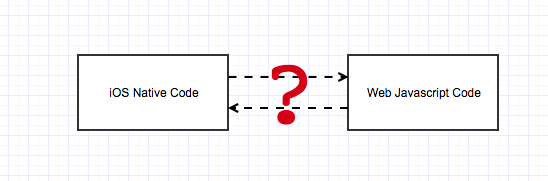
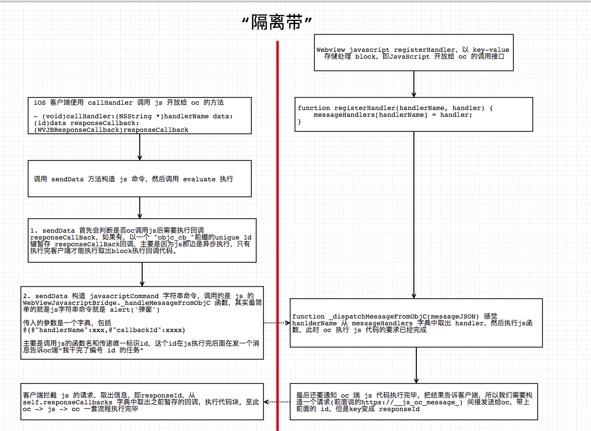

> Theme: JS Native Communication
> Source Code Read Plan:
> - [x] JavaScriptCore 实现原理，热更新如何做到？
> - [x] WebViewJavascriptBridge 实现写博文；
> - [ ] WKWebview 之后是趋势，简单研究下使用
> - [ ] [JLRoute](https://github.com/joeldev/JLRoutes)
> - [ ] Method Forward
> - [ ] GCD 底层libdispatch
> - [ ] Aspect 温顾
> - [ ] YYModel 温顾
> - [ ] SwiftJson
> - [ ] SDWebImage

> Reference Book List:
- [ ] 《Git教程（廖雪峰）》

# 2018/07/01
【温习】KIZBehavior 设计思路：严格意义上来说，这并非是一个第三方库，而是提供解决问题的思路（设计模式），日常编码中我们会遇到产品提出的各种需求，比如这个textfield输入框限制10个字符、navigationBar的透明度随底部的 scrollview 滚动而变化、背景ImageView随 scrollview 滚动差速平移，这些和业务无关，所以我们通常会将其封装成一个对象，称之为 behavior，behavior 会和多个对象挂钩，同时也会“监听”某些Events， Behavior 属性声明所有关联的对象，内部实现来根据 Events 处理事务。

例如：
```
@interface MyBehavior : KIZBehavior
@property(nonatomic, weak)id object1;
@property(nonatomic, weak)id object2;
@property(nonatomic, weak)id object3;
//..声明所有关联对象，这里应该用 weak?
@end
```

`KIZMultipleProxyBehavior` 起到了Proxy中转消息派发的作用：

```

- (BOOL)respondsToSelector:(SEL)aSelector{
    if ([super respondsToSelector:aSelector]) {
        return YES;
    }
    for (id target in self.weakRefTargets) {
        if ([target respondsToSelector:aSelector]) {
            return YES;
        }
    }
    
    return NO;
}

- (NSMethodSignature *)methodSignatureForSelector:(SEL)aSelector{
    NSMethodSignature *sig = [super methodSignatureForSelector:aSelector];
    if (!sig) {
        for (id target in self.weakRefTargets) {
            if ((sig = [target methodSignatureForSelector:aSelector])) {
                break;
            }
        }
    }
    
    return sig;
}

//转发方法调用给所有delegate
- (void)forwardInvocation:(NSInvocation *)anInvocation{
    for (id target in self.weakRefTargets) {
        if ([target respondsToSelector:anInvocation.selector]) {
            [anInvocation invokeWithTarget:target];
        }
    }
}
```

Multi delegate message dispatch 设计要点在于message可能各式各样，某个消息可能只能让 delegates 中的一个或多个对象响应。

`KIZBehavior` 中的 owner，可设可不设，只是有时候为了取到对象而已，需要强转。

# 2018/07/03

iOS 客户端使用 Objective-c 语言，而 Web 端用到了 html 标记语言和 javascript 脚本语言，前者和页面样式相关，后者则是给页面添加交互行为，现在的问题是两者之间如何交互，如下图所示：



oc代码和js代码通常如下定义：

```
// oc 代码
@interface OBJCObject:NSObject
- (void)print;
@end

@implementation OBJCObject
- (void)print {
  NSLog(@"objc print object");
}
@end

// script 代码
<script type="text/javascript">
function display_alert()
  {
  alert("I am an alert box!!")
  }
</script>
```

* 网页中如何点击一个按钮调用 OBJCObject 的 print 方法；
* oc 如何调用 js 代码中的 `display_alert` 方法；

### oc 调用 js 代码
oc 并非直接调用 js 代码，而是调用 UIWebview 和 WKWebview 类开放的接口：

```
// UIWebview
- (nullable NSString *)stringByEvaluatingJavaScriptFromString:(NSString *)script;

// WKWebview
- (void)evaluateJavaScript:(NSString *)javaScriptString completionHandler:(void (^ _Nullable)(_Nullable id, NSError * _Nullable error))completionHandler;
```

可以看到 oc 调用 js 代码非常简单，只需要将js命令转成字符串作为参数传给 evaluate 函数即可，所不同的是 WKWebview 还提供 js 执行完毕后的回调 block。

> 相对来说， oc 调用 js 的方式简单易懂，实现原理可能是动态往网页源码中注入 js 代码，构建调用已有的 js API接口。

### js 调用 oc 代码

js 同样并不能够直接调用 oc 代码，同时也没有开放类似 evaluateOC 这样的接口给 js 调用，这意味着 js 无法单向调用 oc 了吗？

实际上 webview 的 delegate 方法中有：

```
// UIWebview
- (void)webView:(WebView *)webView decidePolicyForNavigationAction:(NSDictionary *)actionInformation request:(NSURLRequest *)request frame:(WebFrame *)frame decisionListener:(id<WebPolicyDecisionListener>)listener

// WKWebview
- (void)webView:(WKWebView *)webView decidePolicyForNavigationAction:(WKNavigationAction *)navigationAction decisionHandler:(void (^)(WKNavigationActionPolicy))decisionHandler;
```

即网页端每发起一次请求，webview 都会拦截这个请求，由客户端决定是否真的发起一次请求，还是客户端拦截并做一些处理。

而 js 调用 oc 代码就需要在这里做文章了。不过 js 调用 oc 代码并非是一个 http 请求！所以我们需要将其封装成一个请求（比如我们约定是 `https://__js_call_oc__`），然后带上js调用oc的方法名称以及参数，这样就会触发 `decidePolicyForNavigationAction` 代理方法，然后客户端在此处拦截请求，判断这个请求是否为 `https://__js_call_oc__`，如果**是**则表示这次请求是 js 想要调用 oc 接口。 

```
- (void)webView:(WebView *)webView decidePolicyForNavigationAction:(NSDictionary *)actionInformation request:(NSURLRequest *)request frame:(WebFrame *)frame decisionListener:(id<WebPolicyDecisionListener>)listener {
    if (webView != _webView) { return; }
    
    NSURL *url = [request URL];
    
    if ([_base isWebViewJavascriptBridgeURL:url]) {
        if ([_base isQueueMessageURL:url]) {
            // 1. 判断是否为 js 调用 oc 接口的消息
            NSString *messageQueueString = [self _evaluateJavascript:[_base webViewJavascriptFetchQueyCommand]];
            [_base flushMessageQueue:messageQueueString];
        } else {
            [_base logUnkownMessage:url];
        }
        [listener ignore];
    } 
}
```

代码注释 1 判断是否为 js 调用 oc 接口的消息，其实这里只能接收到请求链接，但是无法得知接口名称，maybe 可以 `https://__js_call_oc__?api=methodName`，我觉得简单的应该是可以适用的，但是如果webview积累了多条消息，这样就不合适了，所以客户端只需要 `[_base webViewJavascriptFetchQueyCommand]` 用 oc 调用 js 那一套(evaluate)来获取当前页面中缓存的所有调用消息，然后 `flushMessageQueue` 让客户端执行原生代码。

注意我们传递过来也不过是 methodName ，如何调用指定实例的指定方法呢？首先这么想就不符合设计原则，js怎么能随便调用任意实例的任意方法呢？起码要有限制啊，比如类自己开放几个接口供js调用，这样就要用到注册(register)了：

```
- (void)registerHandler:(NSString *)handlerName handler:(WVJBHandler)handler {
    _base.messageHandlers[handlerName] = [handler copy];
}
```

内部实现也很简单，字典作为存储容器，key=方法名称，value=block，其中方法名称是客户端和js端约定好的，我们在 `- (void)webView:(WebView *)webView decidePolicyForNavigationAction:(NSDictionary *)actionInformation request:(NSURLRequest *)request frame:(WebFrame *)frame decisionListener:(id<WebPolicyDecisionListener>)listener` 拦截请求，如果是我们协议的请求，再通过oc调用js接口获取 `messageQueueString` ，此时获取到js想要调用oc的接口名称，我们从字典中拿到block，然后 `block()` 执行客户端代码。

因此，客户端必定有 `@property (strong, nonatomic) NSMutableDictionary* messageHandlers;` 字典类型变量来存储 block。

如果只是js->oc接口就此结束，那么上述实现方式就ok了，但是有些场景是 js 调用 oc ，oc 执行完毕，回调 js 告诉执行结果。

此处回调 js 告诉执行结果设计思路很简单，首先js一方先暂存callback，key 用一个 unique id，`[_base webViewJavascriptFetchQueyCommand]` 中我们即获取到方法名称，又获取到参数，此处传过来这个unique id

```
NSString* responseId = message[@"responseId"];
if (responseId) {
    WVJBResponseCallback responseCallback = _responseCallbacks[responseId];
    responseCallback(message[@"responseData"]);
    [self.responseCallbacks removeObjectForKey:responseId];
} else {
    WVJBResponseCallback responseCallback = NULL;
    NSString* callbackId = message[@"callbackId"];
    if (callbackId) {
        responseCallback = ^(id responseData) {
            if (responseData == nil) {
                responseData = [NSNull null];
            }
            
            WVJBMessage* msg = @{ @"responseId":callbackId, @"responseData":responseData };
            // 1
            [self _queueMessage:msg];
        };
    } else {
        responseCallback = ^(id ignoreResponseData) {
            // Do nothing
        };
    }
    
    WVJBHandler handler = self.messageHandlers[message[@"handlerName"]];
    
    if (!handler) {
        NSLog(@"WVJBNoHandlerException, No handler for message from JS: %@", message);
        continue;
    }
    
    handler(message[@"data"], responseCallback);
}

// 而一般我们注册是如下：
[_bridge registerHandler:@"testObjcCallback" handler:^(id data, WVJBResponseCallback responseCallback) {
    NSLog(@"testObjcCallback called: %@", data);
    // 注意这一行
    responseCallback(@"Response from testObjcCallback");
}];
```

注意responseCallback我们构造的代码块中 `[self _queueMessage:msg]` 就是oc 告诉 js 这个unique id。

2018/07/04 新增oc->js图：



知识点主要两点：
* 客户端和js都有 messageHandlers 和 responseCallbacks 字典，以 iOS 客户端为例，前者是oc端开放给js的接口，需要业务方往 UIWebView和 WKWebview 中注册，调用 registerHandler 方法；后者存储客户端调用js方法后的回调block，调用 callHandler 方法，ps：换句话说就是oc告诉js执行一个js方法，js执行完了，通知oc结果，oc对结果再做一些处理。
* 客户端调用js基于 webview 的 `stringByEvaluatingJavaScriptFromString` 方法；而 js 调用 oc 方法，是将任何页面的 action 都构造成一个 https:// 请求（构造一个iframe http element，设置它的src即可），oc客户端拦截解析分发处理接口。

# 2018/07/07
推荐 Mr_Wei 的 iOS 土味讲义：

* [iOS土味儿讲义（一）--一个Button引发的血案](https://juejin.im/post/5a951a1c6fb9a0633f0e471e)
* [iOS土味儿讲义（二）--弹窗的前世今生](https://juejin.im/post/5ab360d66fb9a028d14101e7)

展示了很多 runtime 的应用场景，当然并非真正应用到实际需求中，但是我觉得这种提供了很好的思路。“弹窗”一文解决方式个人顾虑影响范围，推荐自己单独搞一个 UIWindow 司职显示弹窗，同样是队列管理弹窗 present 顺序，设定不同弹窗的 level 等等特性

# 2018/07/09
[Video Streaming Tutorial for iOS: Getting Started](https://www.raywenderlich.com/188867/video-streaming-tutorial-for-ios-getting-started)

语音视频播放的基础入门文章，值得推荐，初始项目已经搭建完毕，只需要跟着文章填充关键代码即可，每一步都会介绍基础知识，最后完成基于 AVFoundation 的视频播放Demo。


主要文章介绍两种：一、使用系统封装好的 AVPlayerViewController，我们只需要依赖注入一个 player 就可以播放视频了；二，自定义播放控件。

1. UI 方面，必定要有显示层，就是 AVPlayerLayer，当然我们一开始想到的可能是 UIView，实际UIView只是 Layer的代理，真正负责渲染的是 Layer，这里 AVPlayerLayer 会负责把一帧一帧的内容显示出来。我们如果要自定义一个播放器视图View，只需要明确自身持有的 layer 的 Class，如下：
  ```objc
  class VideoPlayerView: UIView {
    // 重写了基类的 layerClass 这样实例化一个 UIView 的同时实例化一个 layerClass 的图层
    override class var layerClass: AnyClass {
      return AVPlayerLayer.self
    }
    
    var playerLayer: AVPlayerLayer {
      return layer as! AVPlayerLayer
    }
  }
  ```

2. 接着从实际考虑，AVPlayerLayer 图层显示内容来源播放器，因此必定要关联一个 player 为其源源不断的输出一帧帧的画面，所以图层会绑定一个 player 播放器实例：
  ```objc
  var player: AVPlayer? {
    get {
      return playerLayer.player
    }
  
    set {
      playerLayer.player = newValue
    }
  }
  ```

3. 那播放器从何而来，播放必定要有资源吧，本地的视频？或者远端的视频？ 因此从设计角度来说，player 播放的单个内容我们封装成一个 AVPlayerItem，上面说的，然后对资源再细分一层 `AVAsset` 抽象不可变类，接触多的是 `AVURLAsset` 子类：

  ```objc
  let asset = AVURLAsset(url: video.url)
  let item = AVPlayerItem(asset: asset)
  
  // 这里展示把播放item “换碟” 给队列 player 中
  player.insert(item, after: player.items().last)
  ```

4. 至于播放器的控制，其实就是 play 和 pause 两个方法，其他属性包括音量(volume)，播放速度(rate)等等

> 总结步骤：先要有 `AVAsset` 资源(e.g.传一个url链接进去) --->  然后以此基础实例化一个 `AVPlayerItem` ----> 然后依赖注入到一个播放器实例 player 中，就好比放碟到 DVD 中 ---> 而 player 和硬件的屏幕是绑定的，player 输出一帧又一帧的画面传递给屏幕显示，这里屏幕就是我们的 AVPlayerLayer


# 2018/07/10

[Operation and OperationQueue Tutorial in Swift](https://www.raywenderlich.com/190008/operation-and-operationqueue-tutorial-in-swift)

GCD VS. Operation 

* GCD ，Grand Center Of Dispatch，轻量级支持多线程任务执行的方式之一，我们仅需要传入一个代码块 block，明确表示在哪个队列中(主队列【串行】、四个全局调度队列【并发】、自定义队列【串行or并发】)执行，你不需要自己创建子线程，不需要手动去触发这个代码块。GCD 会非常智能地从不同队列中取出任务然后调用，至于某些队列中的任务，GCD 需要创建新的线程，或者直接在已有的线程中执行，视情况而定，再说说GCD的缺点，依赖关系不好控制，cancel和suspend block又会增加额外工作；
* Operation 是基于 GCD 上构建的，但是相对于GCD 稍微设置工作量多点，但是我们可以轻松在Operation间设定依赖关系，以及执行取消或挂起操作。

本文也算是入门好文，简单说下 Operation 的使用当做记忆：

```
 // 首先构建操作队列
 lazy var downloadQueue: OperationQueue = {
    var queue = OperationQueue()
    queue.name = "Download queue"
    queue.maxConcurrentOperationCount = 1
    return queue
  }()
```
队列中的操作无非就是add和remove，队列元素是 Operation，这是个抽象类，我们自定义的话就需要继承它：
```
class ImageDownloader: Operation {
  //1
  let photoRecord: PhotoRecord
  
  //2
  init(_ photoRecord: PhotoRecord) {
    self.photoRecord = photoRecord
  }
  
  //3
  override func main() {
    //4
    if isCancelled {
      return
    }

    //5
    guard let imageData = try? Data(contentsOf: photoRecord.url) else { return }
    
    //6
    if isCancelled {
      return
    }
    
    //7
    if !imageData.isEmpty {
      photoRecord.image = UIImage(data:imageData)
      photoRecord.state = .downloaded
    } else {
      photoRecord.state = .failed
      photoRecord.image = UIImage(named: "Failed")
    }
  }
}
```

OperationQueue 队列中添加 Operation

```
// 貌似会执行
pendingOperations.filtrationQueue.addOperation(filterer)
```

挂起：

```
pendingOperations.downloadQueue.isSuspended = false
```

添加依赖：

```
// MyDownloadOperation is a subclass of Operation
let downloadOperation = MyDownloadOperation()
// MyFilterOperation  is a subclass of Operation
let filterOperation = MyFilterOperation()

filterOperation.addDependency(downloadOperation)

```
为 Operation 添加 completionBlock:

```
downloader.completionBlock = {
    if downloader.isCancelled{return}
    
    DispatchQueue.main.async {
        self.pendingOperations.downloadsInProcess.removeValue(forKey: indexPath)
        self.tableView.reloadRows(at: [indexPath], with: .fade)
    }
}
```

# 2018/07/12

在 Swift 中使用马尔可夫链生成文本 [Friday Q&A 2018-04-27: Generating Text With Markov Chains in Swift](https://www.mikeash.com/pyblog/friday-qa-2018-04-27-generating-text-with-markov-chains-in-swift.html)

说实话看完本文我还不知道马尔科夫链是什么东西，但是文章提供了以链表方式存储词和词之间的关系，然后随机生成一条语句。

链表中的Node结构一般定义如下：

```
// C 数据结构
typedef struct Node {
  void *content;
  Node *next；
}Node;

// swift 数据结构
Class Node {
  var content;
  var next:Node;
}
```

以我们说到的单词为例，比如 "You are great, You are the best one, one of you maybe have chance to talk with Liangjie"。这里的"You","are" 都是一个个单词，封装成 Word 类；

```
class Word {
   let str: String?
   var links: [Word] = []
}
```

Node 内容变量 str 类型为 String，存储诸如 "You","are" 单词，至于links为什么是个数组，请见上面句中 “you” 和 “are” ，“you” 和 “maybe” 从某种角度来说是上下文关联的，所以 “You” 作为主单词，关联词可以有很多个，随着更多句子导入分析，我们会得到更多和单词 “you” 结合的单词，当然样本越多，我们就知道哪些单词和 “you” 的关联更频繁，这就是词频。

至于随机语句是怎么生成的，从 links 中随机取一个单词和 str 结合就可以。然后再从这个单词的 links 中再随机选一个。至于可靠性，还是得靠样本，比如样本中多次出现 ”you are“ 这种结合，那么 Word “you” 的links中 “are” 会出现很多次，比如`["are","are","are","maybe","are","are","are","get"]`，随机里面选一个，显然取到 "are" 的概率高很多。

```
class Word {
    let str:String?
    var links:[Word] = []
    
    init(str:String?) {
        self.str = str
    }
    
    func randomNext()->Word {
        let index =  arc4random_uniform(UInt32(links.count))
        return links[Int(index)]
    }
}


class Chain {
    var words:[String?:Word] = [:]
    deinit {
        for word in words.values {
            word.links = []
        }
    }
   
    func add(_ words:[String]) {
        if words.isEmpty {
            return
        }
        let words = words as [String?]
        
        let wordPairs = zip([nil] + words, words + [nil])
        
        for (first, second) in wordPairs {
            let firstWord = word(first)
            let secondWord = word(second)
            
            firstWord.links.append(secondWord)
        }
    }
    
    func word(_ str: String?) -> Word {
        if let word = words[str] {
            return word
        } else {
            let word = Word(str: str)
            words[str] = word
            return word
        }
    }
    
    func generate() -> [String] {
        var result: [String] = []
        
        while true {
            let currentWord = word(result.last)
            
            let nextWord = currentWord.randomNext()
            
            if let str = nextWord.str {
                result.append(str)
            } else {
                break
            }
        }
        return result
    }
}

extension Optional: Hashable where Wrapped: Hashable {
    public var hashValue: Int {
        switch self {
        case let wrapped?: return wrapped.hashValue
        case .none: return 42
        }
    }
}
```

# 2018/07/16

[Debugging with C-Reduce](https://www.mikeash.com/pyblog/friday-qa-2018-06-29-debugging-with-c-reduce.html)调试 xcodeproj 感觉还是个问题 毕竟编译需要一定时间，另外文中给出的脚本也不太明确，不好实践，不过还是蛮有意思的，总结来说这个工具就是平常我们遇到bug或者崩溃，将手动一行行删代码这种操作转为自动化脚本来跑。

# 2018/07/17
[Creating a Framework for iOS](https://www.raywenderlich.com/192939/creating-a-framework-for-ios) raywenderlich 出品，制作自定义控件的framework，并打成 cocoaPods 发布到github上，这篇文章能学习到的知识点：

## 1. 学习 Swift 的 Access Control 
总共有5个类别：

* open 和 public 定义的 entity 允许被所有作用域（包括当前模块内文件或是其他模块文件）访问；
* internal 作用范围仅限在 entity 所定义的模块内部，其他模块文件无法访问。ps：默认 Access Control Level 为 Internal；
* fileprivate 作用范围为当前文件，因此一个文件内定义多个类，某个类标记为 fileprivate 之后，当前模块内的其他文件无法访问这个类，而当前文件内定义的其他类可以访问；
* private 只允许当前作用域访问。

open 只能应用于类和类成员，与 public 的不同之处在于:

* public 以及其他 more restrictive 访问级别只能在定义的模块内被继承；
* public 以及其他 more restrictive 访问级别只能在定义的模块内被重写；
* open 则既可以在定义的模块或是其他模块内被继承或重写。

## 2. Xcode 中创建 Framework 的流程

这个很简单，就是New里面选择 iOS->Framework&Library->Cocoa Touch Framework，然后把源码拉进去就好了

## 3. @IBInspectable 和 @IBDesignable 修饰符

@IBInspectable 修饰我们的视图Class，Storyboard 会实时渲染代码呈现到 XIB 中。

@IBDesignable 修改一些参数，这样在 Storyboard 的属性设置列表中出现参数配置项。

// 某些情况下 我们还需要重写如下方法，如果重写了 drawRect 方法，可能下面的方法就不需要了
```
public override func prepareForInterfaceBuilder() {
  super.prepareForInterfaceBuilder()

  renderer.updateBounds(bounds)
}
```

## 4. 学习如何使用 CocoaPods 将framework打包成一个pod

首先调用 `pod spec create KnobControl` 命令为我们库创建一个 `.podspec` meta说明文件，内容如下：
```
s.name         = "KnobControl"
s.version      = "1.0.0"
s.summary      = "A knob control like the UISlider, but in a circular form."
s.description  = "The knob control is a completely customizable widget that can be used in any iOS app. It also plays a little victory fanfare."
s.homepage     = "http://raywenderlich.com"
```

这个文件和我们的工程是在同一个目录下的。

pod 是package manager，采用的是 xcworkspace 方式，因此对于一开始是 xcodeproj 工程的项目，我们需要将其初始化为 xcworkspace，转换很简单，只需要一行命令，在主工程目录下调用 `pod init`，此时会生成一个 Podfile 文件，这个文件就是描述当前工程以及，用到的所有第三方库(Pod)的描述：

```
platform :ios, '12.0'

target 'KnobShowcase' do
  use_frameworks!

  pod 'KnobControl', :path => '../KnobControl'

end

# Workaround for Cocoapods issue #7606
post_install do |installer|
    installer.pods_project.build_configurations.each do |config|
        config.build_settings.delete('CODE_SIGNING_ALLOWED')
        config.build_settings.delete('CODE_SIGNING_REQUIRED')
    end
end
```

注意path这一栏，既可以是本地相对路径，也可以是remote远程的。

接着我们会调用 pod install 来安装Podfile涉及的所有库，所谓安装，应该就是将我们的主工程和所有第三方库建立依赖。


## 5. 发布我们的Pod到Github 上

这个很简单，只需要在 Github 上 new 一个 repo，然后把我们framework推上去，一定要包含podspec文件，这个是重中之重，描述了我们的库的所有信息，比如名称，支持版本，支持的平台等等信息。

紧接着，podspec中的version要和我们tag保持一致，我们必须要为这个库大一个tag，因为别人用我们的库肯定是稳定的，也就是tags中取一个版本。

最后我们工程中的 `pod 'KnobControl', :path => '../KnobControl'` 改成远程地址就搞定了。

# 2018/07/18
[Basic UIView Animation Tutorial: Getting Started](https://www.raywenderlich.com/193707/basic-uiview-animation-tutorial-getting-started) 动画入门初级教学文章，就目前来说学习价值不大，但是对初学者来说是入门好文，一步步完成一个打虫子的游戏，涉及的动画也是UIView 自带的。

# 2018/07/19

[深入浅出 JavaScriptCore](http://www.cocoachina.com/ios/20170720/19958.html)

本篇文章对 JavaScriptCode 简单介绍，Objective-C和JavaScript两者互相调用，核心借助 JSContext ，它就像是 iOS客户端(Objective-C) 和 网页前端(JavaScript) 两者的共享数据池，两边都可以往里面注入数据，Objective-C和 JavaScript 类型映射关系如下：

```
nil         |   undefined
NSNull      |   null
NSString    |   string
NSNumber    |   number,boolean
NSDictionary |  Object object
NSArray     |   Array object
NSDate     |    Date object
NSBlock     | Function object
id          | Wrapper object
Class       | Constructor object
```

总的来说推荐本文来入门 JavaScriptCore，但是美中不足的是“深入”并未到源码层次。

最后JavaScriptCore交互可以是 JSContext 注入Block 或其他数据，也可以直接让OC对象遵循 `JSExport` 协议的扩展项，比如：

```
@protocol MyPointExports <JSExport>
@property double x
@property double y

- (NSString *)description

+ (MyPoint *)makePointWithX:(double)x y:(double)y;
@end
```

我们抽离 MyPoint 类中希望暴露的方法和属性，然后在 JSExport 协议基础上扩展出 MyPointExports。

> 至于到底 JavaScriptCore 是如何实现两端交互的，还得看源码。

# 2018/07/21
[How to Play, Record, and Merge Videos in iOS and Swift](https://www.raywenderlich.com/188034/how-to-play-record-and-merge-videos-in-ios-and-swift) 是对AVPlayer 的进阶文章，学习如何获取video 和 audio，record video，以及多个video和audio合成。


