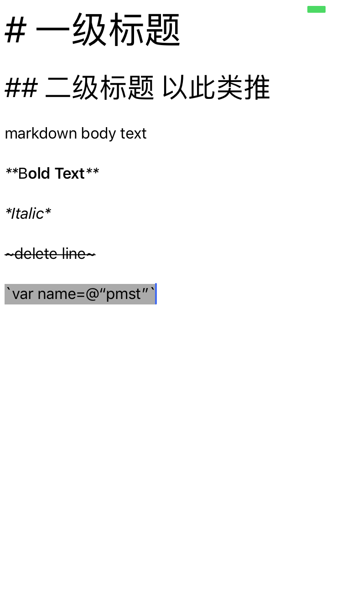

> Theme: Computer underlying knowledge 
> Source Code Read Plan:
>
> - [x] `objc_msgSend` 汇编实现
>
> - [ ] GCD 底层libdispatch
> - [ ] TableView Reload 原理，博文总结
> - [x] Custom UIViewController Transitions (随便写几个demo实现玩)

# 2018/09/03

[可交互式的滑入滑出效果](https://github.com/colourful987/2018-Read-Record/tree/master/Content/iOS/TransitionWorld/TransitionWorld/Transition%20Demo/Demo3)

效果如下：


核心系统方法：

```oc
// UIPercentDrivenInteractiveTransition 三个核心方法
[self updateInteractiveTransition:progress]

[self cancelInteractiveTransition]

[self finishInteractiveTransition]
```

然后在代理方法中返回这个 InteractionController 对象即可

```
- (id<UIViewControllerInteractiveTransitioning>)interactionControllerForDismissal:(id<UIViewControllerAnimatedTransitioning>)animator {
    if (self.slideInteractionController.interactionInProgress) {
        return self.slideInteractionController;
    }
    
    return nil;
}
```

> 总结：转场动画为了可复用性，定义了太多的协议，因此一定要搞清楚各自的职责。
> 从层级最高的来讲是 `UIViewControllerTransitioningDelegate` ，也就是我们经常设置的`delegate`，它从大方向上指明了我们应该可选的不同职责的对象：

1. 转场显示的动画对象(`animationControllerForPresentedController`)；
2. 转场消失的动画对象(`animationControllerForDismissedController`)；
3. 可交互的动画显示对象(`interactionControllerForPresentation`)；
4. 可交互的动画消息对象(`interactionControllerForDismissal`)；
5. 呈现方式(`presentationControllerForPresentedViewController`);

> 如上所述每一个动画/可交互对象同样需要时遵循协议的，比如动画的需要`UIViewControllerAnimatedTransitioning`协议;可交互式对象为`UIViewControllerInteractiveTransitioning`协议；呈现的对象干脆就是一个封装好的基类`UIPresentationController`

码代码过程中，如果我们二次封装，我觉得动画对象应该持有一个可交互式的对象，但是要以依赖注入的方式！

遗留问题：
1. 当progress进度小于0.5放手时也执行了dismiss操作，这个是不合理的;
2. 实例化一个 InteractionController 的方式需要把手势加载到sourceViewController的view上，项目中过早的调用 viewController.view可能导致视图控制器LifeCycle生命周期错乱的可能性。


# 2018/09/05

[右上角圆形发散式转场，参照Raywenderlich](https://github.com/colourful987/2018-Read-Record/tree/master/Content/iOS/TransitionWorld/TransitionWorld/Transition%20Demo/Demo4)

效果如下：


# 2018/09/06
重要事情说三遍：
1. **只要设置**`destinationVC.transitioningDelegate = self`就可以了，如果没有实现自定义呈现类，**不要设置**`destinationVC.modalPresentationStyle = UIModalPresentationCustom`!!!
2. **只要设置**`destinationVC.transitioningDelegate = self`就可以了，如果没有实现自定义呈现类，**不要设置**`destinationVC.modalPresentationStyle = UIModalPresentationCustom`!!!
3. **只要设置**`destinationVC.transitioningDelegate = self`就可以了，如果没有实现自定义呈现类，**不要设置**`destinationVC.modalPresentationStyle = UIModalPresentationCustom`!!!

mmp的转成present的时候往 `transitionContext.containerView`(系统提供的`UITransitionView`) add子视图是没有问题的，但是dismiss的时候却“不正常”，动画正确地执行，然后黑屏！其实“不正常”是情理之中的事情，因为设置了 `destinationVC.modalPresentationStyle = UIModalPresentationCustom;`，系统会向delegate询问关于呈现（Presentation）由谁负责：

```oc
// 如下写法
- (UIPresentationController *)presentationControllerForPresentedViewController:(UIViewController *)presented presentingViewController:(UIViewController *)presenting sourceViewController:(UIViewController *)source {
    return [[DimmingPresentationController alloc] initWithPresentedViewController:presented presentingViewController:presenting];
}

// 附上DimmingPresentationController的实现

@interface DimmingPresentationController()
@property(nonatomic, strong)CHGradientView *dimmingView;
@end

@implementation DimmingPresentationController

- (void)presentationTransitionWillBegin {
    self.dimmingView.frame = self.containerView.bounds;
    [self.containerView insertSubview:self.dimmingView atIndex:0];
    self.dimmingView.alpha = 0;
    
    id <UIViewControllerTransitionCoordinator> transitionCoordinator =  self.presentedViewController.transitionCoordinator;
    
    if (transitionCoordinator) {
        [transitionCoordinator animateAlongsideTransition:^(id<UIViewControllerTransitionCoordinatorContext>  _Nonnull context) {
            self.dimmingView.alpha = 1;
        } completion:nil];
    }
}

- (void)dismissalTransitionWillBegin {
    id <UIViewControllerTransitionCoordinator> transitionCoordinator =  self.presentedViewController.transitionCoordinator;
    
    if (transitionCoordinator) {
        [transitionCoordinator animateAlongsideTransition:^(id<UIViewControllerTransitionCoordinatorContext>  _Nonnull context) {
            self.dimmingView.alpha = 0;
        } completion:nil];
    }
}

// 如果是半屏的话 这个属性设置为NO 表明不移除当前视图
- (BOOL)shouldRemovePresentersView {
    return NO;
}

- (CHGradientView *)dimmingView {
    if (!_dimmingView) {
        _dimmingView = [[CHGradientView alloc] initWithFrame:CGRectZero];
    }
    return _dimmingView;
}
@end
```

说一个视图是 `presentedViewController` 还是 `presentingViewController` ，是有个相对关系的，一定要说 A 是 B 的 `presentedViewController/presentingViewController`。

一个视图控制器即可以是`presentedViewController` 也可以是 `presentingViewController`，比如 A present B, B present C，那么 B 就扮演了两个角色，B是A的 presentedViewController，又是C的presentingViewController；
A 则简单点，是B的presentingViewController；C则只有一种角色，是B的presentedViewController。


# 2018/09/07

[Book 模仿书本翻页动画，参照Raywenderlich](https://github.com/colourful987/2018-Read-Record/tree/master/Content/iOS/BookTutorial)

效果如下：


    
之前作者的 demo 停留在 swift2.x版本，所以特地改写了下，然而没有用最新的swift语法，能跑就行。

整个例子重点是实现的思路，以及collectionView的使用技巧，真的很牛逼！

另外目前只是做了代码搬运工，表示毫无成就感，一没把collectionView运用的得心应手，二不了解这个翻页动画的实现，三... 趁着周末学习一波，起码要有收获，尽量不做代码搬运工，伪成就感还是不要有的好。


# 2018/09/08 - 2018/09/09
给Book animation tutorial工程增加了注释，从几何角度了解这个翻页动画的实现，难点还是`CATransform`的知识 目前搜了几篇文章，可以学习一波基础知识：

* [CGAffineTransform与CATransform3D](https://www.cnblogs.com/jingdizhiwa/p/5481072.html)
* [如何使用 CATransform3D 处理 3D 影像、制做互动立体旋转的效果 ?](http://www.myzaker.com/article/591d1d7a1bc8e04e43000002/)
* [iOS-从三维立方体到理解CATransform3D&CGAffineTransform&m34](https://www.jianshu.com/p/3dd14cfbdc53)

ps: 貌似大家都喜欢以三维矩形筛子来作为演示demo，撞车比较严重


# 2018/09/10

> 教师节快乐！撒花！

给Book animation tutorial 整个demo用swift4.2重写了，需要在Xcode10 iOS12.0下运行。其实这个教程刚出来时候就对着码了，当时说白了也是抄着玩（现在也差不多orz...)，感觉吃透这篇文章可以学习以下几块知识点：
1. collectionView 自定义布局如何实现书本展开、转盘等效果，这里涉及重写 collectionView 的 `layoutAttributesForElements` 等一系列方法，难度2/5星吧；
2. transform 三维上的仿射变换，这个涉及数学几何知识，难度3/5；
3. 转场动画，由于之前已经“瞎搞过一阵子”，所以感觉难度在1/5星；

# 2018/09/11
本周会研究下 tableview 的 reload 操作实现，可以参照的源码 [Chameleon](https://github.com/BigZaphod/Chameleon)，Chameleon is a port of Apple's UIKit (and some minimal related frameworks) to Mac OS X. 说白了就是从iOS移植到Mac端的代码，尽管最后一次提交代码还停留在4 years ago，但是参考价值很足。

其次还涉及到 Runloop，毕竟我们操作的东西都是由runloop对象管理的，大部分其实是procedure过程式，处理流程就摆在那里，源码我看的是 github 上的 apple repo：[swift-corelibs-foundation](https://github.com/apple/swift-corelibs-foundation)。

实际开发中经常会用到 GCD 配合 reloadData  对 TableView  刷新，所以对 GCD 底层实现原理还需要了解，源码应该会看libdispatch。

最后还是站在前人肩膀上，看了下[iOS 事件处理机制与图像渲染过程](http://www.cnblogs.com/yulang314/p/5091894.html)，差不多算16年的博文了，具有参考价值，本文的reference还涉及了如下文章：

* runloop原理 (https://github.com/ming1016/study/wiki/CFRunLoop)
* 深入理解runloop (http://blog.ibireme.com/2015/05/18/runloop/)
* 线程安全类的设计 (http://objccn.io/issue-2-4/)
* iOS保持界面流畅的技巧和AsyncDisplay介绍 （http://blog.ibireme.com/2015/11/12/smooth_user_interfaces_for_ios/）
* 离屏渲染 (http://foggry.com/blog/2015/05/06/chi-ping-xuan-ran-xue-xi-bi-ji/)
* ios核心动画高级技巧 (https://zsisme.gitbooks.io/ios-/content/index.html)


# 2018/09/11 
今天查了一个UIWebview加载网页资源慢的问题，涉及NSURLCache缓存策略，由于之前都不怎么涉及Web相关的业务，所以排查这个问题对于我这个小白来说有些许挑战，一开始比较心虚，像个无头苍蝇没有切入点，在经过一系列 Charles 抓包，调试 UIWebview 、NSURLCache 相关源码，渐渐找到一些眉目，不过根本原因还是未解决，现简单记录下采坑记录，引以为鉴：

1. 关于Charles如何抓包，网上搜关键字应该一堆博文，这里不再赘述，因为我这里一些资源和链接是https，因此我们需要安装Charles的PC充当中间人，和服务器进行TLS/SSL握手通讯，此处客户端需要安装一个证书，在手机端Safari输入`chls.pro/ssl` 地址安装即可；另外还需要在PC端Charles的 SSL Proxying菜单原乡中安装根证书，以及在SSL Proxy Settings 添加需要监视的域名，支持 *号通配符，端口一般都是`443:`。
2. 客户端在联调时候加载一个网页，相应的 Charles 中就能看到这个请求的 request和response信息，这里我关心资源（这里是img或gif资源）的 response header，因为里面有我想要的 `Cache-Control`、`Expires` 和 `Last-Modified` 等信息，这些表示对于缓存由什么作用呢？看名字其实一目了然，如果设置 `Cache-Control` 为 `no-cache` 显然对于这个服务器返回的资源不要做缓存处理，过期时间也是这个道理。
3. 另外还有一种缓存方式为服务器返回403，那么客户端就使用之前缓存过的页面和资源，这里不是很清楚。
4. UIWebview loadRequest时候，request 的 cache policy 默认是 `NSURLRequestUseProtocolCachePolicy`，即由服务端返回资源的 responseHeader 中带的信息决定，也就是上面说的`Cache-Control`、`Expires`等
5. html加载过程：客户端发请求->服务端返回html标记文本->html会有一些css，js，或者`` 标记符中的资源文件，这些都是异步加载的，如果有缓存的话，那么根据策略来使用缓存，同时还可能去请求，请求回来之后再刷新，但是有些是仅使用缓存或者始终以服务端数据为准，这个就有些坑爹了....

看了几个网页，发现有些资源的 `Cache-Control` 设置为了 `no-cache` ，那么自然每次进来都会重新请求资源数据喽；但是有些页面的广告图片明明设置了 `Cache-Control` 为 `max-xxxxx` 以及过期时间，我在调试时候发现，NSURLCache 的 `cachedResponseForRequest` 方法中，以资源request为key去取缓存，返回的依然是nil...这个就不理解了。


# 2018/09/12 

进一步了解 NSURLCache 缓存机制，但是仅限于皮毛，我使用 MacOS 自带的 Apache 服务器，用PHP写了一个page页面，显示一些 `<p></p>` 文本和一个 `` 用于异步加载图片，而服务端获取图片的接口同样是 PHP 实现，可配置 response header 为 no-cache，同样 page页面也可以这么干，以下demo是我从网上找到的设置方式：

```php
sleep(5); // 模拟图片获取耗时操作 这样能明显感觉到是否图片被NSURLCache缓存


$fullpath = '/path/to/image' . basename($_GET['img']); 

if (!is_file($fullpath)) { 
    header("HTTP/1.0 404 Not Found"); 
    exit(); 
} 

// 获取图片信息 
$info = getImageSize($fullpath); 

// 如果不是图片
if (!$info) {                     
    header("HTTP/1.0 404 Not Found"); 
    exit(); 
} 
 
// 以下凡是header函数都是在输出头部信息。较多。 
header('Content-type: '. $info['mime']);          // e.g. image/png 
header('Content-Length: '. filesize($fullpath));  // 文件长度 
 
header('Pragma: ');  
 
// 手动设置过期时间，单位都是秒 
$validtime = 48* 60 * 60;    // 48小时 
 
// 缓存相对请求的时间， 
header('Cache-Control: ' . 'max-age='. $validtime); 
 
//也很重要的Expires头，功能类似于max-age 
//time()+$validtime: 设置期限，到期后才会向服务器提交请求 
//gmdate，生成Sun, 01 Mar 2009 04:05:49 +0000  的字符串，而且是GMT标准时区 
//preg_replace,  生成Sun, 01 Mar 2009 04:05:49 GMT， 注意：可能与服务器设置有关， 
//但我都用默认设置 
header('Expires:'. preg_replace('/.{5}$/', 'GMT', gmdate('r', time()+ $validtime))); 
 
//文件最后修改时间 
$lasttime = filemtime($fullpath); 
 
//最后修改时间，设置了，点击刷新时，浏览器再次请求图片才会发出'IF_MODIFIED_SINCE'头， 
//从而被php程序读取 
header('Last-Modified: ' . preg_replace('/.{5}$/', 'GMT', gmdate('r', $lasttime) )); 
 
//重要，如果请求中的时间和 文件生成时间戳相等，则文件未修改，客户端可用缓存 
if (strtotime($_SERVER['HTTP_IF_MODIFIED_SINCE']) == $lasttime) { 
    header("HTTP/1.1 304 Not Modified"); //服务器发出文件不曾修改的指令 
    exit(); 
} 
 
//如果文件被修改了，只好重新发出数据 
echo file_get_contents($fullpath);
```

其实我们只需要简单设置 header 中的 `Cache-Control` 等属性即可使得image不缓存。

iOS Demo 非常简单，就是搞一个UIWebView加载我们本地服务器的page.php页面来验证：

```oc
NSURLRequest *request = [[NSURLRequest alloc] initWithURL:[NSURL URLWithString:@"http://127.0.0.1/page.php"]];
[self.webview loadRequest:request];
```

为了验证昨天 NSURLCache 系统类的 `- (NSCachedURLResponse *)cachedResponseForRequest:(NSURLRequest *)request` 和 `- (void)storeCachedResponse:(NSCachedURLResponse *)cachedResponse forRequest:(NSURLRequest *)request` 何时被UIWebView调用（苹果自带使用 URL Loading System），我们需要替换掉系统默认的 NSURLCache，如何替换？很简单，首先 NSURLCache 类有一个 `sharedURLCache` 单例，替换它为我们自定义的 NSURLCache 实例即可，如下：

```
@implementation CustomURLCache

// override
- (NSCachedURLResponse *)cachedResponseForRequest:(NSURLRequest *)request {
    NSCachedURLResponse *resp = [super cachedResponseForRequest:request];
    
    NSLog(@"🔴cachedResponseForRequest request : %@", request.URL.absoluteString);
    NSLog(@"🔴cachedResponseForRequest response header: %@", [(NSHTTPURLResponse *)resp.response allHeaderFields]);
    
    return resp;
}

// override
- (void)storeCachedResponse:(NSCachedURLResponse *)cachedResponse forRequest:(NSURLRequest *)request {
    
    NSLog(@"✅storeCachedResponse request : %@", request.URL.absoluteString);
    NSLog(@"✅storeCachedResponse response header: %@", [(NSHTTPURLResponse *)cachedResponse.response allHeaderFields]);
    
    [super storeCachedResponse:cachedResponse forRequest:request];
}

// private
- (void)clearCache {
    [self removeAllCachedResponses];
}
```
然后找一个合适的地方替换 `[NSURLCache sharedURLCache]` 即可：

```oc
self.cache = [[CustomURLCache alloc] initWithMemoryCapacity:1024*1024*10 diskCapacity:1024*1024*60 diskPath:nil];
[NSURLCache setSharedURLCache:self.cache];
```

设置完毕后，开始调试这个demo：第一次加载时候，先出现html中的文字，然后等约5秒后加载出image图片。
* `cachedResponseForRequest` 和 `storeCachedResponse` 都会被调用两次，第一次是刚进入页面加载html link之前，因为先要确定本地是否有缓存，注意到前一个方法return了 nil，所以会加载页面，服务器返回html文本后会调用后者方法，因为要把这个response存储到本地————不管response header有没有设置 Cache-Control 等属性；
* 第二次进入的时候，依然且一定先调用 `cachedResponseForRequest` 方法， request 为page地址，从日志还能看到从本地读出了Cache.....；但是从charles抓包可以看到发送了一个请求，我猜测尽管能从本地读出缓存，但是缓存response中的header信息标识这个是不使用缓存的，因此会发一个请求；
* 总结来说如果取出的response header标识使用了缓存，那么不会再发送请求，也不会有 `storeCachedResponse` 回调；但是如果发送了请求，数据回调后肯定会调用 `storeCachedResponse` 方法存储数据到本地

> 关于缓存的文件和response信息存储地址，使用模拟器的话，应该存储在类似：`~/Library/Developer/CoreSimulator/Devices/15843FEA-1A4A-4F4A-B3C8-014EEA3A11B9/data/Containers/Data/Application/05BCB4F0-4AD7-477C-9CC2-B49C133E8F5C` 有个 Cache.db 文件，如何查看这个db文件，我们可以使用例如 Daturn Free 和 Liya工具，也可以使用 CommandLine，输入 `sqlite3 Cache.db` 命令，然后键入一些数据库查询命令，如 `.tables` 、`select * from table_name`等


# 2018/09/14

今天继续排查问题过程中发现我们项目的工程存在调用的差异，疑点如下：
1. 第二次进入过“缓存” 的页面，部分请求并没有走 `cachedResponseForRequest`发方法————前面说了Apple使用的  URL Loading System，所有请求都会走这个方法；
2. 部分请求走了 `cachedResponseForRequest` 方法，本地并没有缓存，因此需要再次发送请求，但是数据回调后没有调用 `storeCachedResponse`，本地db也没有存储。


# 2018/09/16

学习了 raywenderlich 的 drawPad demo，只是入门的学习制作一款绘图软件，没有undo操作，性能上目前来看是ok的，实现非常有意思：
1. demo使用两个imageView:mainImageView和tempImageView。当然绘制行为都需要一个 context，因此我们需要使用 `UIGraphicsBeginImageContext` 方法创建一个 context，紧接着调用 `UIGraphicsGetCurrentContext`，绘制行为的发起、进行和结束依靠 touchesBegan touchesMove touchesEnded 三个方法（重写ViewController即可，事件响应链可以参照[iOS Touch Event from the inside out](https://www.jianshu.com/p/70ba981317b6)）
2. 接着把上一次 tempImageView 的内容写入 context 中，顺便把当前的点连线也绘制到其中，最后把context生成一张image，在赋值给 tempImageView.image————令人疑惑的是这部操作在 touchesMoved中，不耗性能？
3. 最后touchesEnded时候，同样是创建一个 context，把mainImageView和tempImageView两者内容绘制到context中，生成新的image，赋值给 mainImageView.image，最后清空`tempImageView.image = nil`

现在存在几点疑惑：
1. 如何解决 undo 撤销操作，作者说可以使用 [UndoManager Tutorial: How to Implement With Swift Value Types](https://www.raywenderlich.com/5229-undomanager-tutorial-how-to-implement-with-swift-value-types)，没有尝试
2. 前面说到了 touchemove 一直在进行image写入context，然后在生成新image赋值回去的操作，这样不损耗性能吗？
3. demo只支持了绘制，那么对于添加一些矩形，圆形等如何实现呢？对图片进行放缩，平移等又怎么玩呢？


# 2018/09/17

补下昨天学习的东西，InjectionIII 的原理初探，参考文章是老峰的 [Injection：iOS热重载背后的黑魔法](https://mp.weixin.qq.com/s?__biz=MjM5NTQ2NzE0NQ==&mid=2247483999&idx=1&sn=bc88d37b6f819bd6bd7d8b76e9787620&chksm=a6f958b9918ed1af9a084ce2c2732aaee715193e37fdb830dc31d8f0174c0314b22dc5c0dd1e&mpshare=1&scene=1&srcid=0612tT8PS1pePiL5EmqMr9HH#rd)，自己当然也下了源码学习了一波，简单总结下知识点：

1. FileWatcher 的实现，其实就是Coreserver提供的 FSEventStreamCreate 创建一个事件流，这个方法定义如下：
  ```
  FSEventStreamCreate(
  CFAllocatorRef __nullable  allocator,
  FSEventStreamCallback      callback,
  FSEventStreamContext * __nullable context,
  CFArrayRef                 pathsToWatch,
  FSEventStreamEventId       sinceWhen,
  CFTimeInterval             latency,
  FSEventStreamCreateFlags   flags)  
  ```
  注意其中 `callback` 和 `pathsToWatch`，命名就已经很直白地告诉我们是要监控的文件夹目录和回调函数，文件改动采用枚举定义，有如下几种：`kFSEventStreamEventFlagItemRenamed` 、`kFSEventStreamEventFlagItemModified`、`kFSEventStreamEventFlagItemRemoved`，`kFSEventStreamEventFlagItemCreated`等几种；

2. Socket 通讯，首先Mac App InjectionIII 开启一个端口，然后程序app 在appdelegate中用mainbundle load的动态库也开启了一个端口，两者进行通讯，主要是发送一些信息告知对方处理进度；
3. 观察到文件改动，需要把改动的文件进行 rebuild 操作，这里使用了 Process 执行 shell 脚本命令字符串的方式，编译成dylib后通知应用App完成，客户端使用 dlopen 打开动态库，进行方法交换，然后刷新整个页面

目前遗留问题：
1. 首先由于沙盒安全问题，实际上我在码demo时候根本无法把脚本内容写入到一个.sh文件中。。。
2. 具体一些动态库的生成，比如app中加载 bundle 方式加载动态库我也比较懵逼，虽然网上我是看到有此类做法说明，但是如何制作这样一个 bundle的动态库呢？bundle不是一个资源包吗。。。还是说可以包含可执行文件的资源包

若有知道的朋友，可以提pr给我，感激不尽


# 2018/09/18

[TextKit 入门文章——raywenderlich](https://www.raywenderlich.com/5960-text-kit-tutorial-getting-started)


知识点：
1. 文字排版
2. attributeString，可以用正则匹配文案中的一些带标识符的特殊内容，已另外一种形式表现出来，比如bold加粗（`*content*`），italic斜体(`~content~`)

明天看教程下半部分，感觉可以撸一个markdown在线编辑器


# 2018/09/19

推荐两篇文章[C-Reduce Friday QA系列](https://www.mikeash.com/pyblog/friday-qa-2018-06-29-debugging-with-c-reduce.html)和[Design Patterns in Swift #3: Facade and Adapter](https://www.appcoda.com/design-pattern-structural/)

> 另外 UIWebview NSURLCache 测试验证 iOS12.0 缓存由问题，起码之前提到的两个方法中 `storeCachedResponse` 不会进入，查看本地 Cache.db 数据库也没有存储，应该是apple的sdk bug，难道是因为wkwebview，所以摒弃UIWebview了？

另外 WKWebview 今天帮忙改bug，其中就是前端使用 window.open 方式调用，需要wkwebview的configuration中的preference需要设置下`preferences.javaScriptCanOpenWindowsAutomatically = YES` 完整代码如下：

```
WKWebViewConfiguration *config = [[WKWebViewConfiguration alloc] init];
config.processPool = processPool;
WKPreferences *preferences = [WKPreferences new];
preferences.javaScriptCanOpenWindowsAutomatically = YES;// 设置了才会进 createWebViewWithConfiguration 代理方法
config.preferences = preferences;
self.webView = [[WKWebView alloc] initWithFrame:self.view.bounds configuration:config];
self.webView.autoresizingMask = UIViewAutoresizingFlexibleHeight | UIViewAutoresizingFlexibleWidth;
self.webView.backgroundColor = [UIColor clearColor];
self.webView.contentMode = UIViewContentModeRedraw;
self.webView.opaque = YES;
[self.view addSubview:self.webView];
[_webView setUserInteractionEnabled:YES];
_webView.navigationDelegate = self;
_webView.UIDelegate = self;

-(WKWebView *)webView:(WKWebView *)webView createWebViewWithConfiguration:(WKWebViewConfiguration *)configuration forNavigationAction:(WKNavigationAction *)navigationAction windowFeatures:(WKWindowFeatures *)windowFeatures{
    NSLog(@"createWebViewWithConfiguration  request     %@",navigationAction.request);
    if (!navigationAction.targetFrame.isMainFrame) {
        [webView loadRequest:navigationAction.request];
    }
    if (navigationAction.targetFrame == nil) {
        [webView loadRequest:navigationAction.request];
    }
    return nil;
}
```


# 2018/09/20

TextKit 知识点，核心是`NSTextStorage`、`NSLayoutManager` 和 `NSTextContainer` 三个对象，三者的职责和作用分别如下：

1. `NSTextStorage` 存储要显示的 `AttributedString`，相当于是 `NSLayoutManager` 的“补给站”，我们可以继承 `NSTextStorage` 自定义一个子类，在更新之前动态更新 `AttributedString` 属性，ps: `NSTextStorage` 是继承自 `AttributedString`；
2. `NSTextContainer` 顾名思义就是显示文字的容器，渲染 Text 到屏幕中的某个几何区域，比如圆形，矩形或是自定义图形，每一个 `UITextView` 关联了一个 `NSTextContainer`，如果我们同样继承它自定义一个容器类，需要替换掉 `UITextView` 的容器类即可；
3. `NSLayoutManager` 相当于一个中间者，右手拿着 `NSTextStorage` ，左手拿着 `NSTextContainer`，将前者的文本内容渲染到容器中，扮演者布局引擎的角色。

> 从 storyboard 中实例化得到 UITextView 的同时也会分别得到默认的 `NSTextStorage`、`NSTextContainer`和 `NSLayoutManager`实例。

NSAttributeString 有两个方法需要 override :
```oc
override func replaceCharacters(in range: NSRange, with str: String) {
  print("replaceCharactersInRange:\(range) withString:\(str)")
    
  beginEditing()
  backingStore.replaceCharacters(in: range, with:str)
  edited(.editedCharacters, range: range, 
         changeInLength: (str as NSString).length - range.length)
  endEditing()
}
  
override func setAttributes(_ attrs: [NSAttributedString.Key: Any]?, range: NSRange) {
  print("setAttributes:\(String(describing: attrs)) range:\(range)")
    
  beginEditing()
  backingStore.setAttributes(attrs, range: range)
  edited(.editedAttributes, range: range, changeInLength: 0)
  endEditing()
}
```

前者是替换AttributedString中某段字符串（显示内容）；后者则是替换其中某段区域字符串的显示属性，比如字体类型，颜色等等（显示样式）。

`beginEditing()`， `edited()` 和 `endEditing()` 三个方法必须实现，因为要求 NSTextStorage 通过这三个方法告知 layout manager ，相当于是一个流程，我们自定义一个 NSTextStorage，包裹了一个 AttributedString （这里我不太理解，本身就是继承 AttributedString 类，为啥还要封装一个在里面）。

`NSTextStorage`、`NSTextContainer` 和 `NSLayoutManager` 实例化方式以及组装过程如下，还是比较简单易懂的：

```oc
// 1 textStorage 自定义，实例化后赋值内容
let attrs = [NSAttributedString.Key.font: UIFont.preferredFont(forTextStyle: .body)]
let attrString = NSAttributedString(string: note.contents, attributes: attrs)
textStorage = SyntaxHighlightTextStorage()
textStorage.append(attrString)
  
let newTextViewRect = view.bounds
  
// 2 实例化一个布局管理者
let layoutManager = NSLayoutManager()
  
// 3 实例化一个container容器类
let containerSize = CGSize(width: newTextViewRect.width, 
                           height: .greatestFiniteMagnitude)
let container = NSTextContainer(size: containerSize)
container.widthTracksTextView = true
// 给布局管理类绑定容器类
layoutManager.addTextContainer(container)
// textStorage 绑定布局管理类
textStorage.addLayoutManager(layoutManager)
  
// 4 
textView = UITextView(frame: newTextViewRect, textContainer: container)
textView.delegate = self
view.addSubview(textView)

// 5
textView.translatesAutoresizingMaskIntoConstraints = false
NSLayoutConstraint.activate([
  textView.leadingAnchor.constraint(equalTo: view.leadingAnchor),
  textView.trailingAnchor.constraint(equalTo: view.trailingAnchor),
  textView.topAnchor.constraint(equalTo: view.topAnchor),
  textView.bottomAnchor.constraint(equalTo: view.bottomAnchor)
])
```

前面说到 layoutManager 会持有 NSTextStorage，但是这里却是 `textStorage.addLayoutManager(layoutManager)`，存疑。

最后一个知识点就是正则匹配，主要有：`*content*` 匹配加粗黑体(bold)，`~content~` 匹配印刷样式(script)，`-content-` 匹配删除样式(strike)，`_content_`匹配斜体样式（italic）。

```
let scriptFontDescriptor = UIFontDescriptor(fontAttributes: [.family: "Zapfino"])
  
// 1 
let bodyFontDescriptor = UIFontDescriptor.preferredFontDescriptor(withTextStyle: .body)
let bodyFontSize = bodyFontDescriptor.fontAttributes[.size] as! NSNumber
let scriptFont = UIFont(descriptor: scriptFontDescriptor, 
                        size: CGFloat(bodyFontSize.floatValue))
  
// 2 
let boldAttributes = createAttributesForFontStyle(.body,  withTrait:.traitBold)
let italicAttributes = createAttributesForFontStyle(.body, 
                                                    withTrait:.traitItalic)
let strikeThroughAttributes =  [NSAttributedString.Key.strikethroughStyle: 1]
let scriptAttributes = [NSAttributedString.Key.font: scriptFont]
let redTextAttributes = [NSAttributedString.Key.foregroundColor: UIColor.red]

replacements = [
    "(\\*\\w+(\\s\\w+)*\\*)": boldAttributes,
    "(_\\w+(\\s\\w+)*_)": italicAttributes,
    "([0-9]+\\.)\\s": boldAttributes,
    "(-\\w+(\\s\\w+)*-)": strikeThroughAttributes,
    "(~\\w+(\\s\\w+)*~)": scriptAttributes,
    "\\s([A-Z]{2,})\\s": redTextAttributes
  ]
  
```


# 2018/09/22
在上面代码基础上修改出一个简单的markdown编辑器，仅需要支持黑体，斜体等基础语法即可，只是为了学习：
1. Regex 正则语法，raywenderlich 上有多篇关于regex入门文章
2. 熟悉TextKit的使用
3. AttributedString使用

# 2018/09/24

在TextKit项目基础上搞了几个简单的正则匹配，套了个壳子就是一个 Markdown 编辑器了，只是个demo而已，用正则方式问题如下：
1. 性能不佳，尤其是在正则匹配和textView.attributedString赋值时，内容少的情况下可能不太显著，但是一旦内容很多就扛不住；
2. markdown语法大部分可以用 regex 一个个匹配，但是呈现方式仅用 AttributeString 还是不够的，比如引用“>”样式就无法实现；



参考一些正则表达式的入门文章，还得继续学习：

* [iOS之常用正则（一）](https://blog.csdn.net/u011146511/article/details/76169201)
* [Regular Expressions Tutorial: Getting Started](https://www.raywenderlich.com/5765-regular-expressions-tutorial-getting-started)
* [An Introduction to Regular Expressions](https://www.raywenderlich.com/5767-an-introduction-to-regular-expressions)
* [iOS正则表达式语法全集](https://www.jianshu.com/p/3323adcff24f)
* [正则表达式NSRegularExpression](https://github.com/pro648/tips/wiki/正则表达式NSRegularExpression)
* [iOS正则表达式语法全集](https://github.com/pro648/tips/wiki/iOS正则表达式语法全集)


# 2018/09/25(objc_msgSend)
* [为什么 objc_msgSend 必须用汇编实现](http://arigrant.com/blog/2014/2/12/why-objcmsgsend-must-be-written-in-assembly) 总结来说：C 语言中调用函数要求在编译阶段（compile time)明确方法签名（method signature)，在运行时（runtime）C实现中派发调用是不可能的，唯有基于底层 ASM 汇编才可以。

* [Friday Q&A 2012-11-16: Let's Build objc_msgSend](https://www.mikeash.com/pyblog/friday-qa-2012-11-16-lets-build-objc_msgsend.html) 是12年mike Ash的简单入门实现，代码可以跑起来；
* [Friday Q&A 2017-06-30: Dissecting objc_msgSend on ARM64](https://www.mikeash.com/pyblog/friday-qa-2017-06-30-dissecting-objc_msgsend-on-arm64.html) mike Ash 在17年中旬时候详细的关于在arm上的 `objc_msgSend` 实现，非常值得学习

学习是遇到一个老生常谈的问题，堆栈的增长方向是如何?如《程序员的自我修养》一书中谈及栈的地址比堆高，堆是向上增长的————其实这都是不严谨的。

另外还有以数组举例的：

```C
#include <iostream>
#include <vector>
int main()
{
    using namespace std;
    double a0[4] = {1.2, 2.4, 3.6, 4.8};
    double a1[4] = {1.2, 2.4, 3.6, 4.8};
    vector<double> a2(4);
    vector<double> a3(4);
    a2[0] = 1.0/3.0;
    a2[1] = 1.0/5.0;
    a2[2] = 1.0/7.0;
    a2[3] = 1.0/9.0;
    a3[0] = 1.0/3.0;
    a3[1] = 1.0/5.0;
    a3[2] = 1.0/7.0;
    a3[3] = 1.0/9.0;
    cout << "a0[2]: " << a0[2] << " at " << &a0[2] << endl;
    cout << "a1[2]: " << a1[2] << " at " << &a1[2] << endl;
    cout << "a1[3]: " << a1[3] << " at " << &a1[3] << endl;
    cout << "a2[2]: " << a2[2] << " at " << &a2[2] << endl;
    cout << "a2[3]: " << a2[3] << " at " << &a2[3] << endl;
    cout << "a3[2]: " << a3[2] << " at " << &a3[2] << endl;
    cout << "a3[3]: " << a3[3] << " at " << &a3[3] << endl;

    return 0;
}
```

然后有文章喜欢拿上文中的 `a1[1]` 和 `a1[2]` 比地址，借此判断栈是向上增长还是向下增长。

进程地址空间分布取决于操作系统（e.g. 栈被分配在高地址，堆分配在低地址），栈向什么方向增长取决于操作系统和CPU，所以不能一概而论，不过我们通常以X86_64为例，**栈的增长方向与栈帧布局有关（我也喜欢称之为函数帧）** ：

-----

> [摘自知乎
> RednaxelaFX的回答](https://www.zhihu.com/question/36103513/answer/66101372)。上下文里说的“栈”是函数调用栈，是以“栈帧”（stack frame）为单位的。每一次函数调用会在栈上分配一个新的栈帧，在这次函数调用结束时释放其空间。被调用函数（callee）的栈帧相对调用函数（caller）的栈帧的位置反映了栈的增长方向：如果被调用函数的栈帧比调用函数的在更低的地址，那么栈就是向下增长；反之则是向上增长。而在一个栈帧内，局部变量是如何分布到栈帧里的（所谓栈帧布局，stack frame layout），这完全是编译器的自由。

> 至于数组元素与栈的增长方向：C与C++语言规范都规定了数组元素是分布在连续递增的地址上的。引用C语言规范的规定：
> An array type describes a contiguously allocated nonempty set of objects with a particular member object type, called the element type.A postfix expression followed by an expression in square brackets [] is a subscripted designation of an element of an array object. The definition of the subscript operator []
> is that E1[E2] is identical to (*((E1)+(E2))). Because of the conversion rules that
> apply to the binary + operator, if E1 is an array object (equivalently, a pointer to the
> initial element of an array object) and E2 is an integer, E1[E2] designates the E2-th
> element of E1 (counting from zero).

`double a0[4]` 声明旨在向编译器在栈上申请一块连续的内存，大小为 `sizeof(double)*4`，**并且让a0指向该空间的起始位置（最低地址）**，至于内部到底 a0 、a1哪个在高地址，哪个在低地址由编译器决定，并不能反映栈的增长方向。C与C++语言的数组元素要分配在连续递增的地址上，也不反映栈的增长方向。

以Linux/x86模型为例，主线程栈空间比堆空间地址高，由高地址向低地址增长，借用Gustavo Duarte的Anatomy of a Program in Memory里的图：


多线程进程中，进程的栈是按照上图所示，但是多线程只不过是一组共享虚拟地址空间的地址，线程中的“栈”位置都是随机的，由 `pthread_create()`调用 `mmap()`来分配，也可以由程序自己调用 `mmap()` 获取分配的内存地址再调用 `pthread_create()` 创建线程。

ASLR（Address space layout randomization ）

-----

asm registers knowledge：

1. rax 寄存器作为一个隐藏的参数存在，在函数调用时，计算传递过来的参数个数；
2. xmm 存储传递的浮点数参数;
3. MacOS 内存采用 16 字节对齐方式，而我们无须关心任何对齐问题；

```
pushq %r12    // 存储栈指针
mov %rsp, %r12
andq $-0x10, %rsp
```

TODO:这里如何对 esp 进行16对齐？学习下函数帧调用asm实现！

4. `self`,`_cmd` 会存储在 `%rsi` 和 `%rdi` 寄存器中；
5. `callq _GetImplementation`； 函数调用会返回值，可能是整数，也可能是浮点数，甚至是结构体，返回值会存储在 `%rax` 寄存器中————之前%rax还存储了参数个数；
6. 由于`%rax`之后要恢复到原来的状态，所以得立刻马上迅速把值存储到别的地方

```asm
mov %rax, %r11
mov %r12, %rsp
popq %r12
popq %rax
popq %r9
popq %r8
popq %rcx
popq %rdx
popq %rdi
popq %rsi

jmp *%r11 // 调用查找到的 IMP
```

而对于返回值为结构体的情况，Mike Ash 提出如下方法：

```
NSRect r = SomeFunc(a, b, c);

NSRect r;
SomeFunc(&r, a, b, c);
```

一开始我想的是返回值是一个指向结构体的指针。。。

`objc_msgSend_stret` 和 `objc_msgSend` 中的 `self` 和 `_cmd` 存储的寄存器还不同，前者的 `self` 和 `_cmd` 存储到 `%rdi` 和 `%rsi` 寄存中，返回值在 `%rdi`；后者的`self` 和 `_cmd` 存储到 `%rsi` 和 `%rdx` 寄存中，返回值在 `%rax`。


# 2018/09/26

学习x86_64基础的 asm 指令，reference：[Introduction to X86-64 Assembly for Compiler Writers](https://www3.nd.edu/~dthain/courses/cse40243/fall2015/intel-intro.html)，通过此篇文章学习到：
1. 寄存器的种类，x86_64下常用的有16个，%rax、%rbx...%r8、%r9...%r15，当然此处为64位寄存器，而32位寄存器如%eax，16位寄存器如%ax，再者高8位低8位：%ah、%al；另外%r8-%r15都是通用寄存器，而前者大部分一开始都是为特定指令设计使用的；
2. 学习直接寻址，间接寻址等指令，如下：

| **Mode**                    | **Example**                 |
| --------------------------- | --------------------------- |
| Global Symbol               | MOVQ x, %rax                |
| Immediate                   | MOVQ $56, %rax              |
| Register                    | MOVQ %rbx, %rax             |
| Indirect                    | MOVQ (%rsp), %rax           |
| Base-Relative               | MOVQ -8(%rbp), %rax         |
| Offset-Scaled-Base-Relative | MOVQ -16(%rbx,%rcx,8), %rax |

3. 基础操作 add、sub、imul、idiv等双目操作运算符；而INCQ和DECQ是单目运算符；逻辑比较：JE、JNE、JL、JLE、JG、JGE等，
4. %rsp stack pointer 栈指针操作，首先栈向下增长，esp始终指向栈顶（bottom-most，低地址)，pop和push操作会直接更改%rsp寄存器保存的栈顶地址值，代码如下：

```asm
SUBQ $8, %rsp
MOVQ %rax, (%rsp)

MOVQ (%rsp), %rax
ADDQ $8, %rsp

// 上面等同于下面的指令
PUSHQ %rax
POPQ  %rax
```

x86_64 寄存器目的以及谁负责save:

| Register | Purpose       | Saved?       |
| -------- | ------------- | ------------ |
| %rax     | result        | not saved    |
| %rbx     | scratch       | callee saves |
| %rcx     | argument 4    | not saved    |
| %rdx     | argument 3    | not saved    |
| %rsi     | argument 2    | not saved    |
| %rdi     | argument 1    | not saved    |
| %rbp     | base pointer  | callee saves |
| %rsp     | stack pointer | callee saves |
| %r8      | argument 5    | not saved    |
| %r9      | argument 6    | not saved    |
| %r10     | scratch       | CALLER saves |
| %r11     | scratch       | CALLER saves |
| %r12     | scratch       | callee saves |
| %r13     | scratch       | callee saves |
| %r14     | scratch       | callee saves |
| %r15     | scratch       | callee saves |

其中callee就是被调用者，也就是被调用函数本身。

在调用一个函数之前，需要计算传参个数，同时放置传参到指定寄存器中，接着调用者需要负责将 %r10 和 %r11 push 到栈中，然后再执行函数调用的call指令；执行完函数后return函数值之前，先要把 caller-saved 的 %r10和%r11先pop出来，然后把函数返回值放置到%eax中.(但是现在的版本.s文件确不是这样的)

# 2018/09/27(学习汇编的一个小Demo)

Code snippet :
```c
/// main.c
long x=0;
long y=10;

int main()
{
	x = printf("value: %d",y);
}
```

使用 `gcc -S main.c` 生成汇编文件`main.s`，而其他使用`gcc main.s -c -o main.o`生成目标文件；使用`gcc main.s -o main` 生成可执行文件；使用`nm main.o`可以查看引入的符号，其中`T`表示Text section段，而U表示的是undefined，比如调用其他函数库的方法。

生成的汇编如下（MacOS 10.13.6）

```asm
	.section	__TEXT,__text,regular,pure_instructions
	.macosx_version_min 10, 13
	.globl	_main                   ## -- Begin function main
	.p2align	4, 0x90
_main:                                  ## @main
	.cfi_startproc
## BB#0:
	pushq	%rbp
Lcfi0:
	.cfi_def_cfa_offset 16
Lcfi1:
	.cfi_offset %rbp, -16
	movq	%rsp, %rbp
Lcfi2:
	.cfi_def_cfa_register %rbp
	leaq	L_.str(%rip), %rdi
	movq	_y(%rip), %rsi
	movb	$0, %al
	callq	_printf
	xorl	%ecx, %ecx
	movslq	%eax, %rsi
	movq	%rsi, _x(%rip)
	movl	%ecx, %eax
	popq	%rbp
	retq
	.cfi_endproc
                                        ## -- End function
	.globl	_x                      ## @x
.zerofill __DATA,__common,_x,8,3
	.section	__DATA,__data
	.globl	_y                      ## @y
	.p2align	3
_y:
	.quad	10                      ## 0xa

	.section	__TEXT,__cstring,cstring_literals
L_.str:                                 ## @.str
	.asciz	"value:%d"


.subsections_via_symbols
```

里面一堆的 cfi 指令，[更多请见](http://sourceware.org/binutils/docs-2.17/as/CFI-directives.html#CFI-directives)，这是因为我们调用生成asm的指令不对，按照如下命令`llvm-gcc -S -fno-asynchronous-unwind-tables -fno-dwarf2-cfi-asm main.c`：

```asm
	.section	__TEXT,__text,regular,pure_instructions
	.macosx_version_min 10, 13
	.globl	_main                   ## -- Begin function main
	.p2align	4, 0x90
_main:                                  ## @main
## BB#0:
	pushq	%rbp
	movq	%rsp, %rbp
	leaq	L_.str(%rip), %rdi
	movq	_y(%rip), %rsi
	movb	$0, %al
	callq	_printf
	xorl	%ecx, %ecx
	movslq	%eax, %rsi
	movq	%rsi, _x(%rip)
	movl	%ecx, %eax
	popq	%rbp
	retq
                                        ## -- End function
	.globl	_x                      ## @x
.zerofill __DATA,__common,_x,8,3
	.section	__DATA,__data
	.globl	_y                      ## @y
	.p2align	3
_y:
	.quad	10                      ## 0xa

	.section	__TEXT,__cstring,cstring_literals
L_.str:                                 ## @.str
	.asciz	"value:%d"


.subsections_via_symbols
```
下面会详尽地解释上面十来行代码！首先来看第一条指令，先说说 rbp rsp 名称的由来，其实32位下是esp（extended stack pointer） 栈指针寄存器，以及 ebp（extended base pointer）基址指针寄存器，而到了64位机器则变成了rsp和rbp。R就是在 32位 extended的基础上再加一层，re-extended，再次扩展的意思？说完名称，说命令的作用：
```asm
pushq	%rbp
movq	%rsp, %rbp
```
首先%rbp存的是栈的基址，当函数A调用另外函数B时，此时%rbp还保存着A函数stack-frame的栈低(内存地址上是高地址)，而%rsp指向栈顶（低地址）；由于调用函数B要新开一个stack-frame，那么%rbp肯定要保存它的基址，所以为了调用完毕后恢复函数A的栈，那么我们需要把函数A的%rbp栈基址先保存起来，这就有了 `pushq %rbp` 命令。

而 %rsp 还在正常工作，指向的是函数B stack-frame 的“栈低”（高地址），此时是个特殊状态，即 %rsp == %rbp 的时候，之后 %rbp 一直保存着函数B的栈基址，而%rsp会随着push pop操作寄存器值改变。

接着说说`leaq	L_.str(%rip), %rdi` 指令，先了解下 leaq(load effective address) 地址传递指令，通过两条指令的对比加深印象：

```asm
//不进行间接寻址，直接把传送地址赋值给目的寄存器
leal -8(%ebp), %eax  //取出ebp寄存器的值并减去8赋给eax寄存器，ebp-8 -> eax

//进行了间接寻址取出变量值（内容）
movl -8(%ebp), %eax //取出ebp的值减去8，然后再读取(ebp-8)所指向的内存的内容，赋给eax ，(ebp-8)->eax
```
回过头说上面这条指令，相当于把第一个format格式字符串地址，也就是第一个参数放到 %rdi 寄存器中，至于 `L_.str(%rip)` 不是很懂，待查；同理 `movq	_y(%rip), %rsi` 就是把第二个参数放到 %rsi 寄存器中； `movb	$0, %al` 很简单，就是置 %al（回顾上面就是%rax的低8位） 低8位寄存器清零。

接着`callq	_printf` 就是调用函数了； `xorl	%ecx, %ecx` 亦或操作，对 %ecx 寄存器清零操作，但是具体为啥有这条指令待查。

`movslq	%eax, %rsi` 把结果值 %rax 赋值给 %rsi 寄存器，为啥呢？ （ps:movslq表示将一个双字符号扩展后送到一个四字地址中）

`movq	%rsi, _x(%rip)` 接着把扩展后的值赋值给 `_x` 符号所在的内存地址。

`movl	%ecx, %eax` 相当于赋值结果值 %rax，终于知道为啥前面要有个 %ecx 清零操作了，最后一步就是 `retq`。

大致指令都清楚，存疑有两点：

1. `L_.str(%rip)` 和 `movq	_y(%rip), %rsi` 
2. %rip 寄存器作用


# 2018/09/28
函数调用时，调用者传参方式可以是将参数写入%rsi %rdi %rdx $rcx 寄存器，如果有更多的寄存器，我们可以使用 push 到栈上，这一切都发生下 **下个函数创建一个新的stack-frame之前！**，即 `push %rbp，movl %rsp %rbp`这条命令之前。

调用一个简单的函数:

```c
long square( long x )
{
	return x*x;
}
```
函数定义显示只需要参数 `x` 即可，按照上面所说的：第一个参数默认是放置到 %rdi ，第二个参数放置到 %rsi，接着是 %rdx，%rcx 总计四个参数，而多余的参数只能由调用者预先push到栈上，而函数本身内部通过ebp加地址偏移获取栈上的参数，一般都是 `ebp - 地址偏移`。

```asm
// 旧版本的编译成汇编代码如下
.global square
square:
	MOVQ  %rdi, %rax  # copy first argument to %rax
        IMULQ %rdi, %rax  # multiply it by itself
                          # result is already in %rax
	RET               # return to caller
```
上面的实现非常简单，就是从 %rdi 取出第一个参数放到 %rax 寄存器，然后两个寄存器值相乘得到结果放入 %rax 中————也就是结果寄存器，RET 返回即可。

目前系统下我编译成汇编代码如下：
```asm
	.section	__TEXT,__text,regular,pure_instructions
	.macosx_version_min 10, 13
	.globl	_square                 ## -- Begin function square
	.p2align	4, 0x90
_square:                                ## @square
## BB#0:
	pushq	%rbp
	movq	%rsp, %rbp
	movq	%rdi, -8(%rbp)     #%rdi值存入栈中 此时rsp是没有变的
	movq	-8(%rbp), %rdi     #这里为啥还要赋值%rdi,原来的值没了吗 还是为了确保安全或者是C编译成汇编语言不是很智能罢了
	imulq	-8(%rbp), %rdi     #两者相乘 结果值让如 %rdi
	movq	%rdi, %rax  # 结果值放入 %rax
	popq	%rbp  # rsp和rbp都是指向stack-frame第一个位置，这个位置保存了上一个函数帧的 rbp 值，所以这里这么干
	retq
                                        ## -- End function
	.globl	_main                   ## -- Begin function main
	.p2align	4, 0x90
_main:                                  ## @main
## BB#0:
	pushq	%rbp
	movq	%rsp, %rbp  # main函数开启一个新的stack frame
	subq	$32, %rsp   # rsp 减去 32 ,意味着栈指针往下移了4个字节，也就是新栈第二个4字节
	movl	$2, %eax    # 把立即数 2 存入 %eax 
	movl	%eax, %ecx  # 把值存入了 %ecx 中(32位），其实相当于存入了%rcx（64位）
	-------------------- 其实可以理解为把上一个函数（caller)的传参寄存器先保存起来 --------------------
	movl	$0, -4(%rbp) # 把当前栈上部偏移4字节设为 0
	movl	%edi, -8(%rbp) # 将%edi值存到当前栈上部偏移8字节处
	movq	%rsi, -16(%rbp) # 将%rsi存到当前栈上部偏移16个字节
	----------------------------------------------------------------------------------------------------
	movq	%rcx, %rdi   # 现在轮到调用函数square了，所以新的传参要依次放入 %rdi %rsi %rdx %rcx 中 这里只有一个
	callq	_square # 调用函数 _squre
	xorl	%edx, %edx # 寄存器 %rdx 清零
	movq	%rax, -24(%rbp)         ## 8-byte Spill
	movl	%edx, %eax
	addq	$32, %rsp
	popq	%rbp
	retq
                                        ## -- End function

.subsections_via_symbols
```

而对于更复杂的函数，由C语言实现的代码，调用llvm转成汇编代码个人认为代码过于冗余：

```asm
int func( int a, int b, int c )
{
        int x, y;
        x = a+b+c;
	y = x*5;
        return y;
}

.globl func
func:
	##################### preamble of function sets up stack

  pushq %rbp          # save the base pointer
  movq  %rsp, %rbp    # set new base pointer to esp

	pushq %rdi          # save first argument (a) on the stack
	pushq %rsi          # save second argument (b) on the stack
	pushq %rdx          # save third argument (c) on the stack

  subq  $16, %rsp     # allocate two more local variables

	pushq %rbx          # save callee-saved registers
	pushq %r12
	pushq %r13
	pushq %r14
	pushq %r15

	######################## body of function starts here

  movq  -8(%rbp),  %rbx   # load each arg into a scratch register
  movq  -16(%rbp), %rcx
  movq  -24(%rbp), %rdx

  addq  %rdx, %rcx       # add the args together
  addq  %rcx, %rbx
  movq  %rbx, -32(%rbp)   # store the result into local 0 (x)

	movq  -32(%rbp), %rbx   # load local 0 (x) into a scratch register.
	imulq  $5, %rbx		# multiply it by 5
	movl  %rbx, -40(%ebp)	# store the result in local 1 (y)

  movl  -20(%ebp), %eax   # move local 1 (y) into the result register

	#################### epilogue of function restores the stack

	popq %r15          # restore callee-saved registers
	popq %r14
	popq %r13
	popq %r12
	popq %rbx

  movq %rbp, %rsp    # reset stack to base pointer.
  popq %rbp          # restore the old base pointer

  ret                # return to caller
```

上面的汇编是出自文章中，但我认为实际生成肯定不一样，代码如下：

```asm
	.section	__TEXT,__text,regular,pure_instructions
	.macosx_version_min 10, 13
	.globl	_func                   ## -- Begin function func
	.p2align	4, 0x90
_func:                                  ## @func
## BB#0:
	pushq	%rbp
	movq	%rsp, %rbp
	#===========================================================
	# 将 edi esi edx ecx 32位寄存器参数值推入栈中
	# 再强调一次rdi rsi rdx rcx 都是64位寄存器，函数传参是int 所以32位寄存器足矣
	movl	%edi, -4(%rbp)  
	movl	%esi, -8(%rbp)
	movl	%edx, -12(%rbp)
	#===========================================================
	movl	-4(%rbp), %edx # 计算 a+b+c 存入 %edx
	addl	-8(%rbp), %edx
	addl	-12(%rbp), %edx
	movl	%edx, -16(%rbp) # 将计算结果写入栈中，即表达式 x= a+b+c
	imull	$5, -16(%rbp), %edx # 立即数 5 * x 存入 %edx 中
	movl	%edx, -20(%rbp) #结果写入栈上
	movl	-20(%rbp), %eax #再写会 %eax
	popq	%rbp # 恢复栈的基址 esp也会自动减8
	retq
                                        ## -- End function
	.globl	_main                   ## -- Begin function main
	.p2align	4, 0x90
_main:                                  ## @main
## BB#0:
	pushq	%rbp
	movq	%rsp, %rbp
	subq	$32, %rsp
	#=================================
	# 
	movl	$1, %eax
	movl	$2, %ecx
	movl	$3, %edx
	movl	$0, -4(%rbp)  # 同上
	movl	%edi, -8(%rbp) # 保存上一个stack frame 的传参
	movq	%rsi, -16(%rbp)# 同上
	movl	%eax, %edi # 这里开始才是下一个函数帧传参放到对应的寄存器中 rdi rsi rdx rcx
	movl	%ecx, %esi
	#=================================
	callq	_func
	xorl	%ecx, %ecx
	movl	%eax, -20(%rbp)         ## 4-byte Spill
	movl	%ecx, %eax
	addq	$32, %rsp
	popq	%rbp
	retq
                                        ## -- End function

.subsections_via_symbols
```