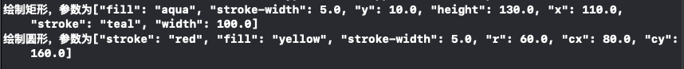
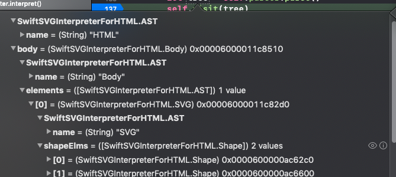

> Theme: 编译器/解释器
> Source Code Read Plan:
* [x] 实现一个计算器解释器；
* [x] 实现pascal解释器 ；
* [x] 实现一门简单的语言 ECHO；
* [ ] 指标平台公示解释器；
* [x] AST source to source 解释成诸如C语言的其他形式，或者是自定义一门标记语言解释成OC的button或是html的元素；
* [x] 编译器的话，可能就是要基于 source to source 到汇编或者C代码，再用对应的编译器编译成可执行文件。

# 2018/11/01
开箱....


> Theme: 编译器/解释器
> Source Code Read Plan:
* [x] 实现一个计算器解释器；
* [x] 实现pascal解释器 ；
* [ ] 指标平台公示解释器；
* [ ] AST source to source 解释成诸如C语言的其他形式，或者是自定义一门标记语言解释成OC的button或是html的元素；
* [ ] 编译器的话，可能就是要基于 source to source 到汇编或者C代码，再用对应的编译器编译成可执行文件。

# 2018/11/01
开箱....

# 2018/11/03
ruslanspivak 的解释器系列文章只更新到14节，关于procedure的语法和形参等都没有讲解，其实就是有关函数和栈堆的使用问题，这些之后就自己摸索了，关于14节比较完整的demo源码我更新到14-1。

# 2018/11/04
Imp a new language：**ECHO**。

实现Lisp解释器练手，实现最基础的 `(+ 3 (- 4 2))`表达式，但是我对atom expr感觉领悟有些不足，果然光看教程码和独立自己实现一个其他语言的解释器差距有点大。

源码我放在Content/iOS/Pascal Interpreter/LISP_INTERPRETER目录下，就当个demo看。


# 2018/11/05
校对了几篇swiftgg译文，感觉自己还是英文渣渣。


# 2018/11/06

实现 **ECHO** 语言的基础语法：

```echo
Simple Grammar:

program: statement_list

statement_list: statement
                | (statement)+

statement: declaration_statement  
           | assignment_statement
           | empty

declaration_statement: var ID COLON type_spec # e.g var x: int

assignment_statement: variable ASSIGN expr

expr : term ((PLUS | MINUS) term)*

term : factor ((MUL | DIV) factor)*

factor : PLUS factor
       | MINUS factor
       | INTEGER_CONST
       | REAL_CONST
       | LPAREN expr RPAREN
       | variable

variable: ID

emprty : 

----------- code example -----------
var x:int
var y:int
var z:int
x = 12 + 2
y = 2*x - 1
z = x + (y - 3 * x)
------------------------------------
```
# 2018/11/07
完成了 ECHO LANGUAGE 的 Token Lexer AST Parser 编写，自己实现一门语言只有真正code的时候才发现真的不容易，maybe是因为我还处于入门的边缘，目前的境况就像那扇大门漏出了一丝缝隙，缝隙中透出一束光，让人想继续打开。

# 2018/11/08
已实现 “ECHO” 的最基础语法，目前仅支持 declaration statement 和 assignment statement 两种：
* `var x:int`
* `z = x + (y - 3 * x)`

另外我新建了一个 Compiler Interpreter 主题的目录，[传送门](https://github.com/colourful987/2018-Read-Record/tree/master/Content/Compiler%20Interpreter)。

接下来的目标是增加基础语法：    
1. `if-else if - else`
2. `for(;;){statement}`
3. `while(condition){ statement}`


# 2018/11/09
添加了 `if-else` 语句的 Token (大括号`{}`/if/else/`> == <`)、Lexer 添加对上述Token的解析，以及 AST 支持条件语句的node，这里我构建的方式其实不是很好，整个`if-else` 作为condBlock代码块，而每一个条件+处理封装成了 CondBranchDecl，条件语句可以有多个CondBranchDecl，所以数据结构用了数组，最后是Condition条件，例如 `x+1 > 2`，这个和Assign赋值表达式很像，如下：

```
# if-else condition declaration
class CondBlock(AST):
    def __init__(self):
        self.condBranchs = []

# condition + expr()
# note: now the block node is program
class CondBranchDecl(AST):
    def __init__(self,condition_node,block_node):
        self.condtion = condition_node
        self.block = block_node

# expr </==/> expr
class Condition(AST):
    def __init__(self,left,op,right):
        self.left = left
        self.op = op
        self.right = right
```

NodeVisitor代码也基本实现，遍历所有条件branch时，满足第一个执行后退出：

```
def visit_CondBlock(self,node):

    for condBranch in node.condBranchs:
        self.visit(condBranch) # TODO must has break

def visit_CondBranchDecl(self,node):
    cond_node = node.condition_node
    block_node = node.block
    value = self.visit(cond_node)
    if value != 0 :
        self.visit(block_node)

def visit_Condition(self,node):
    op = node.op
    leftValue = self.visit(node.left)
    rightValue = self.visit(node.right)

    ret = 0
    if op.type == GREATER:
        ret = leftValue > rightValue
    elif op.type == EQUAL:
        ret = leftValue == rightValue
    elif op.type == LESS:
        ret = leftValue < rightValue

    return ret
```
明天调试代码。


# 2018/11/10
调试了昨天的代码，发现了几个问题，首先是对几个新增AST node的命名，由于我对grammer的定义其实不够清晰，因此抽象几种语法到对应的数据结构也不是很恰当，比如 `if else`语句中用`{}` 包裹的代码片段，之前没细想直接搞了个program用于表示多条statement，然而今天实现`if-else`的时候才发现应该在抽一个出来，专门用于 `{}`包裹的结构；其次Parser中有个逻辑写错了，代码如下:

```
def statement_list(self):
    statements = [] # (statement)+

    node = None
    while self.current_token.type is not EOF:
        # declaration_statement: var ID COLON type_spec # e.g var x: int
        if self.current_token.type == VAR:
            node = self.declaration_statement()
        elif self.current_token.type == IF:
            node = self.condition_statemnt()
        # assignment_statement: variable ASSIGN expr
        elif self.current_token.type == ID:
            node = self.assignment_statement()
        else:
            break # 由于我们只解析赋值语句、if条件语句和、var声明语句，其他不处理，因此这里必须break掉
        statements.append(node)
    return statements
```

试着用“简陋”的解析器解析如下代码片段：
```
var x:int
var y:int
var z:int

x = 12 + 2
y = 2 * x - 1
z = x + (y - 3 * x)

var a:int
var b:int
var c:int

if(x>11) {
    a = 10
}

if (a == 10) {
    b = 100 + 20/4
}

if (b < 200) {
    c = 10
}
```

输出结果如下：

```
/usr/bin/python "/Users/pmst/Source Code Repositories/2018-Read-Record/Content/Compiler Interpreter/ECHO_LANG/main.py"
{'a': 10, 'c': 10, 'b': 105, 'y': 27, 'x': 14, 'z': -1}
```


> 今日收获：如果自己想要开发一门语言，对于 Grammar 对应的数据结构(AST Node) 抽象相当重要，考虑要全面一些，而不是为一个特定语法写一个特定的AST Node。


# 2018/11/11

剁手快乐！

凌晨付尾款，顺便继续写个代码。

实现了小小的 if elif else，但是我发现condition已经能简单实现大于 等于 小于三个比较操作数，然而当然想测试例如 `a > 2 && b < 10` 条件时，发现之前压根没考虑。看来还得加个AST node。


# 2018/11/11 pm
增加对while语法的支持，代码支持和上面if差不多，不再赘述了，又发现一个问题：
1. 抽象的condition写死了 > < == 三个判断，实际上condition应该是一个返回 0 or 非0的表达式，所以我这边考虑的不是很充分；

`while`实现请见[传送门](https://github.com/colourful987/2018-Read-Record/tree/master/Content/Compiler%20Interpreter)。

**一些思考：**
1. 实现 `if-else` 和 `while` grammar 解释器时候，对照自己语言的 `while` 和解释器中对这个语法的支持实现依然借助了python的`while`，这个有问题吗？短暂思考之后觉得完全ok，解释器本身就是用一门语言解释“新的语言”，之所以产生这种相似的错觉，只是因为我想要实现的语言grammar太过大众！“取其精华，去其糟粕”
2. 到目前为止，感觉收获很大，首先知识层面来说学习了BNF，AST，Token，Parser等基础知识，作为一个非科班出身的小菜鸟对理解计算机底层实现很有帮助，思考面也扩大了不少；其次照着教程码一遍parser，现场即兴coding，以及实现自己的语言三者是一个递进的过程，真的不要觉得照着教程码了一遍代码就算大功告成了，这可能连入门都不算。就我而言现在每天接入一个小语法感觉还是游刃有余的，只不过每次接入的时候总会发现一些之前思考缺陷，这就是一种进步！
3. 最后就是老生常谈的问题，为何我学习了感觉没有收获。1. 定目标；3、一鼓作气（这里感谢帮主之前对读书的分享）；2.自律，坚持。

# 2018/11/12 am

好奇看了下 [YYAsyncLayer](https://github.com/ibireme/YYAsyncLayer) 的实现，6个文件，代码量貌似就300行左右，关于如何提高用户体验，保证屏幕交互流畅不掉帧，常规思路一般为：
1. 处理事务放在子线程；
2. 缓存上一次的计算结果；
3. 优化算法，比如操作的时间复杂度

但是平常开发设计到渲染这一层时，可能出于对保证系统渲染流程的“敬畏”，抱着不想“横生枝节”的想法，因此不会在 `drawInContext:` 上搞些名堂。

> 题外话：我作为小白当然也有这种想法，首先不清楚系统渲染流程的情况下，我不会随便去加一些带副作用的处理，但是假如我们已经掌握就另当别论了。

`YYAsyncLayer` 借助GCD+queue的方式，将`drawInContext`的处理放到了队列中执行，这里的绘制时抽象的，我们不过是往context中写入东西罢了，`YYAsyncLayer` 会将context生成一张 image，然后赋值给 CALayer 的contets属性，这里看下系统的说明大概就知道了。为此`YYAsyncLayer`重写了几个 `CALayer` 的方法：

```

- (void)setNeedsDisplay {
    [self _cancelAsyncDisplay];
    [super setNeedsDisplay];
}

- (void)display {
    super.contents = super.contents;
    [self _displayAsync:_displaysAsynchronously];
}

```

首先是`setNeedsDisplay`————我们经常调用的方法，这里其实就是标记这个layer需要在下一个runloop进行渲染，而非真正渲染到screen上，可以理解为一个布尔类型值，打个标记而已；display方法会间接调用 drawInContext 方法，然后生成contents内容属性。

`YYAsyncLayer` 使用我截取下github的示例：

```oc
- (void)setText:(NSString *)text {
    _text = text.copy;
    [[YYTransaction transactionWithTarget:self selector:@selector(contentsNeedUpdated)] commit];
}

- (void)setFont:(UIFont *)font {
    _font = font;
    [[YYTransaction transactionWithTarget:self selector:@selector(contentsNeedUpdated)] commit];
}

- (void)layoutSubviews {
    [super layoutSubviews];
    [[YYTransaction transactionWithTarget:self selector:@selector(contentsNeedUpdated)] commit];
}

- (void)contentsNeedUpdated {
    // do update
    [self.layer setNeedsDisplay];
}

```

可以看到赋值属性后并非立马进行 setNeedsDisplay 属性标识，而是创建了一个事务罢了，监听`kCFRunLoopBeforeWaiting | kCFRunLoopExit`事件，每次runloop休眠前把这些事务拿出来执行一遍（ 如果是异步的，就是把操作全部放到自定义队列中异步执行），这样就不会阻塞主线程，不会有掉帧问题了。

由于是简单浏览了下源码，有如下几点疑问：
1. 首先对渲染的细节不了解，给layer打上标记就，就是更新 contents 内容吗？然后runloop休眠后，系统在有其他线程进行提取contents内容，然后渲染到屏幕上，这里应该涉及GPU的知识点；
2. YYSentinel 中的increase的调用不是很清楚，后面看下
3. `YYAsyncLayer` 解决的应该是卡顿问题，所以貌似对于股票软件中移动k线图没什么用处，走势图在移动过程中总不能出现空白的情况吧。


# 2018/11/12

* [x] 今日任务：source to source compiler ，将pascal转成c语言代码

source to source compiler 其实很简单，就是改写我们的Interpreter就可以了。

所有的visit_xxx函数返回一个字符串即可，但是我只是为了玩下这个知识点，就搞了个全局变量字符串在做拼接————这是很有问题，非常杂乱的赶脚。

就拿 `visit_VarDecl` 来说，这是构造一个声明表达式，对比pascal和c语言：

```
//pascal
VAR z : INTEGER;
//c
int z
```

再看下解释器中的visit_VarDecl方法:
```
def visit_VarDecl(self,node):
    c_var_decl = ''
    type_name = node.type_node.value
    c_param_type = C_MAP_KEYWORDS[node.type_node.value]
    # look up builtin type
    type_symbol = self.current_scope.lookup(type_name)
    var_name = node.var_node.value
    # create new variable, and define into symtab
    var_symbol = VarSymbol(var_name, type_symbol)
    c_var_decl = '{type_name} {var_name}; \n'.format(type_name=c_param_type,var_name=var_name)
    self.cCode += c_var_decl
    self.current_scope.insert(var_symbol)
```

代码比较杂乱，其实可以看到本身要解释pascal的var声明表达式，现在就是构造一个对应的 c语言声明表达式。

> 知识点：由于pascal和c语言变量声明方式从类型和语法表达式都略有不同。因此这里其实还需要构造一个映射表。这里不得不说下 LLVM，所谓的跨平台就是LLVM将输入语言转成中间语言 IR，然后再转成对应平台的目标语言。脑补就是多门语言指向中间语言，再由中间发散出去指向不同平台的不同目标语言。

最后source to source demo也一并附上，仅做参考。


# 2018/11/13

[Getting to Know Enum, Struct and Class Types in Swift](https://www.raywenderlich.com/7320-getting-to-know-enum-struct-and-class-types-in-swift)

raywenderlich 出品，学习的知识点包括：
1. Swift 由6种类型组成，分别是 protocol、enum、struct、class 和 typle function，前四者称之为 Named Types，后两者称之为 Compound Types。有意思的是，一开始我还在诧异那些 Int、Bool、Float 等内置类型归属哪一类，后来立马恍然大悟，看过源码的知道它们应该归属于前四者；
2. enum 用法和使用场景，无非就是 `RawRepresentable`，`CaseIterable`、`Associated Values` ；
3. struct 和 class 用一个小demo来对比说明，struct 配合 protocol 确实用起来很顺手，尤其是 protocol 的 extension简直完美，然而也存在一些问题，如下：

```swift
protocol Drawable {
  func draw(with context: DrawingContext)
}

struct Circle: Drawable {
  var strokeWidth = 5
  var strokeColor = CSSColor.named(name: .red)
  var fillColor = CSSColor.named(name: .yellow)
  var center = (x: 80.0, y: 160.0)
  var radius = 60.0

  // Adopting the Drawable protocol.

  func draw(with context: DrawingContext) {
    context.draw(self)
  }
}

struct Rectangle: Drawable {
  var strokeWidth = 5
  var strokeColor = CSSColor.named(name: .teal)
  var fillColor = CSSColor.named(name: .aqua)
  var origin = (x: 110.0, y: 10.0)
  var size = (width: 100.0, height: 130.0)

  func draw(with context: DrawingContext) {
    context.draw(self)
  }
}
```
很明显，其实 Circle 和 Rectangle 在class类型下可以抽象出 Shape 这个抽象基类，子类只需要赋值就ok了。

```swift
class Shape {
  var strokeWidth = 1
  var strokeColor = CSSColor.named(name: .black)
  var fillColor = CSSColor.named(name: .black)
  var origin = (x: 0.0, y: 0.0)
  func draw(with context: DrawingContext) { fatalError("not implemented") }
}

class Circle: Shape {
  override init() {
    super.init()
    strokeWidth = 5
    strokeColor = CSSColor.named(name: .red)
    fillColor = CSSColor.named(name: .yellow)
    origin = (x: 80.0, y: 80.0)
  }

  var radius = 60.0
  override func draw(with context: DrawingContext) {
    context.draw(self)
  }
}

class Rectangle: Shape {
  override init() {
    super.init()
    strokeWidth = 5
    strokeColor = CSSColor.named(name: .teal)
    fillColor = CSSColor.named(name: .aqua)
    origin = (x: 110.0, y: 10.0)
  }

  var size = (width: 100.0, height: 130.0)
  override func draw(with context: DrawingContext) {
    context.draw(self)
  }
}
```

然而这样也存在问题，比如新来一个“线” Shape，如果继承了 Shape，你会发现 fillColor 在线类型中显得有些突兀，很奇怪。

> 总结来说：oc中视情况少用继承，多用组合。swift中用protocol+extension来搞比较合适，以上仅代表个人想法。


# 2018/11/14 am

严格意义上来说[Getting to Know Enum, Struct and Class Types in Swift](https://www.raywenderlich.com/7320-getting-to-know-enum-struct-and-class-types-in-swift)并不属于解释器的范畴，当时瞄文章内容以为是通过学习swift类型做一个解释器，最终目标是解释成 html 标记语言，如下：

```html
<!DOCTYPE html>
<html>
  <body>
    <svg width='250' height='250'>
      <rect x='110.0' y='10.0' width='100.0' height='130.0' stroke='teal' 
        fill='aqua' stroke-width='5' />
      <circle cx='80.0' cy='160.0' r='60.0' stroke='red' fill='yellow' 
        stroke-width='5' />
    </svg>
  </body>
</html>
```

真它喵我就信了，结果发现不过学习protocol实现圆和矩形两个shape，而 DrawingContext 协议定义了如何“绘制”圆和矩形，其实就是输出对应的html标记语言，也就是上面的 rect 和 circle，这种拼接输出方式就不再赘述。其实这个操作很像昨天pascal解释成c语言很类型。

相关代码我已经上传到[GitHub](https://github.com/colourful987/2018-Read-Record/tree/master/Content/Compiler%20Interpreter/SwiftShape2SVGObject/SwiftShape2SVGObject_Protocol.playground)。

说实话，这种面向协议编程拿Shape举例的文章看过不下4、5篇，甚至WWDC我记得将POP的时候也是拿这个举例的。但是今天在学习这篇教程的时候，自己似乎又对设计模式有些感悟，之后补上。


# 2018/11/15 am

今天写了下将昨天的 html 标记语言parse成AST，然后将SVG相关内容用约定好的ios render 呈现画布，可以绘制矩形，圆等等，今日只完成parse部分，并没有调试。工程放置在[这里](https://github.com/colourful987/2018-Read-Record/tree/master/Content/Compiler%20Interpreter/SwiftSVGInterpreterForHTML)

可认为是昨日的一个逆过程:

```html
<html>
  <body>
    <svg width='250' height='250'>
      <rect x='110.0' y='10.0' width='100.0' height='130.0' stroke='teal' 
        fill='aqua' stroke-width='5' />
      <circle cx='80.0' cy='160.0' r='60.0' stroke='red' fill='yellow' 
        stroke-width='5' />
    </svg>
  </body>
</html>
```
最后会用ios 的 core graphic 绘制到uiview上。


# 2018/11/16 am

今日实现了上面html标记语言的解释器，即将parse后的AST语法树解释成swift中可呈现的UIView，内容包括矩形，圆形等等，不过我目前对绘制圆和矩形采用了print的方式：



语法树解析结果为：



贴图AST其实表达意义不大，总的来说确实已经实现了html标记语言到ios端解释成绘图，至于print转成绘图也是很简单，我会使用14号学习的知识，采用面向对象协议方式来玩这个，大致思路为：

1. 首先为圆和矩形等制定抽象协议
2. 圆和矩形类仅用于描述圆/矩形的属性，比如宽度，高度，stoke颜色，fill颜色等等，这些属性值都是由Interpreter从html标记语言中获得，比如`x='100'`，`stroke-width='5'` 这种
3. 为了遵循Single responsibility principle，我将渲染步骤单独拎出来封装成一个类，也就是说我们会有一个rect render class和circle render class，而我们的circle默认可以绑定一个 render实例；

明日实现上述思路，基本就是走个场，因为这个方案过一遍之后感觉还是没有问题的。


# 2018/11/17

添加了Render类用于渲染SVG HTML 语言对应的 ios 绘制方式，由于SVG中设置参数之前AST中我们用property抽象对象来表示，在 Interpreter 的时候将其放置到了一个字典中，也就是说一个Shape绑定了相应的图形参数，比如宽高，绘制颜色等等，我们的渲染类————或者称之为画笔，需要在绘制前，先根据这些参数设定好属性，因此我搞了一个协议来规范这个解析参数操作：

```swift
protocol ParseRenderParams {
    func parse(with params:Dictionary<String, Any>)
}

struct Circle:Drawable {
    var strokeWidth = 5
    var strokeColor = Color.named(name: .red)
    var fillColor = Color.named(name: .yellow)
    var center = (x:80.0, y:160.0)
    var raduis = 60.0
}

extension Circle:ParseRenderParams {
    func parse(with params: Dictionary<String, Any>) {
        // 这里就是解析字典，然后将属性分别设置给上述几个属性
        // 绘制时候就用这些属性渲染出一个符合预期的圆了
        print("解析传入的参数: \(params)")
    }
}
```


> 总结：上述可算作一个“完整”且具有应用场景的解释器，允许你们从 HTML->iOS绘制图形，甚至 HTML 新闻-> 原生控件显示。但是严格意义上来说终究是个Demo，太多业务场景没有考虑。

之后安排，可能另外起一个工程实现一门语言————之前那个太随性了...考虑有如下两点：

1. 先系统地考虑下grammar，对Token抽象归类，AST 这个抽象这次会考虑周全点，比如函数调用，堆栈等等，之前Symbol相关的我都没有实现；实现语言还没想好，无非就是 swift pythom oc，想用swift，但又怕用得不够swifty；用python吧感觉自己还要补python知识浪费进度，oc呢确实顺手，而且有运行时和python差不多，但是老是啃一样也没啥意思；
2. 这个项目可能更新会慢一点，用于巩固，温习和探索新的解释器/编译器知识领域，目前来说仅入门而已，都没看过llvm的源码实现... 我发现之前学习的汇编和objc_msgSend相关知识又模糊了，这说明之前的学习方式是有问题的，付出和收入不成正比，甚至可以说回报率极低，需要想想怎么改进。

# 2018/11/18

[如何编程解决朋友圈个数问题？](https://mp.weixin.qq.com/s/uPoruWUD-v_1YQf2KPO45w)

算法题，学习到了如何使用数组来表示完全二叉树，非常有意思，简直就是新大陆。ps: 对这个所谓的面试题不是很理解，如何算作一个朋友圈感觉很奇怪，但是这并不影响我对并查集实际应用的兴趣