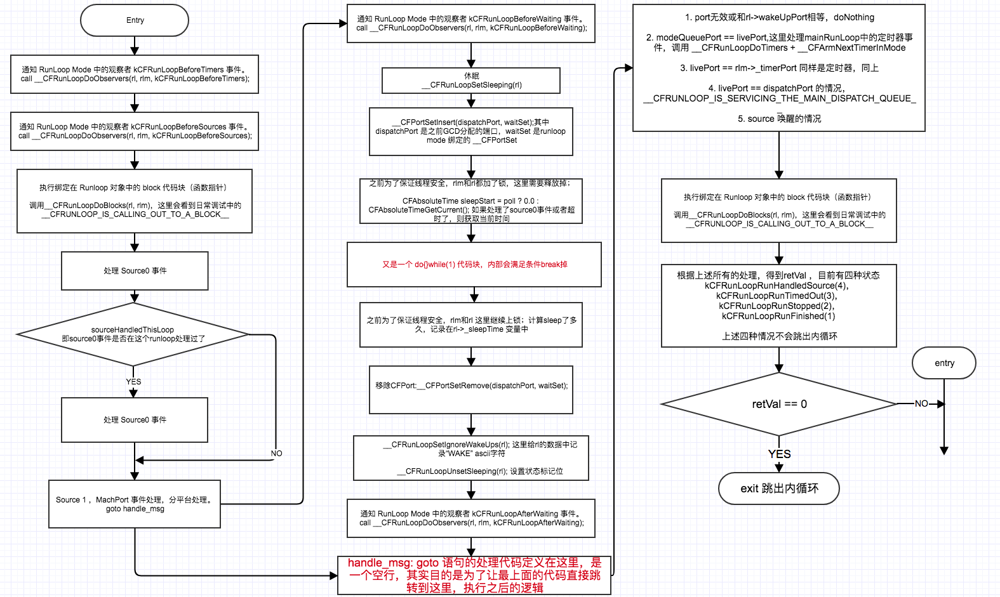

# 1. CFRunLoopRun
总流程图：其中 `CFRunLoopRunSpecific` 方法实现是一套设计好的工作流程，针对不同的事件作出对应的响应处理，用枚举标识处理结果，可以看到结果状态为 `kCFRunLoopRunStopped` 或 `kCFRunLoopRunFinished` 时退出 while 循环：


当然类似：
```
do {
  ret = doSomething();
}while(ret);
```
上述代码存在一个问题，`doSomething` 如果一直返回 1，会导致无限循环，CPU 占据 100 % 使用率，这可以理解，因为始终保持工作状态。但是应用程序并非一直处于工作状态，所以在空闲时可以让进程休眠，一旦有事件产生，则唤醒应用处理。

举个例子：响应键盘输入，做出不同处理。有两种方式：方式一、轮询，即不断查询GPIO引脚高低电平值，但是这样做会导致CPU负荷很大，为了减轻CPU的压力，又能及时响应键盘输入，我们可以每隔100ms查询一次状态，假设只要查询状态代码耗时 10ms，那么工作时间占比是 10/110 ≈ 10%而已，如何设定时间间隔 100ms 呢？如下方式就可以了：

```
// 关于i,j的范围设定 并非是1000
for (int i = 0;i<1000;i++){
  for (int j = 0; j< 1000;j++){
    // NoOp
  }
}
```

首先这段代码双循环，但是未处理任何事务(No Operation)，所以 CPU 会自动切换到休眠状态，把时间片释放给其他进程使用，至于休眠多久，就这里 i =1000和j=1000是根据晶振频率决定。

方式二：中断，即默认休眠状态，只有当GPIO发生高低电平变化了触发硬件中断，跳入到中断处理代码。

两种方式区别在于一个主动，一个被动，后者响应准确且及时，避免不必要的CPU消耗。

**遗留问题：**
1. `CFRunLoopRun` 的 caller 是谁？

# 2. CFRunLoopGetCurrent

RunLoop 和线程一一对应，通过 `pthread_self()` 获取到当前线程信息的指针，类型为 `pthread_t`。

* `CHECK_FOR_FORK`:
* `_CFGetTSD` 线程特有数据，TSD:Thread-Specific Data，即一个线程内部的各个函数都能访问、但其他线程不能访问的变量，这种机制还称之为线程局部静态变量（Static memory local to a thread）或线程局部存储（TLS:Thread-Local storage），更多请见[Linux中的线程局部存储一文](https://blog.csdn.net/cywosp/article/details/26469435);
* `_CFRunLoopGet0(pthread_self())` 是大部分博客讲解的重点：每个线程在fork的时候得到唯一的一个 `pthread_t` 结构体指针，以它为key，value为RunLoop对象存储到一个全局字典中，按照代码逻辑来说，先从字典中尝试获取当前线程对应的runloop对象，获取直接返回，没有则创建一个，存储同时返回;

```objective-c
CFRunLoopRef CFRunLoopGetCurrent(void) {
    CHECK_FOR_FORK();
    CFRunLoopRef rl = (CFRunLoopRef)_CFGetTSD(__CFTSDKeyRunLoop);
    if (rl) return rl;
    return _CFRunLoopGet0(pthread_self());
}
```

**遗留问题：**
1. 为何有两种存储方式：TSD 和 CFMutableDictionaryRef；为何先从TSD尝试获取？

## 2.1 _CFRunLoopGet0

这里涉及的知识点不多，1. `__CFRunLoops` 静态字典变量作为cache，key=线程ID(pthread_t type) value=runloop；2.懒加载？其实也不算 3.所有的实现都是基于结构体，结构体比平常用到复杂一些，主要是成员多是函数指针;4.runloop结构体我觉得更像是一份配置描述：`CFMutableSetRef _modes`，内含多个运行mode配置，在不同事件下以配置好的mode加载运行，运行在那个`do{}while(1)` 代码块中，代码块要做的工作就是根据这个mode配置和处理流程做事罢了。


# 3. CFRunLoopRunSpecific

> Q: 何为运行(调起)一个 RunLoop ？
> A: RunLoop 是一系列配置+事件响应处理，`do {} while(1)`中的 代码块就是按照预先设定好的处理流程，来响应不同的事件。`CFRunLoopRunSpecific`函数 就是一次处理流程（除了网上说的7个步骤，其实还包括mode切换等），处理结果为 CFRunLoopRunResult 类型：

```
typedef CF_ENUM(SInt32, CFRunLoopRunResult) {
    kCFRunLoopRunFinished = 1,
    kCFRunLoopRunStopped = 2,
    kCFRunLoopRunTimedOut = 3,
    kCFRunLoopRunHandledSource = 4
};
```

`CFRunLoopRunSpecific` 函数定义如下，外部决定唤起rl中的哪个mode设置为当前运行模式：

```objective-c
SInt32 CFRunLoopRunSpecific(CFRunLoopRef rl, CFStringRef modeName, CFTimeInterval seconds, Boolean returnAfterSourceHandled){
SInt32 CFRunLoopRunSpecific(CFRunLoopRef rl, CFStringRef modeName, CFTimeInterval seconds, Boolean returnAfterSourceHandled) {     /* DOES CALLOUT */
    CHECK_FOR_FORK();
    // 1. 对于异常传参判断处理
    if (modeName == NULL || modeName == kCFRunLoopCommonModes || CFEqual(modeName, kCFRunLoopCommonModes)) {
        static dispatch_once_t onceToken;
        dispatch_once(&onceToken, ^{
            CFLog(kCFLogLevelError, CFSTR("invalid mode '%@' provided to CFRunLoopRunSpecific - break on _CFRunLoopError_RunCalledWithInvalidMode to debug. This message will only appear once per execution."), modeName);
            _CFRunLoopError_RunCalledWithInvalidMode();
        });
        return kCFRunLoopRunFinished;
    }
    // 2. 如果runloop已经释放掉了，标识为结束且退出
    if (__CFRunLoopIsDeallocating(rl)) return kCFRunLoopRunFinished;
    __CFRunLoopLock(rl);
    
    // 3. 从rl中寻找是否有预先设定的modeName
    CFRunLoopModeRef currentMode = __CFRunLoopFindMode(rl, modeName, false);
    if (NULL == currentMode || __CFRunLoopModeIsEmpty(rl, currentMode, rl->_currentMode)) {
        Boolean did = false;
        if (currentMode) __CFRunLoopModeUnlock(currentMode);
        __CFRunLoopUnlock(rl);
        return did ? kCFRunLoopRunHandledSource : kCFRunLoopRunFinished;
    }
    
    // 4. 这里是runloop的模式切换，比如之前是defaultRunloop 现在切换成trackingMode
    volatile _per_run_data *previousPerRun = __CFRunLoopPushPerRunData(rl);
    CFRunLoopModeRef previousMode = rl->_currentMode;
    rl->_currentMode = currentMode;
    int32_t result = kCFRunLoopRunFinished;
    
    // ====================== 5.Runloop Core Handle Flow ====================
    // 5.1 通知观察者 进入核心Runloop处理前的事件
	if (currentMode->_observerMask & kCFRunLoopEntry ) __CFRunLoopDoObservers(rl, currentMode, kCFRunLoopEntry);
    // 5.2 进入 RunLoop Core Handle Flow
	result = __CFRunLoopRun(rl, currentMode, seconds, returnAfterSourceHandled, previousMode);
    // 5.3 通知观察者 进入核心Runloop处理退出的事件
	if (currentMode->_observerMask & kCFRunLoopExit ) __CFRunLoopDoObservers(rl, currentMode, kCFRunLoopExit);
    // =====================================================================
    
    // 6. 处理完外部要求的runloop 模式后，还得恢复到之前的运行模式
    __CFRunLoopModeUnlock(currentMode);
    __CFRunLoopPopPerRunData(rl, previousPerRun);
	rl->_currentMode = previousMode;
    __CFRunLoopUnlock(rl);
    return result;
}
```

1. 对于异常传参判断处理
2. 如果runloop已经释放掉了，标识为结束且退出
3. 从rl中寻找是否有预先设定的modeName
4. 这里是runloop的模式切换，比如之前是defaultRunloop 现在切换成trackingMode
5. Runloop Core Handle Flow
  5.1 通知观察者 进入核心Runloop处理前的事件
  5.2 进入 RunLoop Core Handle Flow
  5.3 通知观察者 进入核心Runloop处理退出的事件
6. 处理完外部要求的runloop 模式后，还得恢复到之前的运行模式

## 3.1 __CFRunLoopRun 
__CFRunLoopRun 函数的处理流程如下：


而内部又集成了一个 `do{}while(1)` ，处理流程如下：



流程已经很详细的列出，但是并没有细致到某个函数，这里罗列几个认为比较有意思的函数：
1. `__CFRunLoopDoObservers` 观察者模式，派发事件给注册通知的对象，Run Loop Observer Activities 有6个事件，详情见CFRunLoopActivity枚举；
2. `__CFRunLoopDoBlocks` 执行绑定在RunLoop中的block事件处理代码块；
3. `__CFRunLoopDoSources0` 处理source0事件；
4. `__CFRunLoopServiceMachPort` 猜测是source1事件，就是machport事件；
5. `__CFRunLoopSetSleeping` 休眠机制了解下
6. `__CFPortSetInsert` , `_dispatch_runloop_root_queue_perform_4CF` , `__CFPortSetRemove`
7. `livePort，rl->_wakeUpPort，modeQueuePort，rlm->_timerPort`两两之间比较为何可以得出各类事件：`CFRUNLOOP_WAKEUP_FOR_NOTHING`,`CFRUNLOOP_WAKEUP_FOR_WAKEUP`,`CFRUNLOOP_WAKEUP_FOR_TIMER`,`CFRUNLOOP_WAKEUP_FOR_TIMER`,`CFRUNLOOP_WAKEUP_FOR_DISPATCH`,`CFRUNLOOP_WAKEUP_FOR_SOURCE`，这里就是唤醒后的事件处理，但是可以看到唤醒也有不同原因的。

## 3.2 `__CFRunLoopDoObservers`
关于 `STACK_BUFFER_DECL` 宏:
```
#define STACK_BUFFER_DECL(T, N, C) T N[C]

STACK_BUFFER_DECL(CFRunLoopObserverRef, buffer, (cnt <= 1024) ? cnt : 1);
// 展开其实就是如下声明，注意1024个观察者以下，我们希望在栈上分配内存，而大于1024则是在堆上
CFRunLoopObserverRef *buffer[cnt]; 
```

> Window宏下面是使用 `_alloca`函数，内存分配函数，与malloc,calloc,realloc类似·，但是注意一个重要的区别，_alloca是在栈(stack)上申请空间，用完马上就释放。

```
for (CFIndex idx = 0; idx < cnt; idx++) {
    CFRunLoopObserverRef rlo = (CFRunLoopObserverRef)CFArrayGetValueAtIndex(rlm->_observers, idx);
    if (0 != (rlo->_activities & activity) && __CFIsValid(rlo) && !__CFRunLoopObserverIsFiring(rlo)) {
        collectedObservers[obs_cnt++] = (CFRunLoopObserverRef)CFRetain(rlo);
    }
}
```
上面将 runloop mode 中绑定 observers 都保存到数组中，retain一次，应该是为了方便之后的操作。

Note: 一般我们会在一个runloop mode 下，将自己订阅（subscribe）成观察者（observer），RunLoop开放的接口调用方式如下：

```objective-c
/* Run Loop Observer Activities */
typedef CF_OPTIONS(CFOptionFlags, CFRunLoopActivity) {
    kCFRunLoopEntry = (1UL << 0),
    kCFRunLoopBeforeTimers = (1UL << 1),
    kCFRunLoopBeforeSources = (1UL << 2),
    kCFRunLoopBeforeWaiting = (1UL << 5),
    kCFRunLoopAfterWaiting = (1UL << 6),
    kCFRunLoopExit = (1UL << 7),
    kCFRunLoopAllActivities = 0x0FFFFFFFU
};

// 创建observer 
CFRunLoopObserverRef observer = CFRunLoopObserverCreateWithHandler(CFAllocatorGetDefault(), kCFRunLoopAllActivities, YES, 0, ^(CFRunLoopObserverRef observer, CFRunLoopActivity activity) {
    
});
// 添加观察者到当前RunLoop的默认模式(kCFRunLoopDefaultMode)
CFRunLoopAddObserver(CFRunLoopGetCurrent(), observer, kCFRunLoopDefaultMode);   
// 释放Observer
CFRelease(observer);
```

最后就是派发当前特定事件给所有观察者：
```objective-c
for (CFIndex idx = 0; idx < obs_cnt; idx++) {
    CFRunLoopObserverRef rlo = collectedObservers[idx];
    __CFRunLoopObserverLock(rlo);
    if (__CFIsValid(rlo)) {
        Boolean doInvalidate = !__CFRunLoopObserverRepeats(rlo);
        __CFRunLoopObserverSetFiring(rlo);
        __CFRunLoopObserverUnlock(rlo);
        // Note: 遍历所有的观察者rlo，当activity事件发生时，调用rlo的callout 即函数指针，也就是前面注册的回调处理
        // 当前还要穿上下文给回调函数
        __CFRUNLOOP_IS_CALLING_OUT_TO_AN_OBSERVER_CALLBACK_FUNCTION__(rlo->_callout, rlo, activity, rlo->_context.info);
        if (doInvalidate) {
            CFRunLoopObserverInvalidate(rlo);
        }
        __CFRunLoopObserverUnsetFiring(rlo);
    } else {
        __CFRunLoopObserverUnlock(rlo);
    }
    CFRelease(rlo);
}
```

> rlo 同样是一个结构体，内部持有一个函数指针`CFRunLoopObserverCallBack _callout;`，这个就是回调处理；而 `__CFRUNLOOP_IS_CALLING_OUT_TO_AN_OBSERVER_CALLBACK_FUNCTION__` 的实现更是简单的要命，就是调用rlo的函数指针，然后传入对应的参数：当前观察者 observer，context上下文，事件activity：

```objective-c
static void __CFRUNLOOP_IS_CALLING_OUT_TO_AN_OBSERVER_CALLBACK_FUNCTION__(CFRunLoopObserverCallBack func, CFRunLoopObserverRef observer, CFRunLoopActivity activity, void *info) {
    if (func) {
        // 核心代码只有一行
        func(observer, activity, info);
    }
    asm __volatile__(""); // thwart tail-call optimization
}
```

> 总结：RunLoop 是必须运行在某个配置下（类型为`CFRunLoopModeRef`），允许你注册观察者到 Mode 中，本质观察者也是一个数据结构，内部持有一个回调的函数指针，然后观察者因为注册被Mode持有。

## 3.3 `__CFRunLoopDoBlocks`

RunLoop 绑定了两个 `struct _block_item` 数据结构的指针：head和tail，定义如下：

```
struct _block_item {
    struct _block_item *_next;
    CFTypeRef _mode;	// CFString or CFSet
    void (^_block)(void);
};
```
看定义可认为这是一个链表，而一个 block item 内部持有一个函数指针，然后指向下一个 block item。

看函数名称 `__CFRunLoopDoBlocks` 就知道这个函数的作用是执行Block，那么执行哪些 Block 就是个关键问题，遍历block_item链表的源码如下：

```c
CFSetRef commonModes = rl->_commonModes;
CFStringRef curMode = rlm->_name;
// ...省略
while (item) {
    struct _block_item *curr = item;
    item = item->_next;
    Boolean doit = false;
    // ==============条件匹配==================
    if (CFStringGetTypeID() == CFGetTypeID(curr->_mode)) {
        doit = CFEqual(curr->_mode, curMode) || (CFEqual(curr->_mode, kCFRunLoopCommonModes) && CFSetContainsValue(commonModes, curMode));
    } else {
        doit = CFSetContainsValue((CFSetRef)curr->_mode, curMode) || (CFSetContainsValue((CFSetRef)curr->_mode, kCFRunLoopCommonModes) && CFSetContainsValue(commonModes, curMode));
    }
    // =========================================
    if (!doit) prev = curr;
    if (doit) {
        if (prev) prev->_next = item;
        if (curr == head) head = item;
        if (curr == tail) tail = prev;
        void (^block)(void) = curr->_block;
            CFRelease(curr->_mode);
            free(curr);
        if (doit) {
                __CFRUNLOOP_IS_CALLING_OUT_TO_A_BLOCK__(block);
            did = true;
        }
        Block_release(block); // do this before relocking to prevent deadlocks where some yahoo wants to run the run loop reentrantly from their dealloc
    }
}
```

关键点：先获取当前Runloop绑定的 commonModes ，这是一个集合 Set；接着获取到当前RunLoop运行的Mode名称，因为接下来要比较；试想，我们的链表是一串的 `block_item` 对象，内部持有一个函数指针以及在何种模式下允许调用(`CFTypeRef _mode`)，找到匹配项后，就是 `__CFRUNLOOP_IS_CALLING_OUT_TO_A_BLOCK__`，这个函数实现更加简单，就是调用下函数指针，甚至不需要传参给它：

```c
static void __CFRUNLOOP_IS_CALLING_OUT_TO_A_BLOCK__(void (^block)(void)) {
    if (block) {
        block();
    }
    asm __volatile__(""); // thwart tail-call optimization
}
```

> 总结：这里的知识点是链表的使用和条件匹配。

> 疑问：这些 Block_item 链表是何时何地绑定到 RunLoop 中的呢？

## 3.4 `__CFRunLoopDoSources0`

Runloop Mode 不仅允许注册 observers，也允许 source0 事件注册，source0事件可以是多个，因此要用容器数据结构存储，也就是`CFMutableSetRef`，而成员结构为`CFRunLoopSourceRef`，看下定义：

```c
struct __CFRunLoopSource {
    CFRuntimeBase _base;
    uint32_t _bits;
    pthread_mutex_t _lock;
    CFIndex _order;			/* immutable */
    CFMutableBagRef _runLoops;
    union {
	      CFRunLoopSourceContext version0;	/* immutable, except invalidation */
        CFRunLoopSourceContext1 version1;	/* immutable, except invalidation */
    } _context;
};
```

学习过runloop的同学知道，source0之外还有source1，注意到两者的数据结构都为 `__CFRunLoopSource`，区别是source0 的上下文用 version0，source1的上下文用 version1，这里巧妙的用联合实现，如果仔细看`__CFRunLoopSource`定义，你应该立马注意到source0,1事件对应的处理函数指针呢？答案是在 `CFRunLoopSourceContext`中：

```
typedef struct {
    CFIndex	version;
    void *	info;
    const void *(*retain)(const void *info);
    void	(*release)(const void *info);
    CFStringRef	(*copyDescription)(const void *info);
    Boolean	(*equal)(const void *info1, const void *info2);
    CFHashCode	(*hash)(const void *info);
    void	(*schedule)(void *info, CFRunLoopRef rl, CFRunLoopMode mode);
    void	(*cancel)(void *info, CFRunLoopRef rl, CFRunLoopMode mode);
    void	(*perform)(void *info);
} CFRunLoopSourceContext;

typedef struct {
    CFIndex	version;
    void *	info;
    const void *(*retain)(const void *info);
    void	(*release)(const void *info);
    CFStringRef	(*copyDescription)(const void *info);
    Boolean	(*equal)(const void *info1, const void *info2);
    CFHashCode	(*hash)(const void *info);
#if (TARGET_OS_MAC && !(TARGET_OS_EMBEDDED || TARGET_OS_IPHONE)) || (TARGET_OS_EMBEDDED || TARGET_OS_IPHONE)
    mach_port_t	(*getPort)(void *info);
    void *	(*perform)(void *msg, CFIndex size, CFAllocatorRef allocator, void *info);
#else
    void *	(*getPort)(void *info);
    void	(*perform)(void *info);
#endif
} CFRunLoopSourceContext1;
```

> source0 事件可能是Apple预先帮我注册进去，比如屏幕触摸产生的事件，底层通过Mach Port传递过来的source1事件，然后Apple觉得让我们自己来处理这些太麻烦了，干脆对这些系统级别的事件封装了一层，就是source0，注册到runloop mode中。

> 上面source1对应的处理函数就是 `perform` 函数指针。

核心代码还是遍历所有的 source1 对象，然后分别调用 `perform` 函数指针：

```c
__CFRUNLOOP_IS_CALLING_OUT_TO_A_SOURCE0_PERFORM_FUNCTION__(rls->_context.version0.perform, rls->_context.version0.info);

static void __CFRUNLOOP_IS_CALLING_OUT_TO_A_SOURCE0_PERFORM_FUNCTION__(void (*perform)(void *), void *info) {
    if (perform) {
        perform(info);
    }
    asm __volatile__(""); // thwart tail-call optimization
}
```

当然source0还是有优先级的，为此执行前先排序下：

```c
CFArraySortValues((CFMutableArrayRef)sources, CFRangeMake(0, cnt), (__CFRunLoopSourceComparator), NULL);
```

> 疑惑：`CFGetTypeID(sources) == CFRunLoopSourceGetTypeID()` 这个条件的代码块中，只调用第一个 source1 的 `perform` 函数指针，why?


## 3.5 `__CFRunLoopServiceMachPort`

调用如下：

```c
uint8_t msg_buffer[3 * 1024]; // 栈上
mach_msg_header_t *msg = NULL;
mach_port_t livePort = MACH_PORT_NULL;

//... 省略
msg = (mach_msg_header_t *)msg_buffer; 
if (__CFRunLoopServiceMachPort(dispatchPort, &msg, sizeof(msg_buffer), &livePort, 0, &voucherState, NULL)) {
    goto handle_msg;
}

//... 省略
```

> 注意到函数传入的是 `&msg`，即指针的指针。注意到代码中一句注释:"In that sleep of death what nightmares may come ..."

```c
static Boolean __CFRunLoopServiceMachPort(mach_port_name_t port, mach_msg_header_t **buffer, size_t buffer_size, mach_port_t *livePort, mach_msg_timeout_t timeout, voucher_mach_msg_state_t *voucherState, voucher_t *voucherCopy) {
    Boolean originalBuffer = true;
    kern_return_t ret = KERN_SUCCESS;
    for (;;) {		/* In that sleep of death what nightmares may come ... */
        /// 1
        mach_msg_header_t *msg = (mach_msg_header_t *)*buffer;
        msg->msgh_bits = 0;
        msg->msgh_local_port = port;
        msg->msgh_remote_port = MACH_PORT_NULL;
        msg->msgh_size = buffer_size;
        msg->msgh_id = 0;
        
        /// 2
        if (TIMEOUT_INFINITY == timeout) { CFRUNLOOP_SLEEP(); } else { CFRUNLOOP_POLL(); }
        
        /// 3
        ret = mach_msg(msg, MACH_RCV_MSG|(voucherState ? MACH_RCV_VOUCHER : 0)|MACH_RCV_LARGE|((TIMEOUT_INFINITY != timeout) ? MACH_RCV_TIMEOUT : 0)|MACH_RCV_TRAILER_TYPE(MACH_MSG_TRAILER_FORMAT_0)|MACH_RCV_TRAILER_ELEMENTS(MACH_RCV_TRAILER_AV), 0, msg->msgh_size, port, timeout, MACH_PORT_NULL);

        /// 4        
        // Take care of all voucher-related work right after mach_msg.
        // If we don't release the previous voucher we're going to leak it.
        voucher_mach_msg_revert(*voucherState);
        
        // Someone will be responsible for calling voucher_mach_msg_revert. This call makes the received voucher the current one.
        *voucherState = voucher_mach_msg_adopt(msg);
        
        if (voucherCopy) {
            *voucherCopy = NULL;
        }
        
        /// 5
        CFRUNLOOP_WAKEUP(ret);
        
        /// 6
        if (MACH_MSG_SUCCESS == ret) {
            *livePort = msg ? msg->msgh_local_port : MACH_PORT_NULL;
            return true;
        }
        
        if (MACH_RCV_TIMED_OUT == ret) {
            if (!originalBuffer) free(msg);
            *buffer = NULL;
            *livePort = MACH_PORT_NULL;
            return false;
        }
        if (MACH_RCV_TOO_LARGE != ret) break;
        buffer_size = round_msg(msg->msgh_size + MAX_TRAILER_SIZE);
        if (originalBuffer) *buffer = NULL;
        originalBuffer = false;
        *buffer = realloc(*buffer, buffer_size);
    }
    HALT;
    return false;
}
```

1. msg 为 `mach_msg_header_t` 结构体，一一赋值；
2. `CFRUNLOOP_SLEEP` 和 `CFRUNLOOP_POLL` 宏定义其实并不做任何事情，它的定义是 `do { } while (0)`，这里的作用我认为仅是提高代码可读性;
3. 代码片段3就是调用 `msg` 函数的API，是进程间消息**收发**函数，定义如下：
    ```
    extern mach_msg_return_t	mach_msg(
    				mach_msg_header_t *msg,
    				mach_msg_option_t option,  
    				mach_msg_size_t send_size,
    				mach_msg_size_t rcv_size,
    				mach_port_name_t rcv_name,
    				mach_msg_timeout_t timeout,
    				mach_port_name_t notify);
    				
    //查看函数调用对应关系
    option -> MACH_RCV_MSG|(voucherState ? MACH_RCV_VOUCHER : 0)|MACH_RCV_LARGE|((TIMEOUT_INFINITY != timeout) ? MACH_RCV_TIMEOUT : 0)|MACH_RCV_TRAILER_TYPE(MACH_MSG_TRAILER_FORMAT_0)|MACH_RCV_TRAILER_ELEMENTS(MACH_RCV_TRAILER_AV) //可以设置为收消息还是发消息等类型
    send_size -> 0
    rcv_size -> msg->msgh_size
    rev_name -> port
    timeout ->  timeout
    notify -> MACH_PORT_NULL
    ```
4. `voucher_mach_msg_revert` 和 `voucher_mach_msg_adopt` 成对出现，不太了解作用；
5. `CFRUNLOOP_WAKEUP` 和上面的 `CFRUNLOOP_SLEEP` 、 `CFRUNLOOP_POLL` 宏定义一样都不做任何事，需要确认第三步是否会等待消息；
6. 后面是对接收到信息的处理

## 3.6 `__CFRunLoopSetSleeping`

```
__CFRunLoopSetSleeping(rl);
```

设置runloop实例的状态。

## 3.7 `__CFPortSetInsert` , `_dispatch_runloop_root_queue_perform_4CF` , `__CFPortSetRemove`
## 3.8 `runloop wakeup` 的6种情况

同样采用了宏定义方式增加代码阅读性：
* `CFRUNLOOP_WAKEUP_FOR_NOTHING` 正常唤醒
* `CFRUNLOOP_WAKEUP_FOR_TIMER`定时器唤醒
* `CFRUNLOOP_WAKEUP_FOR_DISPATCH` GCD 唤醒
* `CFRUNLOOP_WAKEUP_FOR_SOURCE` source 唤醒

```
if (MACH_PORT_NULL == livePort) {
    CFRUNLOOP_WAKEUP_FOR_NOTHING();
    // handle nothing
} else if (livePort == rl->_wakeUpPort) {
    CFRUNLOOP_WAKEUP_FOR_WAKEUP();
    // do nothing on Mac OS
} else if (modeQueuePort != MACH_PORT_NULL && livePort == modeQueuePort) {
    CFRUNLOOP_WAKEUP_FOR_TIMER();
    if (!__CFRunLoopDoTimers(rl, rlm, mach_absolute_time())) {
        // Re-arm the next timer, because we apparently fired early
        __CFArmNextTimerInMode(rlm, rl);
    }
} else if (rlm->_timerPort != MACH_PORT_NULL && livePort == rlm->_timerPort) {
    CFRUNLOOP_WAKEUP_FOR_TIMER();

    if (!__CFRunLoopDoTimers(rl, rlm, mach_absolute_time())) {
        // Re-arm the next timer
        __CFArmNextTimerInMode(rlm, rl);
    }
} else if (livePort == dispatchPort) {
    CFRUNLOOP_WAKEUP_FOR_DISPATCH();
    __CFRunLoopModeUnlock(rlm);
    __CFRunLoopUnlock(rl);
    _CFSetTSD(__CFTSDKeyIsInGCDMainQ, (void *)6, NULL);

    __CFRUNLOOP_IS_SERVICING_THE_MAIN_DISPATCH_QUEUE__(msg);
    _CFSetTSD(__CFTSDKeyIsInGCDMainQ, (void *)0, NULL);
    __CFRunLoopLock(rl);
    __CFRunLoopModeLock(rlm);
    sourceHandledThisLoop = true;
    didDispatchPortLastTime = true;
} else {
    CFRUNLOOP_WAKEUP_FOR_SOURCE();
    // Despite the name, this works for windows handles as well
    CFRunLoopSourceRef rls = __CFRunLoopModeFindSourceForMachPort(rl, rlm, livePort);
    if (rls) {
    	mach_msg_header_t *reply = NULL;
		sourceHandledThisLoop = __CFRunLoopDoSource1(rl, rlm, rls, msg, msg->msgh_size, &reply) || sourceHandledThisLoop;
		if (NULL != reply) {
		    (void)mach_msg(reply, MACH_SEND_MSG, reply->msgh_size, 0, MACH_PORT_NULL, 0, MACH_PORT_NULL);
		    CFAllocatorDeallocate(kCFAllocatorSystemDefault, reply);
		}
	}
}
```

根据上面不同情况下唤醒 RunLoop， 然后执行一些列操作后，会调用 `__CFRunLoopDoBlocks(rl, rlm);` 来处理之前注入的处理事务。通过if-else分支赋值当前runloop的状态：

```
{
  // 省略一堆代码。。。。
  // 省略一堆代码。。。。
  // 省略一堆代码。。。。
	if (sourceHandledThisLoop && stopAfterHandle) {
	    retVal = kCFRunLoopRunHandledSource;
    } else if (timeout_context->termTSR < mach_absolute_time()) {
        retVal = kCFRunLoopRunTimedOut;
	} else if (__CFRunLoopIsStopped(rl)) {
        __CFRunLoopUnsetStopped(rl);
	    retVal = kCFRunLoopRunStopped;
	} else if (rlm->_stopped) {
	    rlm->_stopped = false;
	    retVal = kCFRunLoopRunStopped;
	} else if (__CFRunLoopModeIsEmpty(rl, rlm, previousMode)) {
	    retVal = kCFRunLoopRunFinished;
	} 
}while( 0 == retVal)
```

至此整个 runloop 的处理到此结束， 最后返回 retVal 作为 `__CFRunLoopRun` 的返回值。

4. Mach消息发送机制初探

> Darwin 是 Apple 的开源操作系统，简单理解就是一个能处理各项事务的软件程序，它既能开放API接口给上层应用使用，也能操作硬件接口，以“模块化”划分:我们可以封装一些常用的函数接口成为系统库 libSystem.B.sylib 等，然后 IOKit 负责 IO 读写、Mach 是轻量级内核），仅提供了诸如处理器调度、IPC (进程间通信)等非常少量的基础服务，但都是至关重要的：线程管理、线程资源分配、虚拟内存分配及管理、底层物理资源的分配。
> IOKit/BSD/Mach 又称之为“XNU” 内核， XNU Not Unix。

这里引用 ibireme 深入理解 RunLoop 的图：


Mach 中 IPC 采用消息发送方式，不允许直接调用另外一个对象的接口，而是传递消息给这个对象，消息会加入到目标对象的队列中等待处理。

既然要用到消息传递通信方式，那么自然会规定“消息”的数据结构，总不能发送字符串“hello world”来通信吧...

一个简单消息由三个部分组成：

* 消息头(`mach_msg_header_t`) required
* 消息主体(`mach_msg_body_t`) optional
* 数据 data 这里应该用到了c语言中的变长结构体
* 尾消息(`mach_msg_trailer_t`) optional 只与接收端有关系

图片引自 [Mach消息发送机制](https://www.jianshu.com/p/a764aad31847)


端口是一个32位的整型标识符，消息在端口之间传递。消息从某一个端口发送到另一个端口，每一个端口都可以接收来自任意发送者的消息，但是每一个消息只能有一个接收者。向一个端口发送消息实际上是将消息放在队列中，直到消息被处理。

所有的Mach原生对象都是通过端口访问的，换句话说，我们要查找一个对象的句柄(标识应用程序中的不同对象和同类中的不同的实例的值)，实际上查找的是这个对象端口的句柄。

ipc_port 数据结构定义如下：

```c
struct ipc_port {

    /*
     * Initial sub-structure in common with ipc_pset
     * First element is an ipc_object second is a
     * message queue
     */
    struct ipc_object ip_object;
    struct ipc_mqueue ip_messages;

    natural_t ip_sprequests:1,  /* send-possible requests outstanding */
          ip_spimportant:1, /* ... at least one is importance donating */
          ip_impdonation:1, /* port supports importance donation */
          ip_tempowner:1,   /* dont give donations to current receiver */
          ip_guarded:1,         /* port guarded (use context value as guard) */
          ip_strict_guard:1,    /* Strict guarding; Prevents user manipulation of context values directly */
          ip_reserved:2,
          ip_impcount:24;   /* number of importance donations in nested queue */

    union {
        struct ipc_space *receiver;
        struct ipc_port *destination;
        ipc_port_timestamp_t timestamp;
    } data;

    union {
        ipc_kobject_t kobject;
        ipc_importance_task_t imp_task;
        uintptr_t alias;
    } kdata;
        
    struct ipc_port *ip_nsrequest;
    struct ipc_port *ip_pdrequest;
    struct ipc_port_request *ip_requests;
    struct ipc_kmsg *ip_premsg;

    mach_vm_address_t ip_context;

    mach_port_mscount_t ip_mscount;
    mach_port_rights_t ip_srights;
    mach_port_rights_t ip_sorights;

#if MACH_ASSERT
#define IP_NSPARES      4
#define IP_CALLSTACK_MAX    16
/*  queue_chain_t   ip_port_links;*//* all allocated ports */
    thread_t    ip_thread;  /* who made me?  thread context */
    unsigned long   ip_timetrack;   /* give an idea of "when" created */
    uintptr_t   ip_callstack[IP_CALLSTACK_MAX]; /* stack trace */
    unsigned long   ip_spares[IP_NSPARES]; /* for debugging */
#endif  /* MACH_ASSERT */
} __attribute__((__packed__));
```

> 引用“Mach原语：一切以消息为媒介”一文：在用户态下，消息传递都是通过`mach_msg()`函数实现的，这个函数会触发一个mach陷阱`mach_msg_trap()`，接下来`mach_msg_trap()`又会调用`mach_msg_overwrite_trap()`，它会通过`MACH_SEND_MSG`和`MACH_RCV_MSG`来判断是发送操作，还是接收操作。

